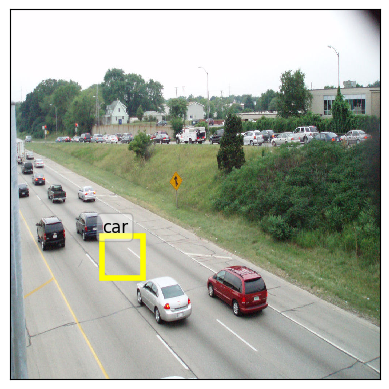
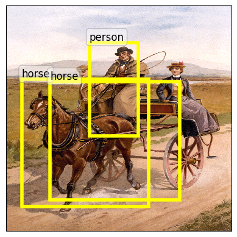
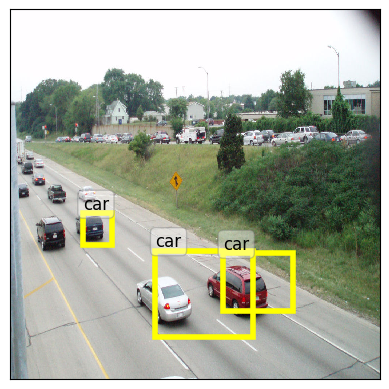

# Largest bounding box model

In the following, I suppose the dataset Pascal VOC2012 has been saved into **/mounts/Datasets2/Pascal-VOC2012/**

## Extracting the features

For extracting the features with a Resnet152 , the precomputed features being saved in /tmp/tensors-single. 
You can tweak the number of workers, below I use 7. 

    python3 extract_features.py  --use_gpu --model resnet152 --target_mode largest_bbox --image_mode shrink --output_dir /tmp/tensors-single --dataset_dir /mounts/Datasets2/Pascal-VOC2012/ --num_workers 7

## Learning the largest bounding box predictor

If you have a *low memory* cpu/gpu , consider adding --lowmem to the following command

    python3 train.py --use_gpu --tensors /tmp/tensors-single

## Testing a learned model

The following line loads a best model saved in **./logs/largest_bbox_2/best_model.pt** and test it on the image **TEST_IMAGE.ext**
    
    python3 test.py  --model resnet152 --use_gpu --model_file ./logs/largest_bbox_2/best_model.pt  --target_mode largest_bbox --image_file TEST_IMAGE.ext

Here is an example with the [Irish jaunting car image](https://en.wikipedia.org/wiki/Jaunting_car#/media/File:Irish_jaunting_car,_ca_1890-1900.jpg), as a funny application on a not so natural image.

# Multi box model

## Extracting the features

For extracting the features with a Resnet152 , the precomputed features being saved in /tmp/tensors-single. 
You can tweak the number of workers, below I use 7. 

    python3 extract_features.py  --use_gpu --model resnet152 --target_mode all_bbox --image_mode shrink --output_dir /tmp/tensors-multi --dataset_dir /mounts/Datasets2/Pascal-VOC2012/ --num_workers 7

## Learning the multibox predictor

If you have a *low memory* cpu/gpu , consider adding --lowmem to the following command

    python3 train.py --use_gpu --tensors /tmp/tensors-multi

## Testing a learned model

The following line loads a best model saved in **./logs/all_bbox_2/best_model.pt** and test it on the image **TEST_IMAGE.ext**

    
    python3 test.py  --model resnet152 --use_gpu --model_file ./logs/all_bbox_2/best_model.pt  --target_mode all_bbox --image_file TEST_IMAGE.ext

Here is an example with the [Irish jaunting car image](https://en.wikipedia.org/wiki/Jaunting_car#/media/File:Irish_jaunting_car,_ca_1890-1900.jpg), as a funny application on a not so natural image.

