---
title:  'First steps in PyTorch : classifying fashion objects (FashionMNIST)'
author:
- Jeremy Fix
keywords: [PyTorch tutorial, FashionMNIST]
...

## Objectives

**Forenote** The pytorch tutorial is more complicated than the Keras
tutorial because the interface is less high level. The Pytorch code is
therefore more verbose but at the same time we better see low levels
features that would eventually allow you to define custom elements.

In this practical, we will make our first steps with PyTorch and train our first models for classifying the [fashion dataset of zalando](https://github.com/zalandoresearch/fashion-mnist) which is made of :

-   60000 28x28 grayscale images in the training set
-   10000 28x28 grayscale images in the test set
-   belonging to 10 classes (Tshirt, Trouser, Pullover, Dress, Coat, Sandal, Shift, Sneaker, Bag, Ankle boot)

It should be noted that this dataset has been devised in order to
replace the traditional MNIST dataset which is by far too easy now (a
simple CNN can reach a test accuracy higher than 99.5%). We may have
used MNIST for this introductory practical but well ... let us have fun
with fashion, why not ?!

As you enter the universe of Pytorch, you might be interested in looking at [dedicated pytorch tutorials](https://pytorch.org/tutorials/).

The models you will train are :

-   a linear classifier (logistic regression)
-   a fully connected neural network with two hidden layers
-   a vanilla convolutional neural network (i.e. a LeNet like convnet)
-   some fancier architectures (e.g. ConvNets without fully connected layers)

As we progress within this tutorial, you will also see some syntactic
elements of PyTorch to :

-   load the datasets,
-   define the architecture, loss, optimizer,
-   save/load a model and evaluate its performances
-   monitor the training progress by interfacing with a dedicated web
    server

**VERY VERY Important**: Below, we see together step by step how to set up our training script. While reading the following lines you will progressively fill in python script. We also see the modules to be imported only when these are required for the presentation. But obviously, it is clearer to put these imports at the beginning of your scripts. So the following python codes **should not be strictly copy-pasted** on the fly.

## Working with datasets : datasets, dataloaders, transforms

A [torch.utils.data.dataset](https://pytorch.org/docs/stable/data.html#torch.utils.data.Dataset)
is an object which provides a set of data accessed with the operator\[
\]. Pytorch already inherits dataset within the torchvision module for
for [classical image datasets](https://pytorch.org/docs/stable/torchvision/datasets.html).

In this pratical, we will be working on the
[FashionMNIST](https://pytorch.org/docs/stable/torchvision/datasets.html#torchvision.datasets.FashionMNIST).
Let us discuss what we need to do with our dataset. Obviously, we need
to load the data and FashionMNIST provides a training set and a test set
(train flag in the FashionMNIST constructor). In order to latter perform
early stopping, we need to split the training set in a training set and
validation set, which will be done by calling
[random\_split](https://pytorch.org/docs/stable/data.html#torch.utils.data.random_split).

``` {.sourceCode .python}
import torch
import torchvision                                                       
import torchvision.transforms as transforms

import os.path

 ############################################################################################ Datasets

dataset_dir = os.path.join(os.path.expanduser("~"), 'Datasets', 'FashionMNIST')
valid_ratio = 0.2  # Going to use 80%/20% split for train/valid

# Load the dataset for the training/validation sets
train_valid_dataset = torchvision.datasets.FashionMNIST(root=dataset_dir,
                                           train=True,
                                           transform= None, #transforms.ToTensor(),
                                           download=True)

# Split it into training and validation sets
nb_train = int((1.0 - valid_ratio) * len(train_valid_dataset))
nb_valid =  int(valid_ratio * len(train_valid_dataset))
train_dataset, valid_dataset = torch.utils.data.dataset.random_split(train_valid_dataset, [nb_train, nb_valid])


# Load the test set
test_dataset = torchvision.datasets.FashionMNIST(root=dataset_dir,
                                                 transform= None, #transforms.ToTensor(),
                                                 train=False)
```

When running this script on the GPU, uou may encounter a time out issue which is due to the way our GPUs connect to internet. If this is the case, have a look to the [FAQ](faq.html).

<div class="w3-card w3-sand">


We could have used the "transform" argument of the FashionMNIST
constructor. However, given the way these objects are defined in
PyTorch, this would enforce to use exactly the same transforms for both
the training and validation sets which is too constraining (think about
adding dataset transformation to the training set and not the validation
set).

</div>

We now need to convert the PIL images into Pytorch tensors, a simple
call to
[torchvision.transforms.ToTensor()](https://pytorch.org/docs/stable/torchvision/transforms.html?highlight=totensor#torchvision.transforms.ToTensor)
will do the job for now. Later on, we will add other transforms in the
pipeline (e.g. dataset normalization and dataset augmentation) and I
would like to already define the code which later will make inserting
new transforms easy. I propose to do it the following way :

``` {.sourceCode .python}
class DatasetTransformer(torch.utils.data.Dataset):

    def __init__(self, base_dataset, transform):
        self.base_dataset = base_dataset
        self.transform = transform

    def __getitem__(self, index):
        img, target = self.base_dataset[index]
        return self.transform(img), target

    def __len__(self):
        return len(self.base_dataset)


train_dataset = DatasetTransformer(train_dataset, transforms.ToTensor())
valid_dataset = DatasetTransformer(valid_dataset, transforms.ToTensor())
test_dataset  = DatasetTransformer(test_dataset , transforms.ToTensor())
```

Now that we get our datasets, we need to define
[DataLoader](https://pytorch.org/docs/stable/data.html#torch.utils.data.DataLoader)
s that will allow us to iterate over the eventually shuffled sets,
creating minibatches on the fly. Preparing the mini batches is performed
in a parallel way, ensure to set num\_threads to an appropriate values
depending on your setup (sh machines have 8 cores). Parallel processing
of the mini batches really has an impact and can actually be a limiting
factor. To give you an idea, when preparing this tutorial, switching
from 1 to 8 workers on a 8 cores machine changed the running time of a
single epoch from 8s down to 2s.

``` {.sourceCode .python}
############################################################################################ Dataloaders
num_threads = 4     # Loading the dataset is using 4 CPU threads
batch_size  = 128   # Using minibatches of 128 samples

train_loader = torch.utils.data.DataLoader(dataset=train_dataset,
                                          batch_size=batch_size,
                                          shuffle=True,                # <-- this reshuffles the data at every epoch
                                          num_workers=num_threads)

valid_loader = torch.utils.data.DataLoader(dataset=valid_dataset,
                                          batch_size=batch_size, 
                                          shuffle=False,
                                          num_workers=num_threads)


test_loader = torch.utils.data.DataLoader(dataset=test_dataset,
                                          batch_size=batch_size,
                                          shuffle=False,
                                          num_workers=num_threads)


print("The train set contains {} images, in {} batches".format(len(train_loader.dataset), len(train_loader)))
print("The validation set contains {} images, in {} batches".format(len(valid_loader.dataset), len(valid_loader)))
print("The test set contains {} images, in {} batches".format(len(test_loader.dataset), len(test_loader)))
```

This should print out :

``` console
The train set contains 48000 images, in 375 batches
The validation set contains 12000 images, in 94 batches
The test set contains 10000 images, in 79 batches
```

We display below an excerpt of the dataset with the associated labels.

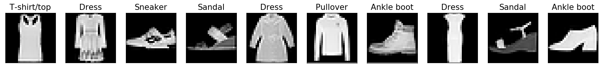{.bordered width="100%"}

As a matter of interest, the image above has been generated with the
following code :

``` {.sourceCode .python}
import matplotlib.pyplot as plt
import matplotlib.cm as cm

nsamples=10
classes_names = ['T-shirt/top', 'Trouser', 'Pullover', 'Dress', 'Coat', 'Sandal','Shirt', 'Sneaker', 'Bag', 'Ankle boot']
imgs, labels = next(iter(train_loader))

fig=plt.figure(figsize=(20,5),facecolor='w')
for i in range(nsamples):
    ax = plt.subplot(1,nsamples, i+1)
    plt.imshow(imgs[i, 0, :, :], vmin=0, vmax=1.0, cmap=cm.gray)
    ax.set_title("{}".format(classes_names[labels[i]]), fontsize=15)
    ax.get_xaxis().set_visible(False)
    ax.get_yaxis().set_visible(False)

plt.savefig('fashionMNIST_samples.png', bbox_inches='tight')
plt.show()
```

A Linear classifier
-------------------

Before training deep neural networks, it is good to get an idea of the
performances of a simple linear classifier. So we will define and train
a linear classifier and see together how this is written in
Python/PyTorch.

### Building the network

#### Neural network module for computing the class scores

We consider a linear classifier, i.e. we perform logistic regression. As
a reminder, in logistic regression, given an input image
$x \in \mathbb{R}^{28\times 28}$, we compute scores for each class k
as $w_k^T x$ (in this notation, the input is supposed to be extended
with a constant dimension equal to 1 to take into account the bias),
that we pass through the softmax transfer function to get probabilities
over the classes :

$$P(y=k / x) = \frac{e^{w_k^T x}}{\sum_{j=0}^{9} e^{w_j^T x}}$$

In Pytorch, it is good practice to define your own class for your model
by subclassing
[torch.nn.Module](https://pytorch.org/docs/stable/nn.html#torch.nn.Module)
which provides already a bunch of useful methods. Subclassing the Module
class usually consists only in redefining the constructor and the
[forward
method](https://pytorch.org/docs/stable/nn.html#torch.nn.Module.forward).
Hereafter is a proposed implementation explained below.

<div class="w3-card w3-sand">

We could have defined our model by simply calling the
[torch.nn.Sequential](https://pytorch.org/docs/stable/nn.html#torch.nn.Sequential)
function but this works only for the very specific case of a ....
sequence of layers and we aimed in this tutorial not to restrict our
presentation of the syntax to this very specific use case.

</div>

``` {.sourceCode .python}

import torch.nn as nn

class LinearNet(nn.Module):
    def __init__(self, input_size, num_classes):
        super(LinearNet, self).__init__()
        self.input_size = input_size
        self.classifier = nn.Linear(self.input_size, num_classes)

    def forward(self, x):
        x = x.view(x.size()[0], -1)
        y = self.classifier(x)
        return y

model = LinearNet(1*28*28, 10)

use_gpu = torch.cuda.is_available()

if use_gpu:
    model.cuda() # Moves all the parameters to the GPU
```

<div class="w3-card w3-sand">

We could have ended the forward function by calling the [softmax
function](https://pytorch.org/docs/stable/nn.html#torch.nn.Softmax) but
there is the all-in-one efficient [CrossEntropy
loss](https://pytorch.org/docs/stable/nn.html#torch.nn.CrossEntropyLoss)
expecting the scores and not the probabilities.

</div>

I suppose the piece of code above requires some further explanation. The
code above is going to compute the scores for each classes. In the
constructor, we simply instantiate a
[torch.nn.Linear](https://pytorch.org/docs/stable/nn.html#torch.nn.Linear)
object which is hosting the weights (a matrix of size (10, 784)) and the
biases (a vector of size (10,)). Now, in the **forward** function, we
start by reshaping our inputs from images to vectors before applying the
linear transformation. Below is an example to better understand
[torch.Tensor.view](https://pytorch.org/docs/stable/tensors.html#torch.Tensor.view)

``` {.sourceCode .python}
import torch
a = torch.randn(128, 1, 28, 28)
print(a.size())
# This prints :   torch.Size([128, 1, 28, 28]);     
# a.size()[0] is 128
av = a.view(a.size()[0], -1)
print(av.size())
# This prints :   torch.Size([128, 784])
```

The "-1" in the call of view means "whatever is necessary so that the
other dimensions are ok.". In this particular example, we enforce the
first dimension to be 128 so PyTorch is computing that the dimension
with "-1" should actually be $1\times 28 \times 28 = 784$.

If you wonder about the initialization of the parameters (and you would
be right!), you can have a look in the [source code of
torch.nn.Linear](https://github.com/pytorch/pytorch/blob/master/torch/nn/modules/linear.py)
to see that both the weights and biases are initialized with a uniform
distribution
$\mathcal{U}(-\frac{1}{\sqrt{fan_{in}}},\frac{1}{\sqrt{fan_{in}}})$.
If you wan't to experiment with different initialization schemes, you
can invoke the
[torch.nn.Module.apply](https://pytorch.org/docs/stable/nn.html#torch.nn.Module.apply)
function. Check the documentation for an example use case.

#### Instantiating The Cross entropy loss

As we saw in the lecture, multiclass logistic regression with the cross
entropy loss function is convex which is very nice from an optimization
perspective : local minima are all global minima. Pytorch provides the
[torch.nn.CrossEntropyLoss()](https://pytorch.org/docs/stable/nn.html#torch.nn.CrossEntropyLoss)
object which computes the softmax followed by the cross entropy.

Let us see this in action by considering a 3-class problem. Let us take
an input, of true class y=1, being assigned the scores
$\hat{z} = [-100, 10, 8]$, i.e. the assigned probabilities being
$\hat{y} = [\frac{\exp(-100)}{\sum_i \exp(y_i)}, \frac{\exp(10)}{\sum_i \exp(y_i)}, \frac{\exp(8)}{\sum_i \exp(y_i)}] = [0.0000, 0.8808, 0.1192]$
the cross entropy loss is given by $-\sum_{i=0}^{3} \log(\hat{y}_y) = -\log(0.8808) \approx 0.1269$
and is computed in Pytorch as :

``` {.sourceCode .python}
f_loss = torch.nn.CrossEntropyLoss()
f_loss(torch.Tensor([[-100, 10, 8]]), torch.LongTensor([1]))
# This prints :   torch.Tensor(0.1269)
```

For now, back to our experiment, we just need to instantiate the loss :

``` {.sourceCode .python}
f_loss = torch.nn.CrossEntropyLoss()
```

#### Instantiating the optimizer

As you know, optimizing the parameters of our neural network is
performed by some kind of gradient descent. There are several optimizers
provided in the [torch.optim
package](https://pytorch.org/docs/stable/optim.html). We will use the
[Adam
optimizer](https://pytorch.org/docs/stable/optim.html#torch.optim.Adam);
To know more about optimizers, there is a [compendium of optimizers
provided by Sebastian
Ruder](http://ruder.io/optimizing-gradient-descent/index.html). In
Pytorch, the optimizer needs a reference to the parameters that it needs
to modifies.

``` {.sourceCode .python}
optimizer = torch.optim.Adam(model.parameters())
```

### Training and testing the network

Training our model means iterating over the mini batches of the training
set and, for each mini-batch, computing the forward and backward passes
to ultimately provide the optimizer the gradient from which it can
compute an update of the parameters.

Below is a proposal for a train function that you must read, copy and
understand.

``` {.sourceCode .python}
def train(model, loader, f_loss, optimizer, use_gpu):
    """
    Train a model for one epoch, iterating over the loader
    using the f_loss to compute the loss and the optimizer
    to update the parameters of the model.

    Arguments :

        model     -- A torch.nn.Module object
        loader    -- A torch.utils.data.DataLoader
        f_loss    -- The loss function, i.e. a loss Module
        optimizer -- A torch.optim.Optimzer object
        use_gpu   -- Boolean, whether to use GPU

    Returns :
    """

    # We enter train mode. This is useless for the linear model
    # but is important for layers such as dropout, batchnorm, ...
    model.train()

    for i, (inputs, targets) in enumerate(loader):
        if use_gpu:
            inputs, targets = inputs.cuda(), targets.cuda()

        # Compute the forward pass through the network up to the loss
        outputs = model(inputs)
        loss = f_loss(outputs, targets)

        # Backward and optimize
        optimizer.zero_grad()
        loss.backward()
        optimizer.step()


# An example of calling train to learn over 10 epochs of the training set
for i in range(10):
    train(model, train_loader, f_loss, optimizer, use_gpu)
```

For testing the network, we define a **test** function which computes
our metrics of interest. There are no built-in metrics in pytorch. In
the following code, what might be surprising is the **with** statement
and the call to **model.eval()**. The python [with
statement](https://docs.python.org/3/reference/compound_stmts.html#with)
is used to invoke a piece of code within a context, here the context of
the [torch.no_grad()
object](https://pytorch.org/docs/stable/autograd.html#locally-disable-grad).
This disables any gradient computation therefore improving the
performances. The second statement is the
[model.eval](https://pytorch.org/docs/stable/nn.html#torch.nn.Module.eval)
which indicates to all the modules to switch into evaluation mode
(layers such as Batch Normalization layers behave differently in
training or inference modes).

``` {.sourceCode .python}
def test(model, loader, f_loss, use_gpu):
    """
    Test a model by iterating over the loader

    Arguments :

        model     -- A torch.nn.Module object
        loader    -- A torch.utils.data.DataLoader
        f_loss -- The loss function, i.e. a loss Module
        use_gpu   -- Boolean, whether to use GPU

    Returns :

        A tuple with the mean loss and mean accuracy

    """
    # We disable gradient computation which speeds up the computation
    # and reduces the memory usage
    with torch.no_grad():
        # We enter evaluation mode. This is useless for the linear model
        # but is important with layers such as dropout, batchnorm, ..
        model.eval()
        N = 0
        tot_loss, correct = 0.0, 0.0
        for i, (inputs, targets) in enumerate(loader):

            # We got a minibatch from the loader within inputs and targets
            # With a mini batch size of 128, we have the following shapes
            #    inputs is of shape (128, 1, 28, 28)
            #    targets is of shape (128)

            # We need to copy the data on the GPU if we use one
            if use_gpu:
                inputs, targets = inputs.cuda(), targets.cuda()

            # Compute the forward pass, i.e. the scores for each input image
            outputs = model(inputs)

            # We accumulate the exact number of processed samples
            N += inputs.shape[0]

            # We accumulate the loss considering
            # The multipliation by inputs.shape[0] is due to the fact
            # that our loss criterion is averaging over its samples
            tot_loss += inputs.shape[0] * f_loss(outputs, targets).item()

            # For the accuracy, we compute the labels for each input image
            # Be carefull, the model is outputing scores and not the probabilities
            # But given the softmax is not altering the rank of its input scores
            # we can compute the label by argmaxing directly the scores
            predicted_targets = outputs.argmax(dim=1)
            correct += (predicted_targets == targets).sum().item()
        return tot_loss/N, correct/N
```

We are now ready to setup our training/evaluation loop where we will be
training on the training set and after every epoch display our metrics
on the validation set (here, we will evaluate on the test set only at
the very end, when the best model would have been selected to prevent us
from making any kind of decision based on the test set metrics).

``` {.sourceCode .python}
for t in range(epochs):
    print("Epoch {}".format(t))
    train(model, train_loader, f_loss, optimizer, use_gpu)

    val_loss, val_acc = test(model, valid_loader, f_loss, use_gpu)
    print(" Validation : Loss : {:.4f}, Acc : {:.4f}".format(val_loss, val_acc))
```

We here used 20% of the training set for validation purpose. This is
based on the validation loss that we should select our best model, we
will see in a few moment how to automatically save the best model during
training.

You are now ready for **executing your first training**. You need first
to log on a GPU node as described in section [Using the GPU cluster of CentraleSupelec](cluster.html) (or [here](cluster_sm20.html) for SM20 lifelong trainees)

``` console
# First you log to the cluster
...
# And then :
python3 train_fashion_mnist_linear.py
```

This is your first trained classifier with Pytorch. You may reach a
validation accuracy of something around 85% after about 5 epochs.

**Exercice** Modify the train function in order to accumulate the number
of correctly classified samples during iterating over the training set.
You can then display the training loss and accuracies nicely during
training. Try the code below to see what I mean.

``` {.sourceCode .python}
import sys
import random
import time

def progress(loss, acc):
    sys.stdout.write('Loss : {:2.4f}, Acc : {:2.4f}\r'.format(loss, acc))
    sys.stdout.flush()

for i in range(10):
    progress(random.random(), random.random())
    time.sleep(0.5)
sys.stdout.write('\n')
```

If you prefer, you could also make use of progress bars as in
<https://github.com/kuangliu/pytorch-cifar/blob/master/utils.py> or of
some [dedicated progressbar
packages](https://github.com/WoLpH/python-progressbar)

### Saving/Loading the best model

#### Saving

When training a model, as we saw during the lecture, we are not so much
interested in saving the model which is minimizing the loss on the
training set. Rather than keeping the model minimizing the empirical
risk, we want to keep as best model the one minimizing the real risk or
an estimation of it. Here, our real risk is being estimated on the
validation set. Still, we want to do a little more than just saving the
best model and here is my wishlist :

-   every time the training script is executed, it should save its best
    model in a new directory
-   the model minimizing the validation loss should be saved during the
    training
-   the model could be loaded in a brand new script, not only in the
    training script (e.g. if normalization is applied to the dataset,
    the parameters of the normalization must also be saved)

For the first point, I provide you the following function.

``` {.sourceCode .python}
import os

def generate_unique_logpath(logdir, raw_run_name):
    i = 0
    while(True):
        run_name = raw_run_name + "_" + str(i)
        log_path = os.path.join(logdir, run_name)
        if not os.path.isdir(log_path):
            return log_path
        i = i + 1


###################################################
# Example usage :
# 1- create the directory "./logs" if it does not exist
top_logdir = "./logs"
if not os.path.exists(top_logdir):
    os.mkdir(top_logdir)

# 2- We test the function by calling several times our function
logdir = generate_unique_logpath(top_logdir, "linear")
print("Logging to {}".format(logdir))
# -> Prints out     Logging to   ./logs/linear_0
if not os.path.exists(logdir):
    os.mkdir(logdir)

logdir = generate_unique_logpath(top_logdir, "linear")
print("Logging to {}".format(logdir))
# -> Prints out     Logging to   ./logs/linear_1
if not os.path.exists(logdir):
    os.mkdir(logdir)
```

We now need to keep track of the validation loss and save the best model
if it improves that metric. Up to my knowledge, there is nothing already
provided within pytorch to perform this. I propose to define a class
called ModelCheckpoint for this task :

``` {.sourceCode .python}
class ModelCheckpoint:

    def __init__(self, filepath, model):
        self.min_loss = None
        self.filepath = filepath
        self.model = model

    def update(self, loss):
        if (self.min_loss is None) or (loss < self.min_loss):
            print("Saving a better model")
            torch.save(self.model.state_dict(), self.filepath)
            #torch.save(self.model, self.filepath)
            self.min_loss = loss

###########################################
# Example usage 

# Define the callback object
model_checkpoint = ModelCheckpoint(logdir + "/best_model.pt", model)


# In the training loop 
for t in range(epochs):
    ....
    model_checkpoint.update(val_loss)
```

Saving the model is done here by calling
[torch.save](https://pytorch.org/docs/stable/torch.html?highlight=torch%20save#torch.save)
on
[model.state_dict()](https://pytorch.org/docs/stable/nn.html?highlight=state_dict#torch.nn.Module.state_dict)
which is the [recommended approach for saving the
model](https://pytorch.org/docs/stable/notes/serialization.html#recommend-saving-models).
The state_dict function returns the parameters as well as the
information like running averages that you have within
batchnormalization layers.

**Modify your script** to make use of the ModelCheckpoint object.

#### Loading

To load a saved model, you need to instantiate your model and to invoke
the
[load_state_dict](https://pytorch.org/docs/stable/nn.html?highlight=state_dict#torch.nn.Module.load_state_dict)
function. Below is an example script loading and testing the model.

``` {.sourceCode .python}

model_path = THE_PATH_TO_YOUR_model.pt_FILE
model = LinearNet(1*28*28, 10)
if use_gpu:
    model.cuda() # Moves all the parameters to the GPU

model.load_state_dict(torch.load(model_path))

# Switch to eval mode 
model.eval()

test_loss, test_acc = test(model, test_loader, f_loss, use_gpu)
print(" Test       : Loss : {:.4f}, Acc : {:.4f}".format(test_loss, test_acc))
```

### Dashboard for monitoring/comparing runs

We now turn to the question of monitoring one or several runs. You can choose betwen several options ([Visdom](https://github.com/facebookresearch/visdom), [Trixi](https://github.com/MIC-DKFZ/trixi)) but probably the most convenient is actually to rely on Tensorboard and pytorch now has a built-in [tensorboard writer](https://pytorch.org/docs/stable/tensorboard.html#torch-utils-tensorboard). 

It requires to install tensorboard but it
is definitely a convenient viewer. The basic idea of this viewer is to
add few lines in your code which is dumping data on disk and to start
the tensorboard server which is continuously browsing your disk for new
data and provides a web server.

Let us fill in our scripts with the codes required to dump some
information. Below is an example snippet of code to insert in your
script.

<div class="w3-card w3-sand">

You can actually display much more information on a tensorboard (e.g.
sending images, videos, audios, texts, histograms, precision/recall
curves, ...), you can check the [pytorch tensorboard
tutorial](https://pytorch.org/tutorials/intermediate/tensorboard_tutorial.html)

</div>

``` {.sourceCode .python}
from torch.utils.tensorboard import SummaryWriter

[...]
tensorboard_writer   = SummaryWriter(log_dir = logdir)

[...]
for t in range(epochs):
    [...]
    tensorboard_writer.add_scalar('metrics/train_loss', train_loss, t)
    tensorboard_writer.add_scalar('metrics/train_acc',  train_acc, t)
    tensorboard_writer.add_scalar('metrics/val_loss', val_loss, t)
    tensorboard_writer.add_scalar('metrics/val_acc',  val_acc, t)
```

Now, each time you are running your training, you will see some
"events.out.xxxxx" files created in your logdir. These files contain the logs and can be read with tensorboard.

Once this is done, you have to
start tensorboard on the GPU and connect to it following one of the appropriate process as described in run [Using the GPU cluster of CentraleSupelec](cluster.html)

```console
[In one terminal on the GPU]
sh11:~:mylogin$ tensorboard --logdir ./logs
Starting TensorBoard b'47' at http://0.0.0.0:6006
(Press CTRL+C to quit)

[In a terminal local to your machine]
mymachine:~:mylogin$ ./port_forward.sh ..... -p 6006
```

And then start a browser on your laptopt and log to
<http://localhost:6006> . Once this is done, you will be able to monitor
your metrics in the browser while the training are running.

You can now run several experiments, monitor them and get a copy of the
best models. A handy bash command to run several experiments is given
below :

``` console
sh11:~:mylogin$ for iter in $(seq 1 10); do echo ">>>> Run $iter" && python3 train_mnist_linear.py ; done;
```


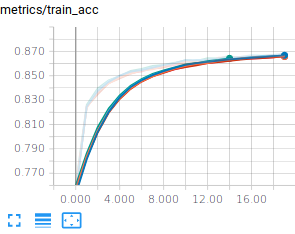{width=30%}

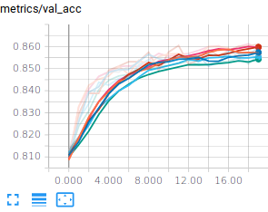{width=30%}

You should reach a validation and test accuracy around 85% and this is
rather consistent, but, remember, we have a convex optimization problem,
so that we expect the trainings to be consistent. In case they would not
be consistent, that would be an indication that your optimization
problem is not well conditioned (e.g. your input data are not
normalized). Fortunately (but unfortunately from a pedagogical point of
view) the FashionMnist dataset is already normalized.

### Saving a summary file of your run

If you want to test several models, meta-parameters and so one, it is
good practice to dump all the necessary information of your run to know
exactly in which condition it has been done.

Fortunately, the Pytorch objects usually overwrite the __repr__
python function which provides a handy way to generate and save such a
summary :

``` {.sourceCode .python}
import sys

[....]

summary_file = open(logdir + "/summary.txt", 'w')
summary_text = """

Executed command
================
{}

Dataset
=======
FashionMNIST

Model summary
=============
{}

{} trainable parameters

Optimizer
========
{}

""".format(" ".join(sys.argv), model, sum(p.numel() for p in model.parameters() if p.requires_grad), optimizer))
summary_file.write(summary_text)
summary_file.close()

tensorboard_writer.add_text("Experiment summary", summary_text)
```

The representation of the model provided by PyTorch does not list the
number of parameters. You can have a look at
<https://stackoverflow.com/questions/42480111/model-summary-in-pytorch>
if you want to include this information in your summary. As you may see,
we also added some information on the tensorboard in order to quickly
check the parameters of the models.

### Normalizing the input

So far, we used the raw data, which are not necessarily normalized. It
is usually a good idea to normalize the input because it allows to make
training faster (because the loss becomes more circular symmetric) and
also allows to use a consistent learning rate and a consistent
regularization factor for all the parameters in the architecture. It
turns out that FashionMNIST is already kind of normalized so that what
we are going to do in this section will not have a big impact on your
training.

There are various ways to normalize the data and various ways to
translate it into Keras. The point of normalization is to equalize the
relative importance of the dimensions of the input. One normalization is
**min-max scaling** just scaling the input by a constant factor, e.g.
given an image I, you feed the network with I/255. - 0.5. Another
normalization is standardization. Here, you compute the mean of the
**training vectors** and their variance and normalize every input vector
(even the test set) with these data. Given a set of training images
$X_i \in \mathbb{R}^{784}, i \in [0, N-1]$, and a vector
$X \in \mathbb{R}^{784}$ you feed the network with
$\hat{X} \in \mathbb{R}^{784}$ given by

$$X_\mu = \frac{1}{N} \sum_{i=0}^{N-1} X_i$$

$$X_\sigma = \sqrt{\frac{1}{N} \sum_{i=0}^{N-1} (X_i - X_\mu)^T (X_i - X_\mu)} + 10^{-5}$$

$$\hat{X} = (X - X_\mu)/X_\sigma$$

How do we introduce normalization in our Pytorch model ? One way is to
create a dataset that is normalized and use this dataset for training
and testing. Another possibility is to embed normalization in the
network by introducing normalization within the forward method of your
model. Below, we will see how to compute the mean and variance images
and to introduce normalization in our DatasetTransformer objects.
**Important** the statistics for normalization are to be computed on the
training set and the same statistics should be used on the validation
and test sets.

``` {.sourceCode .python}
normalizing_dataset = DatasetTransformer(train_dataset, transforms.ToTensor())
normalizing_loader = torch.utils.data.DataLoader(dataset=normalizing_dataset,
                                           batch_size=batch_size,
                                           num_workers=num_threads)

# Compute mean and variance from the training set
mean_train_tensor, std_train_tensor = compute_mean_std(normalizing_loader)


data_transforms = transforms.Compose([
        transforms.ToTensor(),
        transforms.Lambda(lambda x: (x - mean_train_tensor)/std_train_tensor)
])

train_dataset = DatasetTransformer(train_dataset, data_transforms)
valid_dataset = DatasetTransformer(valid_dataset, data_transforms)
test_dataset  = DatasetTransformer(test_dataset , data_transforms)
```

with the following definition for compute_mean_std

``` {.sourceCode .python}
def compute_mean_std(loader):
    # Compute the mean over minibatches
    mean_img = None
    for imgs, _ in loader:
        if mean_img is None:
            mean_img = torch.zeros_like(imgs[0])
        mean_img += imgs.sum(dim=0)
    mean_img /= len(loader.dataset)

    # Compute the std over minibatches
    std_img = torch.zeros_like(mean_img)
    for imgs, _ in loader:
        std_img += ((imgs - mean_img)**2).sum(dim=0)
    std_img /= len(loader.dataset)
    std_img = torch.sqrt(std_img)

    # Set the variance of pixels with no variance to 1
    # Because there is no variance
    # these pixels will anyway have no impact on the final decision
    std_img[std_img == 0] = 1

    return mean_img, std_img
```


A Fully connected 2 hidden layers classifier
--------------------------------------------

### Basics

Let us change the network to build a 2 hidden layers feedforward
network. This is simply about adding dense layers with appropriate
activations in between the input and the output layer. Basically, the
only thing you need to change compared to the linear model is when you
build up the model. A simple 2 layers network would be defined as :

``` {.sourceCode .python}
def linear_relu(dim_in, dim_out):
    return [nn.Linear(dim_in, dim_out),
            nn.ReLU(inplace=True)]

class FullyConnected(nn.Module):

    def __init__(self, input_size, num_classes):
        super(FullyConnected, self).__init__()
        self.classifier =  nn.Sequential(
            *linear_relu(input_size, 256),
            *linear_relu(256, 256),
            nn.Linear(256, num_classes)
        )

    def forward(self, x):
        x = x.view(x.size()[0], -1)
        y = self.classifier(x)
        return y
```

The code above creates a feedforward network with 2 hidden layers. We
here used a [torch.nn.ReLu activation
function](https://pytorch.org/docs/stable/nn.html?highlight=relu#torch.nn.ReLU)
but you are free to experiment with other activation functions, e.g.
[torch.nn.PReLU](https://pytorch.org/docs/stable/nn.html?highlight=relu#torch.nn.PReLU),
[torch.nn.ELU](https://pytorch.org/docs/stable/nn.html?highlight=relu#torch.nn.ELU)

Before running your experiments, remember to adapt the call to
**generate_unique_logpath**, replacing "linear" by "fc" for example to
easily distinguish your various experiments.

For example, training a Input-256(Relu)-256(Relu)-10(Softmax) network
(around 270.000 trainable parameters), the training accuracy gets around
99% after 100 steps, the validation and test accuracies around 89%.
If you also look at the losses, you should be observing that the model
is overfitting. Below are some examples you might get :


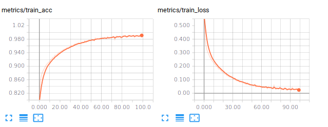{width="75%"}

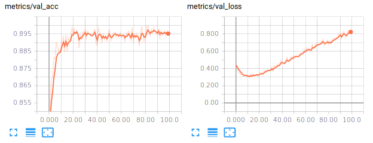{width="75%"}

We can try to improve the generalization performance by introducing some
regularization, which is addressed in the next paragraph.

### Regularization

There are various ways to regularize our networks. One can penalize the
norms of the parameter vector using
[torch.norm](https://pytorch.org/docs/stable/torch.html?highlight=norm#torch.norm))
or use dedicated layers such as
[torch.nn.Dropout](https://pytorch.org/docs/stable/nn.html#torch.nn.Dropout).

L2 regularization (or weight decay) is usually applied to the kernel
only and not the bias. It adds a term in the loss function to be
minimized of the form $\lambda \sum_i w_i^2$. The parameter $\lambda$
has to be experimentally determined (by monitoring the performances on
the validation set) and usually quite small, e.g. values around
$10^{-5}, 10^{-3}$ or so. If you wish to experiment with L2 penalty, you
can add this penalty when computing your loss. Basically, you add in
some operations in your computational graph which compute the norm of
the weights. In order to easily catch the weights (excluding the
biases), it might be handy to instantiate the linear layers without
using nn.Sequential, as in the example below :

<div class="w3-card w3-sand">

To introduce weight decay, you could have used the *weight_decay* keyword
argument of the optimizer. But I found it better to introduce you to the
more general syntax that can allow you to customize your loss basically.

</div>

``` {.sourceCode .python}
class FullyConnectedRegularized(nn.Module):

    def __init__(self, input_size, num_classes, l2_reg):
        super(FullyConnectedRegularized, self).__init__()
        self.l2_reg = l2_reg
        self.lin1 = nn.Linear(input_size, 256)
        self.lin2 = nn.Linear(256, 256)
        self.lin3 = nn.Linear(256, num_classes)


    def penalty(self):
        return self.l2_reg * (self.lin1.weight.norm(2) + self.lin2.weight.norm(2) + self.lin3.weight.norm(2))

    def forward(self, x):
        x = x.view(x.size()[0], -1)
        x = nn.functional.relu(self.lin1(x))
        x = nn.functional.relu(self.lin2(x))
        y = self.lin3(x)
        return y
```

In this code, as you may see, we access the pytorch tensor of the
weights and compute its L2 norm to be included in the penalty. This
penalty brings in an element through which our gradient can be
backpropagated :

``` {.sourceCode .python}
def train(model, loader, loss_function, optimizer, use_gpu):
[...]

    # Backward and optimize
    optimizer.zero_grad()
    loss.backward()
    model.penalty().backward()
    optimizer.step()
[...]
```


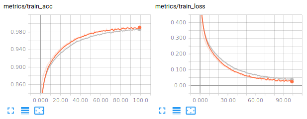{width="75%"}

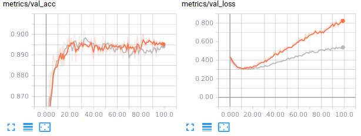{width="75%"}

Another more recently introduced regularization technique is called
Dropout [@Srivastava2014]. It consists in setting to 0 the
activations of a certain fraction of the units in a layer. In their
original paper, the authors of dropout suggest for example *Dropping out
20% of the input units and 50% of the hidden units was often found to be
optimal*. A dropout mask is generated for every training sample. At test
time, an ensemble of dropped out networks are combined to compute the
output (see also <http://cs231n.github.io/neural-networks-2/#reg>). In
Pytorch, we simply need to introduce [nn.Dropout
layers](https://pytorch.org/docs/stable/nn.html#torch.nn.Dropout)
specifying the rate at which to drop (i.e. zero) units. You will see
below an example of how to make use of dropout in your network. Learning
a neural network with dropout is usually slower than without dropout so
that you may need to consider increasing the number of epochs.

``` {.sourceCode .python}
import torch.nn as nn
...
# Using the Layer approach
classifier = nn.Sequential(
 nn.Dropout(0.2),
 nn.Linear(input_size, 256),
 nn.ReLU(),
 nn.Dropout(0.5),
 nn.Linear(256, 10)
 )
```

I let you modify your code to test this approach.

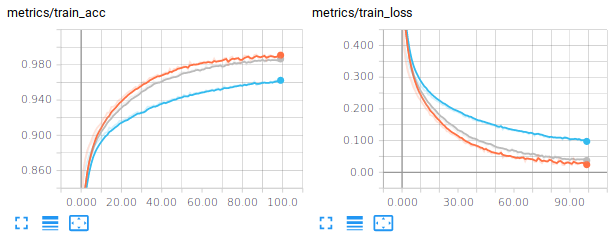{width="75%"}

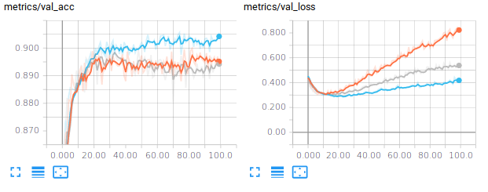{width="75%"}

A vanilla convolutional neural network
--------------------------------------

The MultiLayer Perceptron does not take any benefit from the intrinsic
structure of the input space, here images. We propose in this paragraph
to explore the performances of Convolutional Neural Networks (CNN) which
exploit that structure. Our first experiment with CNN will consider a
*vanilla* CNN, i.e. a stack of conv-relu-maxpooling layers followed by
some dense layers.

In order to write our script from training CNN, compared to the script
for training a linear or a multilayer feedforward model, we need to
change the input_shape and also introduce new layers: [torch.nn.Conv2d
layers](https://pytorch.org/docs/stable/nn.html#torch.nn.Conv2d),
[torch.nn Pooling
layers](https://pytorch.org/docs/stable/nn.html#pooling-layers) .

The tensors for convolutional layers are 4D which include batch_size,
number of channels, image width, image height. The ordering is framework
dependent. It can be :

-   channels_last (tensorflow convention), in which case, the tensors
    are (batch_size, image height, image width, number of channels)
-   channels_first (theano convention), in which case, the tensors are
    (batch_size, number of channels, image height, image width)

The next step is to define our model. We here consider stacking
Conv-Relu-MaxPool layers. In PyTorch, from an input of 16 channels, one
block with 32 $5\times 5$ stride 1 filters and $2\times 2$ stride 2 max pooling would be
defined with the following syntax :

``` {.sourceCode .python}

import torch.nn as nn 

conv_classifier = nn.Sequential(
    nn.Conv2d(16, 32,
              kernel_size=5,
              stride=1,
              padding=2, bias=True),
    nn.ReLU(inplace=True),
    nn.MaxPool2d(kernel_size=2, stride=2))
```

The padding argument of the convolution is ensuring that the convolution
will not decrease the size of the representation. We let this as the job
of the max-pooling operation. Indeed, the max pooling layer has a stride
2 which effectively downscale the representation by a size of 2.

How do you set up the architecture ? the size of the filters ? the
number of blocks ? the stride ? the padding ? well, this is all the
magic. Actually, we begin to see a small part of the large number of
degrees of freedom on which we can play to define a convolutional neural
network.

The last thing we need to speek about is the flattening we need to
operate before going through the eventual last dense layers. Usually
(but this is not always the case), there are some final fully connected
(dense) layers at the end of the architecture. When you go from the
Conv/MaxPooling layers to the final fully connected layers, you need to
flatten your feature maps because linear layers expect an input which is
a vector, not a matrix. This means converting the 4D Tensors to 2D
Tensors. For example, the code below illustrates the connection between
some convolutional/max-pooling layers to the output layer with a
10-class classification:

``` {.sourceCode .python}
# Given x of size (128, 16, 28, 28)
x = torch.randn(128, 16, 28, 28)
features = conv_classifier(x)
print(features.shape)
# -> prints out (128, 32, 14, 14)
flatten_features = features.view(features.size()[0], -1)
print(flatten_features.shape)
# -> prints out (128, 6272)
```

And then you can go on feeding your flatten features within linear
layers. Now, we should have introduced all the required blocks. As a
first try, I propose you to code a network with :

-   The input layer
-   3 consecutive blocks with Conv($5\times 5$, strides=1,
    padding=2)-Relu-MaxPooling($2\times 2$, strides=2). Take 16 filters for the
    first Conv layer, 32 filters for the second and 64 for the third
-   Two dropout-linear-relu blocks of size 128 and 64, with 0.5 dropout
    probability (try also without the dropout, you should observe
    overfitting)
-   One dense layer with 10 units

The last layer is linear but I remind you that the softmax is embedded
within the loss function. Training this architecture, you should end up
with around 92% of validation and test accuracies with losses around
0.22. By the way, a loss of 0.22 means that, in average, your model is
assigning the correct class a probability around 80% (remember the
cross entropy loss for a single sample is $-\log(\hat{y}_y))$.

Small kernels, no fully connected layers, Dataset Augmentation, Model averaging
-------------------------------------------------------------------------------

### Architecture

Recently, it is suggested to use small convolutional kernels (typically
$3\times 3$, and sometimes $5\times 5$). The rationale is that using two stacked $3\times 3$
convolutional layers gives you receptive field size of $5\times 5$ with less
parameters (and more non linearity). This is for example the guideline
used in VGG : use mostly $3\times 3$ kernels, stack two of them, followed by a
maxpool and then double the number of filters. The number of filters is
usually increased as we go deeper in the network (because we expect the
low level layers to extract basic features that are combined in the
deeper layers). Finally, in [@Lin2014], it is also suggested that we
can completly remove the final fully connected layers and replace them
by global average pooling which is basically average pooling with a
kernel of the same size (width,height) as the feature map. It appears that removing fully
connected layers, the network is less likely to overfit and you end up
with much less parameters for a network of a given depth (this is the
fully connected layers that usually contain most of your parameters).
Therefore, I suggest you to give a try to the following architecture :

-   InputLayer
-   64C3s1-BN-Relu-64C3s1-BN-Relu - MaxPool2s2
-   128C3s1-BN-Relu-128C3s1-BN-Relu - MaxPool2s2
-   256C3s1-BN-Relu-256C3s1-BN-Relu - GlobalAverage(RF size 7)
-   Dense(10), (Softmax&lt;-- included in the loss)

where **64C3s1** denotes a convolutional layer with 64 kernels, of size
$3\times 3$, with stride 1, with zero padding to keep the same size for the
input and output. **BN** is a [torch.nn.BatchNorm2d
layer](https://pytorch.org/docs/stable/nn.html#torch.nn.BatchNorm2d) .
**MaxPool2s2** is a max-pooling layer with receptive field size $2\times 2$ and
stride 2. GlobalAverage is an averaging layer computing an average over
a whole feature map. The input of the global average layer being 256
feature maps of size $7\times 7$, its output is 256 features. For
regularizing, you may want to try adding weight_decay when creating
[torch.optim.Adam](https://pytorch.org/docs/stable/optim.html#torch.optim.Adam)
optimizer (try values around $10^{-6} - 10^{-4}$), or introduce dropout
layers between the convolutional stage and the linear layer.

This should bring you with, after 50 epoch, a test accuracy around
93%, a test loss around 0.27, with 1M trainable parameters.

### Dataset Augmentation and model averaging

One process which can bring you improvements is Dataset Augmentation.
The basic idea is to apply transformations to your input images that
must keep invariant your label. For example, slightly rotating,
translating an image of, say, a pullover is still an image of a pullover
as shown below :

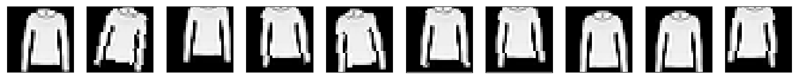{width="100%"}

And the same applies for other classes as well :

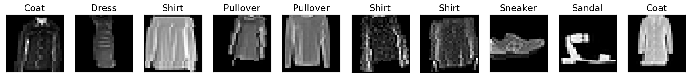{width="100%"}

Now, the idea is to produce a stream (actually infinite if you allow
continuous perturbations) of training samples generated from your finite
set of training samples. Transformation of images can be performed by
composing and calling functions in
[torchvision.transforms](https://pytorch.org/docs/stable/torchvision/transforms.html).
These functions work on PIL images. For example, I show you below how I
would perform some random transformations on an image "toto.png"

``` {.sourceCode .python}
# An example code calling transforms on PIL images
from PIL import Image, ImageFilter
import torchvision.transforms as transforms 

# Read image
im = Image.open( 'hulk.png' )

transform_image = transforms.Compose([
        transforms.RandomHorizontalFlip(0.5),
        transforms.RandomAffine(degrees=10, translate=(0.2, 0.2))
        ])

for i in range(3):
    t_im = transform_image(im)
    t_im.save("hulk-{}.png".format(i))
    t_im.show()
```

{width="15%"}

{width="15%"}

{width="15%"}

Now, to introduce this into our training script, remember when we
created our datasets :

``` {.sourceCode .python}
train_dataset = DatasetTransformer(train_dataset, transforms.ToTensor())
valid_dataset = DatasetTransformer(valid_dataset, transforms.ToTensor())
test_dataset  = DatasetTransformer(test_dataset , transforms.ToTensor())
```

The last argument of DatasetTransformer is actually expecting a function
which is applied to every sample. In the case above, it was simply
transforming the PIL image into a Pytorch tensor. Now, we will do a
little bit more :

``` {.sourceCode .python}
import torch.transforms as transforms

train_augment_transforms = transforms.Compose([
    transforms.RandomHorizontalFlip(0.5),
    transforms.RandomAffine(degrees=10, translate=(0.1, 0.1)),
    transforms.ToTensor()
])

train_dataset = DatasetTransformer(train_dataset, train_augment_transforms)
```

With the *fancy* CNN and dataset augmentation, you should be getting
around 93% accuracy on the test set with a test loss around 0.2;

Now, as a final step in our beginner tutorial on pytorch, you can train
several models and average their probability predictions over the test
set. This will eventually bring you an additional point in your
accuracy. For example, I trained 6 *fancy* CNN with the best settings I
found (weight decay of $10^{-6}$, data augmentation) and then build a
model which is outputing the average probability assigned by each model.
This led me to a test loss of 0.1510 and a test accuracy of 94.59%

```{.sourceCode .matlab}
Individual performances : 
[./logs/fancyCNN_38]    Test : Loss : 0.1895, Acc : 0.9352
[./logs/fancyCNN_39]    Test : Loss : 0.1878, Acc : 0.9373
[./logs/fancyCNN_40]    Test : Loss : 0.1920, Acc : 0.9352
[./logs/fancyCNN_41]    Test : Loss : 0.1881, Acc : 0.9399
[./logs/fancyCNN_42]    Test : Loss : 0.1964, Acc : 0.9357
[./logs/fancyCNN_43]    Test : Loss : 0.1962, Acc : 0.9362
==============================
Averaged model : 
Test : Loss : 0.1510, Acc : 0.9459
```

A possible solution
-------------------

You will find a possible solution, with a little bit more than what we have seen in this practical in the [LabsSolutions/00-pytorch-FashionMNIST](https://github.com/jeremyfix/deeplearning-lectures/tree/master/LabsSolutions/00-pytorch-FashionMNIST) directory.

References
----------


