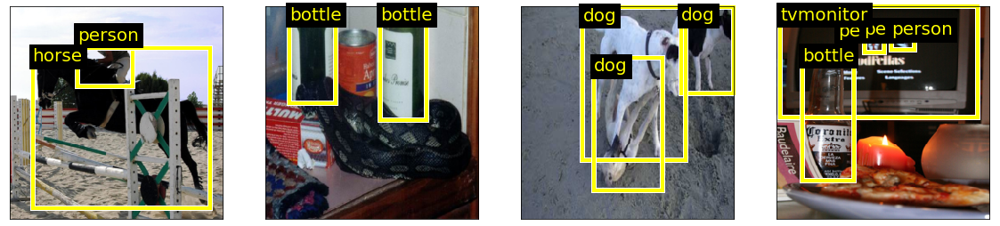
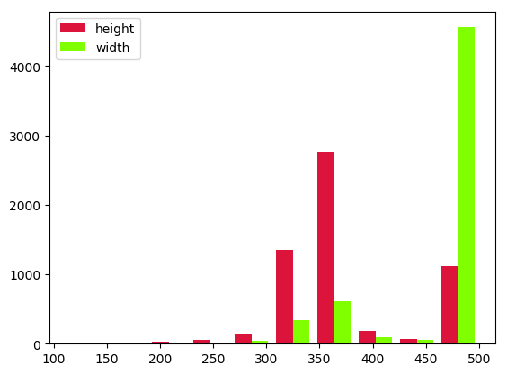
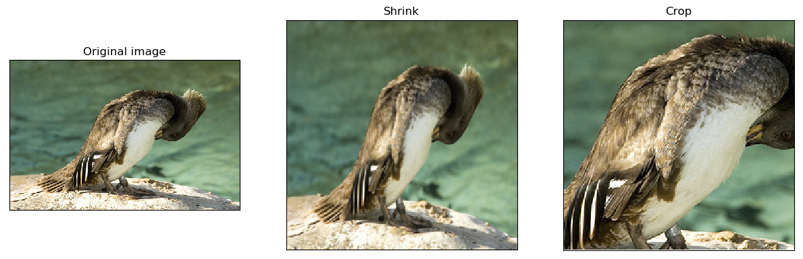
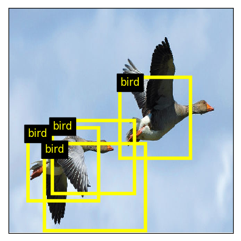

---
title:  'Transfer learning and Object detection'
author:
- Jeremy Fix
keywords: [PyTorch tutorial, Transfer learning, Object detection]
...


## Objectives

In the previous practical, you trained feedforward neural networks for classifying images, i.e. assigning a **single** label to each image hopefully reaching a good accuracy on the test set. We now consider a second problem in computer vision : object detection. The task is here to find every occurrence of a set of classes of objects. Given an image, we want to output a set of bounding boxes for every object classes of interest.

Below is an example of what we want to do :

{width=100%}


In this practical, we will work with the [Pascal VOC 2012 dataset](http://host.robots.ox.ac.uk/pascal/VOC/). Pascal VOC used to be a popular contest on the topic of object recognition in computer vision. It ended in 2012. The dataset consists in 11.530 images, annotated with 27.450 bounding boxes belonging to one of 20 classes. Segmentations, which we are not going to use for now, are also provided. 

We will progress step by step starting by regressing and classifying the largest object's bounding box and then move on detecting multiple objects (an interesting pedagogical approach I borrow from J. Howard of [fast.ai](http://www.fast.ai)). Also we will follow a particular track to perform object detection but a lot of variations are actually possible. I invite you to read [@Huang2016;@Hui2018] which present some variations.

One of the interests of this practical also lies in the way we will compute the features from which to detect objects. We will use **pretrained** models, and more specifically, models like resnet, densenet, etc. trained for classification on ImageNet. From these models, we will cut-off the classification head and keep the model up to the last convolutional feature maps. The head of the model will be defined depending on the problem of interest.


## Exploring the dataset

You are provided with some basic codes that allow you to explore the dataset. In the next sections, you will progressively extend this code. To explore the dataset you need to download :

- [data.py](https://raw.githubusercontent.com/jeremyfix/deeplearning-lectures/master/Labs/01-pytorch-object-detection/data.py) : provides some useful functions to create your pascal VOC datasets.

The python code below shows you how to load your dataset. The function `data.make_trainval_dataset` is the one loading your data and gets few parameters. In this practical, we will play around with three important parameters **image_transform_params**, **target_transform_params** and **transform** : 

- **transform** : the operations to be applied on the images before feeding in the models. We will use this parameter when defining our first model in [Largest object detection](#largest_object_detection),
- **image_transform_params** : this defines how the images are resized, this is a dictionary which can be one of :
    - `{'image_mode': 'none'}` : keeps the original image size
    - `{'image_mode'='shrink', output_image_size={'width':.., 'height': ..}}` : squeezes the image to fit in the provided dimensions
    - `{'image_mode'='crop'  , output_image_size={'width':.., 'height': ..}}` : center crops the image to fit in the provided dimensions
- **target_transform_params** : 
    - `{'target_mode'='preprocessed'}` : the original labels slightly preprocessed
    - `{'target_mode'='largest_bbox', 'image_transform_params': dict}` : a mode you will implement in [Largest object detection/Preprocessing the targets](#preprocessing-the-targets)
    - `{'target_mode'='all_bbox'    , 'image_transform_params': dict, 'num_cells': int}` : a mode you will implement in [Multiple object detection/Preprocessing the targets](#preprocessing-the-targets-1)


``` {.sourceCode .python .numberLines}

import data
import torchvision.transforms as transforms


# The dataset is already downloaded on the cluster
dataset_dir = "/opt/Datasets/Pascal-VOC2012/"
download = False

# How do we preprocess the image (e.g. none, crop, shrink)
image_transform_params = {'image_mode': 'none'}

# How do we preprocess the targets
target_transform_params = {'target_mode': 'preprocessed'}

# The post-processing of the image
image_transform = transforms.ToTensor()


train_dataset, valid_dataset = data.make_trainval_dataset(
        dataset_dir             = dataset_dir,
        image_transform_params  = image_transform_params,
        transform               = image_transform,
        target_transform_params = target_transform_params,
        download                = download)

# Display the first element of the dataset
# i.e. a pair made of an image and the slightly preprocessed targets
print(train_dataset[0])

```

This should output 
```{.sourceCode .python}
(tensor([[[1.0000, 1.0000, 1.0000,  ..., 0.7922, 0.7961, 0.8000],
         ...,
         [0.6980, 0.7059, 0.7255,  ..., 0.3216, 0.2863, 0.3137]],

        ...,
         [0.5922, 0.6000, 0.6196,  ..., 0.2863, 0.2510, 0.2745]]]), 

{'annotation': {'folder': 'VOC2012', 'filename': '2008_000008.jpg', 'source': {'database': 'The VOC2008 Database', 'annotation': 'PASCAL VOC2008', 'image': 'flickr'}, 'size': {'width': 500, 'height': 442, 'depth': 3}, 'segmented': True, 'object': [{'name': 'horse', 'pose': 'Left', 'truncated': False, 'occluded': True, 'bndbox': {'xmin': 53, 'ymin': 87, 'xmax': 471, 'ymax': 420}, 'difficult': False}, {'name': 'person', 'pose': 'Unspecified', 'truncated': True, 'occluded': False, 'bndbox': {'xmin': 158, 'ymin': 44, 'xmax': 289, 'ymax': 167}, 'difficult': False}]}})
```

To discover the dataset and how to manipulate our dataset objects, I suggest below two exercises. 

**Exercise** Can you print out some elements about the distribution of width/height of the images in the training set ? You can access the sizes from within the annotations or the tensor object. I remind you the pytorch tensors are shaped (Channel, Height, Width) (minibatches are shaped (Batch, Channel, Height, Width)),

Example output :

{width=30%}

**Exercise** Can you identify the total number of objects of each class in the training set  ? Please note the "preprocessed" targets are a dictionary with a key "annotation" and subkey "object". The list of classes is given in `data.classes`. Expected output :
```{.sourceCode .python}
{'aeroplane': 470,
 'bicycle': 410,
 'bird': 592,
 'boat': 508,
 'bottle': 749,
 'bus': 317,
 'car': 1191,
 'cat': 609,
 'chair': 1457,
 'cow': 355,
 'diningtable': 373,
 'dog': 768,
 'horse': 377,
 'motorbike': 375,
 'person': 5019,
 'pottedplant': 557,
 'sheep': 509,
 'sofa': 399,
 'train': 327,
 'tvmonitor': 412}
```


<!--
 Validation set 
 ```{.sourceCode .python}
 {'aeroplane': 484,
  'bicycle': 380,
  'bird': 629,
  'boat': 491,
  'bottle': 733,
  'bus': 320,
  'car': 1173,
  'cat': 618,
  'chair': 1449,
  'cow': 347,
  'diningtable': 374,
  'dog': 773,
  'horse': 373,
  'motorbike': 376,
  'person': 5110,
  'pottedplant': 542,
  'sheep': 485,
  'sofa': 387,
  'train': 329,
  'tvmonitor': 414}
 ```
-->


## Largest object detection

### Introduction

Before addressing the full problem of detecting multiple objects in an image, we will start a first convenient step which deals with detecting and classifying the largest object in an image. This first step allows to introduce elements for transfer learning as well as the specific *classification head* and *regression head*. 

This first step is depicted below. 

 [source](./data/01-pytorch-object-detection/object_detection.xml)](./data/01-pytorch-object-detection/single_object_detection.png){width=100%}


### Preprocessing the images

As we have observed in the beginning of the practical, the images in the dataset are of varying sizes. In order to feed minibatches into our neural networks, we need to resize our images to fixed sizes. The code for resizing the images is already provided to you with two modes *shrinking* or *cropping*. The two are illustrated below. For the following we will work exclusively with images shrunk to $224 \times 224$. Using the code you are provided, **create a script** in which you instantiate the datasets with the different image transforms, take some samples of these datasets, and save them to disk. Hint: if the *transform* argument of make\_trainval\_dataset is set to None, the dataset returns PIL images. 

{width=50%}

Shrinking is usually what is done because changing the aspect ratio of objects does not appear experimentally to be dramatic while keeping the whole content of the image.
<div class="w3-card w3-sand">
There are neural network architectures that can deal with varying input sizes but the ones we will consider will make use of fully connected layers which require their input to be of fixed size.
</div>

### Preprocessing the targets

As you have seen before, the targets provided by the dataset objects are so far the raw annotations. For supervizing learning to detect the largest object, we need to filter the bounding box and class of the largest objects, and then convert it into pytorch tensors. 

The pipeline for transforming the raw targets into the tensors of the largest object is already coded in `data.py` but **you still have to write some functions**. The pipeline that is provided extracts and keeps only the classes and bounding boxes of all the objects (filtering out various information we do not need). It further encodes the bounding boxes by its center and width/height and scales these dimensions into [0, 1] independently along the horizontal and vertical axis as shown below. 

![The bounding boxes are encoded as center/size and these dimensions are normalized in \[0, 1\] ](./data/01-pytorch-object-detection/bbox_encoding.png){width=50%}


The two functions you have to write within `data.py` are :

```{.sourceCode .python}

def filter_largest(objects: list): 
	....

def target_to_tensor(obj: dict):
	....

```

In order to help you to write these codes, we provide you test codes and their expected output below.

```{.sourceCocde .python}

import data

objects = [{'bndbox': {'cx': 0.524, 'cy': 0.5735294117647058, 'width': 0.836, 'height': 0.753393665158371}, 'class': 5}, 
		   {'bndbox': {'cx': 0.447, 'cy': 0.23868778280542988, 'width': 0.262, 'height': 0.27828054298642535}, 'class': 0}]


largest_object = data.filter_largest(objects)
print(largest_object)
# Should output :
# {'bndbox': {'cx': 0.524, 'cy': 0.5735294117647058, 'width': 0.836, 'height': 0.753393665158371}, 'class': 5}

target_tensor = data.target_to_tensor(largest_object)
# Should output :
# {'bboxes': tensor([0.5240, 0.5735, 0.8360, 0.7534]), 'labels': tensor([5])}

```

If this works, you can now proceed on generating the dataset with correctly formatted targets by specifying 
```{.sourceCode .python}
image_transform_params = {'image_mode': 'shrink',  
                          'output_image_size': {'width':224, 'height':224}}
target_transform_params = {'target_mode': 'largest_bbox', 
                           'image_transform_params': image_transform_params}
```

when you build your datasets.


### Extracting the features with a pretrained model

Now we are ready to feed the data within a model ! Great ! How will we proceed ? We will be using a pretrained model, i.e. a model trained on ImageNet for classification, we will cut off the head and replace it by the appropriate head for classifying and regressing the largest object. The interest of using a pretrained model lies in the fact that all the ImageNet data has been used to train that model and, hopefully, the extracted features are sufficiently good for this other task of object detection or at least can provided a reasonably good starting point. In a first approach, we will not further train the pretrained layers so that it makes sense to propagate the datasets through the pretrained layers, save the output features and then separately proceed on training the classification and regression heads. No need to forward propagate through the pretrained layers during training if the pretrained layers are kept fixed ! Do not worry, we will come back to our task soon, for now on, we focus on extracting and saving the features of a pretrained model.

Torchvision provides several pretrained models in the [torchvision.models](https://pytorch.org/docs/stable/torchvision/models.html). As stated in the documentation, all the pretrained models expect images at least $224 \times 224$, with channels in $[0,1]$ and normalized with $mean=[0.485, 0.456, 0.406]$ and $std = [0.229, 0.224, 0.225]$.

This normalization can be provided when you create your training and validation sets as :
```{.sourceCode .python}
imagenet_preprocessing = transforms.Normalize(mean=[0.485, 0.456, 0.406],
                                              std=[0.229, 0.224, 0.225]) 

image_transform = transforms.Compose([transforms.ToTensor(), imagenet_preprocessing]) 

train_dataset, valid_dataset = data.make_trainval_dataset(
        dataset_dir             = ...,
        image_transform_params  = ...,
        transform               = image_transform,
        target_transform_params = ...,
        download                = ...)
``` 

Now, we need to construct and load a pretrained model. We will take as example [ResNet18](https://pytorch.org/docs/stable/_modules/torchvision/models/resnet.html). For feature extraction, we consider resnet without the two last layers which are a GlobalAverage and FullyConnected(1000) layers. These are the layers usefull for the classification task in ImageNet. We also remove the GlobalAverage because we will soon need the spatial layout of the feature maps. 

```{.sourceCode .python}
model = torchvision.models.resnet18(pretrained=True)
feature_extractor = nn.Sequential(*list(model.children())[:-2])

# If working with a CPU 
device = torch.device('cpu')

# If working with the GPU
device = torch.device('gpu')

feature_extractor.to(device)
```

You can now set up your datasets, dataloaders and iterate over your training and validation data to extract the features and build up tensors from which we will learn to predict the largest object location and class ! To help you in this work, the script [utils.py](https://raw.githubusercontent.com/jeremyfix/deeplearning-lectures/master/Labs/01-pytorch-object-detection/utils.py) will be helpful. The function `extract_save_features` saves a dictionary. Within the context of this section, the dictionnary that is saved will have :

- For the training set :
	- the key 'features' with torch tensor of shape (5717, 512, 7, 7)
	- the key 'bboxes' with torch tensor of shape (5717,4)
	- the key 'labels' with torch tensor of shape (5717)
- For the validation set :
	- the key 'features' with torch tensor of shape (5823, 512, 7, 7)
	- the key 'bboxes' with torch tensor of shape  (5823,4)
	- the key 'labels' with torch tensor of shape (5823)

The number of features may vary depending on the model you used for feature extraction. In the illustration above, the last feature maps had 512 channels.


### Learning a classification and regression head from pretrained features

We now move on to train our predictor to output the bounding box and class of the largest object taking as input the features we just extracted.  

In case you need it, you can build a dataset from multiple tensors using [TensorDataset](https://pytorch.org/docs/stable/data.html#torch.utils.data.TensorDataset)

```{.sourceCode .python}
import torch.utils

data = torch.load(args.train_dataset)
    
train_dataset = torch.utils.data.TensorDataset(data['features'], 
                                               data['bboxes'], 
                                               data['labels'])
```

#### Architecture

You now have to build your network object inheriting from torch.nn.Module. We provide you with a starter code [models.py](https://raw.githubusercontent.com/jeremyfix/deeplearning-lectures/master/Labs/01-pytorch-object-detection/models.py). For the bounding box head, remember that your bounding boxes coordinates always lie in $[0, 1]$ so you can constrain your output to lie in this range.

I may suggest :

- a regression head : Dropout(0.5), Linear($512\times7\times7$,1024), Relu, BatchNorm(1024), Dropout(0.5), Linear(1024,4), Sigmoid
- a classification head : Linear($512\times 7\times 7$, 20)

With $20$ outputs, you must understand that your model will always try to consider there is an object in your image... but, well, our training set image always contain one of the classes inside it, right ?

#### Loss

Now that the architecture is defined, let us consider defining an appropriate loss. Our model is outputing a pair of bounding boxes and logits. We have simultaneously a regression and classification task. We therefore use two losses. Several papers in object detection suggest to use a [SmoothL1Loss](https://pytorch.org/docs/stable/nn.html#torch.nn.SmoothL1Loss) for the bounding boxes. For the classification part, we stick to the [CrossEntropyLoss](https://pytorch.org/docs/stable/nn.html#torch.nn.CrossEntropyLoss). 

#### Training

You can now stick together :

- your dataloader,
- your model, 
- your losses, 
- an optimizer, 
- ModelCheckpoint 
- tensorboardX callbacks

and write your training and testing function. Most of the remaining code is similar to what we did in the previous practical. The only difference comes from the training function where we now have to backpropagate through two losses rather than just one. Hit the button, tweak your optimization/regularization settings and then go on.


### Testing

For testing our best model with respect to the validation loss, you can use the following code [test_single.py](https://raw.githubusercontent.com/jeremyfix/deeplearning-lectures/master/Labs/01-pytorch-object-detection/test_single.py). 

Below is an example with a resnet-152 as feature extractor, with a raisonnable validation bounding box loss of 0.0098 and validation classification accuracy of 81.57%. 

](./data/01-pytorch-object-detection/birds2-predict-one-object.png){width=20%}

](./data/01-pytorch-object-detection/birds2-occlusion-predict-one-object.png){width=20%}


## Multiple objects detection

### Introduction

We now move on to detect multiple objects. In order to do so, we will follow the approach of Yolo and SSD. The pipeline is illustrated below.

{width=100%}

The only difference with multiple object detection is the preprocessing of the targets and the classification/regression head. We first divide the image into a $7 \times 7$ so-called grid cells. Every grid cell is responsible for predicting **at most one object**. It is the responsibility of the **grid cell hosting the center** point of the object to predict it. On the image, the bird is requested to be predicted by the central grid cell. 

### Preprocessing the targets and extracting the features

We now consider all the objects annotated on the image. As for single object case, the pipeline is already coded in the [data.py](https://raw.githubusercontent.com/jeremyfix/deeplearning-lectures/master/Labs/01-pytorch-object-detection/data.py) you already downloaded and filled in the previous part. The interesting function is now 

```{.sourceCode .python}
def targets_to_grid_cell_tensor(objects: list, num_cells: int): 
    bboxes  = torch.zeros((4, num_cells, num_cells),dtype=torch.float)
    has_obj = torch.zeros((num_cells, num_cells), dtype=torch.uint8)
    labels  = torch.zeros((num_cells, num_cells),dtype=torch.int)
    ....
```

This function is partly coded, you have to finish it. The encoding of the bounding boxes in every cell will be encoded by its center **relative to the current grid cell** and width/height relative to the dimensions of the images. So, the only difference for the encoding is that the center is relative to a grid cell. The encoding of the center of the box is illustrated below. This illustrates the example given in the python code below.

{width=40%}

In order to help you to write this code, we provide you test codes and their expected output below.

```{.sourceCode .python}

import data as data

# Our objects
# The bounding boxes centers/sizes are relative to the width/height of the image 

objects = [{'bndbox': {'cx': 0.60, 'cy': 0.65, 'width': 0.84, 'height': 0.75}, 'class': 5},
           {'bndbox': {'cx': 0.40, 'cy': 0.20, 'width': 0.26, 'height': 0.27}, 'class': 0}]


output = data.targets_to_grid_cell_tensor(objects, 4)

# In grid cell tensors, the centers of the bounding boxes are encoded
# relative to the grid cell thats host the object
print("bboxes : {}".format(output['bboxes']))
print("has_obj : {}".format(output['has_obj']))
print("labels : {}".format(output['labels']))
```

which should output :
```{.sourceCode .python}
bboxes : tensor([[[0.0000, 0.6000, 0.0000, 0.0000],
                  [0.0000, 0.0000, 0.0000, 0.0000],
                  [0.0000, 0.0000, 0.4000, 0.0000],
                  [0.0000, 0.0000, 0.0000, 0.0000]],
         
                 [[0.0000, 0.8000, 0.0000, 0.0000],
                  [0.0000, 0.0000, 0.0000, 0.0000],
                  [0.0000, 0.0000, 0.6000, 0.0000],
                  [0.0000, 0.0000, 0.0000, 0.0000]],
         
                 [[0.0000, 0.2600, 0.0000, 0.0000],
                  [0.0000, 0.0000, 0.0000, 0.0000],
                  [0.0000, 0.0000, 0.8400, 0.0000],
                  [0.0000, 0.0000, 0.0000, 0.0000]],
         
                 [[0.0000, 0.2700, 0.0000, 0.0000],
                  [0.0000, 0.0000, 0.0000, 0.0000],
                  [0.0000, 0.0000, 0.7500, 0.0000],
                  [0.0000, 0.0000, 0.0000, 0.0000]]])
has_obj : tensor([[0, 1, 0, 0],
                  [0, 0, 0, 0],
                  [0, 0, 1, 0],
                  [0, 0, 0, 0]], dtype=torch.uint8)
labels : tensor([[0, 0, 0, 0],
                 [0, 0, 0, 0],
                 [0, 0, 5, 0],
                 [0, 0, 0, 0]], dtype=torch.int32)

```


### Extracting the features with a pretrained model

You can now proceed with the almost exact same code that for the single object. The `extract_save_features` function of [utils.py](https://raw.githubusercontent.com/jeremyfix/deeplearning-lectures/master/Labs/01-pytorch-object-detection/utils.py) will save a dictionnary with the following keys :

- For the training set :
	- the key 'features' with torch tensor of shape (5717, 512, 7, 7)
	- the key 'bboxes' with torch tensor of shape (5717, 4, 7, 7)
	- the key 'has_obj' with torch tensor of shape (5717, 7, 7)
	- the key 'labels' with torch tensor of shape (5717, 7, 7)
- For the validation set :
	- the key 'features' with torch tensor of shape (5823, 512, 7, 7)
	- the key 'bboxes' with torch tensor of shape  (5823, 4, 7, 7)
	- the key 'labels' with torch tensor of shape (5823, 7, 7)
	- the key 'labels' with torch tensor of shape (5823, 7, 7)

Our target tensors keep their spatial layout. The dimensions (width/height) of the target tensors depend on the number of cells you want. 


### Learning a classification and regression head from pretained features

#### Architecture

You now have to build your multi box model inheriting from torch.nn.Module. You can go on filling in the starter code [models.py](https://raw.githubusercontent.com/jeremyfix/deeplearning-lectures/master/Labs/01-pytorch-object-detection/models.py). Remembering all the dimensions of the boundings boxes lie in $[0,1]$, I suggest the following structures :

- a regression head : 2$\times$[Conv1x1(512), Relu, BatchNorm], Conv1x1(4), Sigmoid
- a classification head : Conv1x1(21)

We use Conv1x1 networks, i.e. we are sliding a MLP over the spatial feature maps. With this architecture, if your features maps have a spatial layout of $7 \times 7$, with appropriate zero padding and stride 1, you end with an output $(B, 4, 7, 7)$ for the regression head and $(B, 21, 7, 7)$ for the classification head. The $21$ numbers of the classification head correspond to the $20$ logits for our classes and an additional number representing the probability the cell hosts an object.

#### Loss

The loss is a multitask loss with a part for the regression and a part for the classification. We want to correctly predict if an object is hosted by a cell and if this is the case, to correctly fit the bounding box and predict the class. Therefore, one possible loss is given below.


$$
J = \sum_{i \in cells} 1_i^{obj} (L_{box}(i) + L_{class}(i)) + L_{obj}(i)
$$

The $1_i^{obj}$ is $1$ if and only if the grid cell $i$ hosts a true object (remember the has_obj tensor) and is $0$ otherwise. When there is an object to predict we want the model to fit the bounding box (e.g. a L1 smooth loss) and the class (e.g. a cross entropy loss). The final term $L_{obj}$ tries to predict the probability that the cell hosts an object (e.g. with a binary cross entropy loss).


### Training and Testing

You can stick all the components (architecture, loss, checkpoint, monitor callbacks) together and train your network. 

Below is shown an example output of one model where we show the detected objects which have a confidence higher than 0.2. 


{width=25%}

As you see, there are several overlapping predictions. This can be eliminated by performing non maximum suppression, as explained in the next sections.


## A possible solution

You will find a possible solution in the [LabsSolutions/01-pytorch-object-detection](https://github.com/jeremyfix/deeplearning-lectures/tree/master/LabsSolutions/01-pytorch-object-detection) directory.

## Going further

To go on this work, I suggest the following directions : 

- cleaning up the predictions with non maximum suppression
- computing the object detector metric of intersection over union (iou)
- constraining bounding box aspect ratios with anchor boxes
- extracting bounding boxes at multiple scales
- experimenting variations on the loss function, in particular using the focal loss
- experimenting with the larger MS Coco detection dataset.
- full fine tuning : we unfreeze the feature extractor and it is allowed to be finetuned. 
- dataset augmentation : you need to evaluate the feature extractor during training and pay attention to the adaptation of the bounding boxes
- combining feature detection at multiple scales 
- ...

### Non maximum suppression

When you test your model for predicting multiple objects, it outputs, locally, several bounding boxes with a pretty high confidence score. We can clean up these predictions with a final step of non maximum suppression. Have a look [here](https://www.pyimagesearch.com/2014/11/17/non-maximum-suppression-object-detection-python)

### Intersection over union

Measuring the quality of your bounding box prediction with a L2 or L1 norm is not very handy. Usually, the metric that is used to capture the quality of your bounding box prediction is intersection over union. Have a look [here](https://www.pyimagesearch.com/2016/11/07/intersection-over-union-iou-for-object-detection/)

### Anchor boxes

The multiple object predictor we learned outputs a single bounding box for each grid cell and there is no constrain on the aspect ratio of this bounding box. This is potentially an issue for several reasons. The first is that our object detection might have a hard time fitting bounding boxes of different shapes and the second is that natural objects do not actual span the whole range of bounding box ratio. 

One extension is then 1) to allow every grid cell to output $k$ bounding boxes and 2) to constrain these bounding boxes to have specific aspect ratios. 


### Extracting features at multiple scales

If you read the YoLo v3[@Redmon2018], or SSD paper[@Liu2015], you will notice that the authors extract bounding boxes at multiple scales taking as input features maps at different depth in the feature extractor convolutional body.

### Focal loss

In the RetinaNet paper [@Lin2017], it is suggested that training an object detector is easier using a focal loss which decreases the influence of the correctly predicted targets. In the context of classification, instead of using the cross-entropy loss 
$$-\log(p_t)$$

they suggest to use what they call the focal loss :

$$-(1-p_t)^\gamma \log(p_t)$$

with $\gamma = 5$. With the focal loss, when an object is correctly classified (i.e. $p_t \approx 1.0$) its contribution to the total loss is strongly squeezed.

Note, that, according to Yolo v3[@Redmon2018], the focal loss is not something that brought improvements.

### Larger dataset : MS COCO

You can think about experimenting with a larger dataset, such as [MS COCO](http://cocodataset.org/#download). You need the [Python coco API](https://raw.githubusercontent.comcocodataset/cocoapi/master/PythonAPI), there is also the [torchvision.datasets.CocoDetection](https://pytorch.org/docs/stable/torchvision/datasets.html#torchvision.datasets.CocoDetection) and some work to preprocess the provided targets. 

## References


