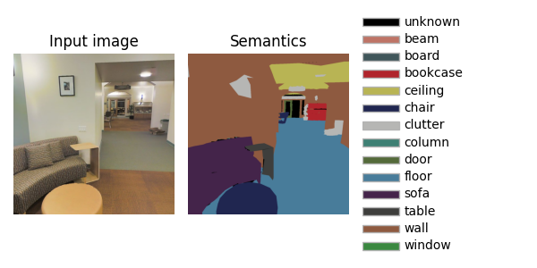

---
title:  'Semantic segmentation'
author:
- Jeremy Fix
keywords: [PyTorch tutorial, semantic segmentation, Stanford 2D-3D S]
...

## Objectives

The objective of this lab work is to implement and explore convolutional neural networks for semantic segmentation. **Semantic segmentation** seeks to learn a function $f$, parametrized by $\theta$ which takes as input a colored image $I$ of arbitrary shape $H\times W$ and outputs an images of labels of the same shape $H \times W$ than the input. Indeed, we seek to label every single pixel of the image as belonging to one of $K$ predefined classes.

In this labwork, we will be working with the large [Stanford 2D-3D S dataset](http://buildingparser.stanford.edu/dataset.html). This dataset is built from 3D scans of buildings with multiple annotation types (pixelwise depth, pixel class, pixelwise normals, scene category). We will consider only the pixelwise class labeling. The data have been collected in 6 different areas. 

| Area | Number of images|
| ---  | --- |
| 1    | 10,327 |
| 2    | 15,714 |
| 3    | 3,704 |
| 4    | 13,268 |
| 5    | 17,593 |
| 6    | 9,890 |
| **Total** | 70,496 |

Below is an example of the input RGB image and the associated labels 

{width=50%}

There are $14$ classes, the first being for the unlabeled pixels.

## Setup and predefined scripts

For this lab work, you are provided with environment setup files, either a [environment.yml](./labs/01-pytorch-segmentation/environment.yml) if you are using conda and a [requirements.txt](./labs/01-pytorch-segmentation/requirements.txt) file if you are a pipenv/pip/virtualenv/etc..

On the CentraleSupelec clusters, I advise you to use virtualenv as conda requires a lot of dependencies to be installed and can sometimes be cumbersome.

``` console
sh11:~:mylogin$ python3 -m pip install virtualenv --user
sh11:~:mylogin$ virtualenv -p python3 $TMPDIR/venv
sh11:~:mylogin$ source $TMPDIR/venv/bin/activate
(venv) sh11:~:mylogin$  python -m pip install -r requirements.txt
```
<!--
> sh11:~:mylogin$ export PATH=PATH:/opt/conda/bin
> sh11:~:mylogin$ conda env create -f environment.yml
> sh11:~:mylogin$ source activate dl-lectures-pytorch-segmentation
-->

If your enviromnent is correctly created and activated, the following should work 

```console
(venv) sh11:~:mylogin$ python -c "import torch; print(torch.__version__)"
1.10.1+cu113
```

Your are also provided with some base code :

- [data.py](./labs/01-pytorch-segmentation/data.py) : script responsible for dataset and dataloader building
- [models.py](./labs/01-pytorch-segmentation/models.py) : script holding the models zoo
- [metrics.py](./labs/01-pytorch-segmentation/metrics.py) : script for the definition of custom metrics
- [main.py](./labs/01-pytorch-segmentation/main.py) : the main script orchestrating the call to all your functions for training and inference
- [utils.py](./labs/01-pytorch-segmentation/utils.py) : several utilitary functions for colorize segmentation masks
- [test_implementation.py](./labs/01-pytorch-segmentation/test_implementation.py) : a script with unit tests to test your answers to the code questions


## Data exploration

You are provided with the `StanfordDataset` class which is a pytorch dataset object, i.e. an object implementing the `__len__` and `__getitem__`  methods. The constructor expects follows the [VisionDataset](https://pytorch.org/vision/stable/generated/torchvision.datasets.VisionDataset.html) interface and expects :

- a root directory for the data (e.g. `/mounts/Datasets4/Stanford2D-3D-S/`)
- either a pair of `transform` and `target_transform` function, or a combined `transforms` function for transforming the RGB input and the semantic mask
- an optional list of `areas` to restrict to, e.g. `area = ['1', '5b']` 

**Question**: For our problem, what is the dimensionality and type of the tensors you expect for the input and targets ?

**Question** : Instantiate your dataset and check that your guess is correct on one of the samples.

If you were to plot the distribution of the classes over the $71000$ masks of size $1080\times 1080$, the relative proportion of the labels are $1.26\%$, $1.57\%$, $2.71\%$, $7.17\%$, $9.94\%$, $3.87\%$, $11.23\%$, $3.05\%$, $10.98\%$, $8.45\%$, $0.33\%$, $2.88\%$, $33.67\%$, $2.88\%$ which is really unbalanced. These figures are ordered the same than the labels on the image at the top, hence $33.67\%$ of the labeled pixels are "wall", and only $0.33\%$ are "sofa". There are several ways to combat this imbalance. One could be in the data sampler when the minibatches are built. Another one is to use an adapted loss function. More on that later in the [loss](#loss-implementation) section. 

**Question** : Some of the labels in the dataset are noisy. For example, check the input image and mask of the image indexed $2702$ (of the area 5a), corresponding to the filename `area_5a/data/semantic/camera_ff5f377af3b34354b054536db27565ae_hallway_7_frame_4_domain_semantic.png`. This noise in the oracle, as well as the one possibly induced by the unknow class, has to be kept in mind as this will certainly prevent a perfect generalization. 

The noise in the orcale may also leads to divergence of the cross entropy loss. Since the cross entropy loss read $-log(p_{y_i})$, if the labels are noisy and your model is super good, the probably of the incorrectly labeled pixels will make the loss diverge.

``` console
(venv) sh11:~:mylogin$ python data.py --area 5a --datadir /mounts/Datasets4/Stanford2D-3D-S
```

## Data pipeline

The data are loaded and the dataloaders are built by calling `get_dataloaders` from the `data` module.

The raw images have a size of $1080 \times 1080$. If we keep large images, the minibatches and their successive transformations will occupy a large space in GPU memory. At least, we can resize the images, e.g. to $256\times 256$, and still keep reasonnable segmentations.

In addition to resize images to a smaller size, we can add data augmentation in our pipeline. Remember, data augmentation is a set of transforms applied to the input which have a predictable influence on the output.

For semantic segmentation, several can be considered, such as [RandomCrop](https://albumentations.ai/docs/api_reference/augmentations/crops/transforms/#albumentations.augmentations.crops.transforms.RandomCrop), [HorizontalFlip](https://albumentations.ai/docs/api_reference/augmentations/transforms/#albumentations.augmentations.transforms.HorizontalFlip), [MaskDropout](https://albumentations.ai/docs/api_reference/augmentations/dropout/mask_dropout/#maskdropout-augmentation-augmentationsdropoutmask_dropout), [CoarseDropout](https://albumentations.ai/docs/api_reference/augmentations/dropout/coarse_dropout/#coarsedropout-augmentation-augmentationsdropoutcoarse_dropout). You can have a look at the list of transforms provided by albumentation [here](https://albumentations.ai/docs/getting_started/transforms_and_targets/).

<div class="w3-card w3-sand">
The transforms are organized into modules with albumentations, e.g. [CoarseDropout](https://albumentations.ai/docs/api_reference/augmentations/dropout/coarse_dropout/#coarsedropout-augmentation-augmentationsdropoutcoarse_dropout) is defined in `albumentations.augmentations.dropout.coarse_dropout.CoarseDropout`. However, the code of albumentations imports all the classes of the submodules recursively on the parent `__init__.py` script. Hence, the coarse dropout (and all the others) can be simply created by calling `A.CoarseDropout()` if you `import albumentations as A`.
</div>

In the provided code, the data loading pipeline simply :

- scales the image by $255$ with [albumentation.Normalize](https://albumentations.ai/docs/api_reference/augmentations/transforms/#albumentations.augmentations.transforms.Normalize)
- transforms the numpy image into a pytorch tensor with [albumentation.ToTensorV2](https://albumentations.ai/docs/api_reference/pytorch/transforms/#albumentations.pytorch.transforms.ToTensorV2) 
 
**Question** In the `train` function of the main script, implement the data augmentation operations you identified as relevant. For testing visually your data augmentation pipeline, you can implement your data augmentation pipeline in the `data.py:test_augmented_dataset` function and evaluate the `data.py` script to see the results. Once satisfied, you can inject your augmentations in the `main.py` script.

**Question** How would you quantify the quality of the hyperparameters of your augmentation pipeline ? 

## Model implementation

The parametric model you learn takes as input a 3-channel image and outputs a probability distribution over the $14$
classes. There has several several propositions in the litterature to adress this problem such as FCN [@Long2015], UNet [@Ronneberger2015], VNet [@Milletari2016], SegNet[@Badrinarayanan2017], DeepLab v3+ [@Chen2018]. In this labwork, I propose we code the UNet of 2015 and you might want to implemented DeepLabv3+ as a homework :)

UNet is a fully convolutional network (FCN), i.e. involving only convolutional operations (Conv2D, MaxPool , ...; there is no fully connected layers). 

**Question** What does it mean that UNet is a fully convolutional network ? What does it mean with respect to the input image sizes it can process ? 

**Question** For minibatch training, what is the constraint that we have on the input image sizes ?

The name U-Net comes from the very specific shape of this encoder-decoder network with a contracting pathway for the
encoding following by an expanding pathway for the decoding. The contracting pathway is expected to learn higher and
higher level features as we progress deeper in the network and the expanding pathway to merge these highlevel features
with the finer grain details brought by the encoder through skip layer connections.

{width=50%}


The provided code implements `UNet` with a `UNetEncoder` class and a `UNetDecoder` class. Both the UNetEncoder and
UNetDecoder relies on repetition of blocks which are UNetConvBlock on the one hand and UNetUpConvBlock on the other
hand.

**UNetEncoder** This downsampling pathway is made of :

- several `UNetConvBlock` blocks where the $i$-th ($i \in [0, \#blocks-1]$) block is made of:
	- `block1`=Conv($3\times 3$)-ReLU-BatchNorm, with $64 \times 2^i$ channels 
	- `block2`=Conv($3\times 3$)-ReLU-BatchNorm, with $64 \times 2^i$ channels and 
	- `block3`= MaxPooling($2\times 2$),
- followed by a Conv($3\times 3$)-ReLU-BatchNorm, with $64 \times 2^{\#blocks}$ channels

Note that the output of `block2`, just before the downsampling is transmitted to the decoder stage, therefore the `UNetConvBlock` forward function outputs two tensors : one to be propagated along the encoder and one to be transmitter to the decoder.

**Question** In the `models.py` script, implement the code in the `UNetEncoder` and `UNetConvBlock` classes. Check your code running the unit tests. Be sure to understand how the propagation is performed through the encoder blocks.

The output of the final layers of the encoder is a tensor of shape $(batch, 64\times 2^{\#blocks}, H/2^{\#blocks}, W/2^{\#blocks})$

**UNetDecoder** This upsampling pathway is made of :

- a first Conv($3\times 3$)-ReLU-BatchNorm block which keeps constant the number of channels,
- followed by several `UNetUpConvBlock` blocks with :
	- `upconv`=UpSample($2$)-Conv($3\times 3$)-ReLU-BatchNorm which halves the number of channels, 
	- a concatenation of the upconv output features with the encoder features
	- a `convblock`= Conv($3\times 3$)-ReLU-BatchNorm-Conv($3\times 3$)-ReLU-BatchNorm which halves the number of its input channels

For the `UNetUpConvBlock`, when its input along the decoder pathway has $c_0$ channels, its output has $c_0/2$ channels since :

- upconv outputs $c_0/2$ channels
- the concatenation of $c_0/2$ channels with the $c_0/2$ channels of the encoder leads to $c_0$ channels
- the `convblock` gets $c_0$ input channels and outputs $c_0/2$ output channels

In order to output a score for each of the $14$ classes, the very last layer of the decoder is a Conv($1\times 1$) with the same number of channels than the number of classes.

**Question** In the `models.py` script, implement the code in the `UNetDecoder` and `UNetUpConvBlock` classes. Check your code against the unit tests. Be sure to understand how the propagation is performed through the decoder blocks.

Once both the encoder and decoder classes are implemented, you can see that the `UNet` class is a simple wrapper around them.

**Question** In the `models.py` script, within the `main()` function, write a piece of code for propagating a dummy tensor within your model. Is the output tensor the shape you expect ?

We are done with the model implementation, let us move on to the metrics and loss.

## Evaluation metrics

Semantic segmentation is a multi-way classification task; One natural metric could be the accuracy but, if you remember, our classes are unbalanced. 

**Question** What would be the accuracy of a predictor always predicting that a pixel is a wall ? Hint: some figures were given in the [data exploration](#data-exploration) section.

<!--

Given we have 33.67% of the pixels that are wall, only these ones will be correctly classified hence an accuracy of 33.67%

-->

To prevent to be mislead, a metric taking care of the class imbalance is the macro F1 score which reads

$$
F1 = \frac{1}{K}\sum_{k=0}^{K-1} \sum_{i=0}^{N-1} \frac{TP(x_i, y_i, k)}{TP(x_i, y_i, k) + \frac{1}{2}(FP(x_i, y_i, k)+FN(x_i, y_i, k))}
$$

which is an $F1$ computed for every class and then averaged over the number of classes. 

**Question** What would be the macro F1 of a model always predicting a wall class ?

<!-- 

We need to compute the F1 for every class

For the wall class, 33.67% of the pixels are TP, all the others (66.33%) are FP hence the F1 is  33.67 / (33.67 + 0.5 * (66.33 + 0)) => F1 = 0.5
For the other classes, as the predictor predicts always wall, there are no positives for the prediction so TP = FP = 0; All the samples are either TN or FN , hence F1 = 0 / (0 + 0.5 * (0 + FN)) = 0     Actually, the FN, which are not necessary to know for the F1 estimation, are class dependent 

FN_unknown = $1.26\%$, FN_beam = $1.57\%$, FN_board = $2.71\%$, ....

At the end of the day, the macro F1 is      1/14 * (0.5 + 13 * 0) = 0.5 / 14. = 0.04

-->

In the provided code the macro F1 is computed both on the training and validation folds. 

**Question** Do you see in the `main.py` script where this metric is computed and what is the use of the macro F1 on the validation fold ?

## Loss implementation

We decided the macro F1 measure is the one to be optimized. Unfortunately, it does not bring in interesting information for a gradient based optimization.

**Question** According to you, why it is useless to use the F1 computed above for the gradient descent optimization of the parameters of our neural network ?

<!--

The F1 metric as computed above is really flat , piecewise constant and therefore it is gradient is not informative on the direction to follow

-->

We need a differentiable proxy to that metric. This is still an open area of research (see for example [@Yeung2022]). Some of the options we will consider here are to use :

- a class balanced loss [@Cui2019], e.g. a weighted cross entropy loss 
- a focal loss [@Lin2017]

Other options could be to consider a Dice loss, a Tversky loss, a combination of these, or to use a batch sampler which could oversample the samples with the minority classes, etc ...

Similarly to a batch sampler, a weighted cross entropy loss will put higher importance on the minority classes compard to the majority classes. The weighted cross entropy loss for a single pixel of class $y$ with predicted probabilities $\hat{y}_k, k \in [0, K-1]$ is given as:

$$
wBCE(y, \hat{y}) = - w_{y} \log(\hat{y}_y)
$$

where the standard cross entropy loss is obtained with $w_k = 1, \forall k \in [1, K]$.

**Question** Which values of the weights would you suggest to fight against class imbalance ? Some classical strategies are discussed in p2 of [@Cui2019] as well as their own scaling strategy. From the pytorch [documentation on the cross entropy loss](https://pytorch.org/docs/stable/generated/torch.nn.CrossEntropyLoss.html), do you see how to specify these weights ? 

<!--

We need to put more importance on the minority classes compared to the majority classes. 

One basic option is to use w_k equals to the inverse of the frequency of the class although some suggest to take the square root of that, and then maybe to normalize the w_k in order to really have :

w_k = (\sum_i n_i)/n_k  where n_k is the number of samples per class thereofre we get the inverse of the relative ratio of the class

-->

**Question** Modify your code to implement the weighted cross entropy with the weighting strategy you choose.

Another option for the loss is the focal loss which adds a factor in front of the cross entropy loss term :

$$
focal(y, \hat{y}) = -(1-\hat{y}_y)^\gamma \log(\hat{y}_y)
$$

with $\gamma \geq 0$ a tunable parameter. Setting $\gamma=0$, we recover the cross entropy loss. With higher $\gamma$, correctly classified pixels have less and less influence, therefore if the most abundant labels are correctly predicted, they barely influence the loss despite their presence in excess. Compared to the cross entropy loss, each term in the focal is penalized by $$(1-\hat{y}_y)^\gamma$$ You can look at [@Lin2017] to see the influence of $\gamma$ on this term or check [this plot](https://www.wolframalpha.com/input?i=plot+%281-x%29%5E5+and+%281-x%29%5E2+and+%281-x%29+from+0+to+1).

**Question** As it can be tricky to implement the focal loss, it is given to you. Do you see where this is implemented and which argument of the main script allows to use it ?


## Training on a small subset

It is now time to run a training of your model. The training script accepts a list of areas ot train on with the `--areas_train` option. It is always a good idea to test on a small experiment to ensure everything is running well. You can run a training on `area_3` by calling :

```bash
python main.py --areas_train 3 --model .... --loss ... train
```

This training is not expected to lead to super performant models but should run at $1$ or $2$ minutes per epoch. Depending on the GPU you are using, you may need to reduce the footprint on the GPU's memory, e.g. lowering the input image size, reducing the number of blocks of the encoder and decoder, ...


<div class="w3-card w3-sand">
Training over all the areas can take up to $1$ hour per epoch. If you use the CentraleSupelec clusters, you can consider running a training over all the areas **during your "free" time** with [slurm batch job](https://dce.pages.centralesupelec.fr/05_examples/#starting-batch-trainings-of-neural-networks). For this you are provided with a [job.py](./labs/01-pytorch-segmentation/job.py) script. For now, let us move on to the next topics.
</div>


**Question** : While the simulation is running, several information (metrics, inference exemples, ...) are dumped into a tensorboard. Take the time to visualize and understand them. 


## Inference

As training can take a long time, you are provided with a pretrained UNet. This model has been pretrained on areas 1, 2, 3, 4 and 6. Therefore the areas 5a and 5b were excluded from training to be considered for testing only, although area 5a has been selected for validation (early stopping). Training has been done for $100$ epochs, took 7 hours to complete although the best model has been found after $2$ hours or so. You can download the pretrained model [unet-10610_0.onnx](http://www.metz.supelec.fr//metz/personnel/fix_jer/Deep/unet-10610_0.onnx). 

The main script allows for testing on either a single image or whole areas. Check the arguments of 

```bash
python main.py test --datadir ... --model ... --modelpath ... --areas_test ... ... 
```


<div class="w3-card w3-sand">
When you just want to use a model for inference, you have multiple possibilities to export your model :

- use pytorch eager mode : this is what you do when you dynamically apply operations as nn.Module,
- use [torchscript](https://pytorch.org/tutorials/recipes/torchscript_inference.html) : this is more efficient than eager mode; You loose the dynamic computational graph but you earn performance. You can also infer with Torhscript C/C++ which is even faster than Torchscript python,
- use [Onnx runtime](https://onnxruntime.ai/) which is a framework independent (no pytorch, tensorflow, etc..) computational graph evaluator available for various languages and platforms (e.g. Python, C++ but also for mobiles, embedded in web apps, ..)

In addition to even better performances (throughput and latency), the onnx format is perfect for abstracting the algorithm at its pure level of description without bells and whistles : a computational graph. 

</div>

**Question** Visualize the computational graph with [netron.app](https://netron.app/)

**Question** Can you identify in the `main.py` script where the model is exported with onnx. Reading [the doc on torch.onnx.export](https://pytorch.org/docs/stable/onnx.html#torch.onnx.export) do you understand what is the meaning of the arguments we provided to the call ?

**Question** Can you identify in the `main.py` script where and how inference is performed with the onnx model ? Can you find more info on the package that is used for inference ?

**Question** Evaluate the quality of the pretrained model on both the training areas (1, 2, 3, 4 and 6) and on the unused areas `5a` and `5b`.

<!--
For now - october 26rd, 2022 - the performances are not fantastic and the model : around 0.8 for the macro F1 on 5a and 0.48 on 5b.
-->

**Question** Your model can be evaluated on images of arbitrary sizes (width, height). Why do you think this is the case ? 

<!-- 
As our model is fully convolutional, it can be applied to images of any size. Since it does not contain any dense layers and only convolutional operations, there is no need to transform the image to a fixed image size.

-->

**Question** Take a picture with your phone, from the web, from the test area in the dataset directory and check the results of inference on this image. Note that the `main.py` script accepts a `--image` instead of a `--datadir ..` to process a single image.


## Going further

There are several directions along which you could pursue the study of semantic segmentation. One is about the models. The U-Net architecture we consider has been release in 2015. You might be interested in implementing more recent architectures such as VNet [@Milletari2016] or DeepLab v3+ [@Chen2018]. Another direction of study is on the losses. We explored some ways to fight against class imbalance with the weighted cross entropy loss and the focal loss. You might be interested in exploring over losses, such as the Tversky loss, the DICE loss, the Lovasz loss, the Matthews Correlation Coefficient loss [@Abhishek2021]. It is interesting to implement your know loss but you might be interested in packages already implementing them such as [smp](https://smp.readthedocs.io/en/latest/losses.html)

In terms of deployment, you could also push a little further the work by serving the onnx model with a webapi that could be requested with an image to label. Probably more on this soon.

## A possible solution

You will find a possible solution in the [LabsSolutions/01-pytorch-segmentation](https://github.com/jeremyfix/deeplearning-lectures/tree/master/LabsSolutions/01-pytorch-segmentation) directory.


## References
