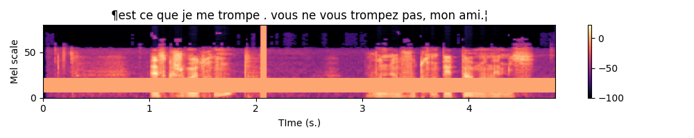

---
title:  'Automatic Speech Recognition'
author:
- Jeremy Fix
keywords: [PyTorch tutorial, Automatic Speech recognition, speech to text]
...

## Objectives

In this labwork, you will be experimenting with various recurrent neural networks for addressing the quite exciting problem of transcribing in text was is said in an audio file, a so called [Automatic Speech Recognition (ASR)](https://en.wikipedia.org/wiki/Speech_recognition) task.

The data we will be using are collected within the [Mozilla common voice](https://commonvoice.mozilla.org/) which are multi-language datasets of audio recordings and unaligned text transcripts. At the time of writing, the v15 corpus contains 2500 hours in English and almost 1000 hours in French. You can contribute yourself by either recording or validating recordings. Although we will be using Common Voice, there are [several other datasets you might interested in](https://www.afcp-parole.org/ressources/corpus-et-outils/corpus/) if you work on ASR.

You will be experimenting with the Connectionist Temporal Classification model (CTC) as introduced in [@Graves2014], which is the basis of the Deep Speech models (proposed by Baidu research[@Amodei2015] and also implemented by [Mozilla](https://github.com/mozilla/DeepSpeech)). Soon or later, this labwork might be extended to encompass Seq2Seq with attention as introduced in the Listen Attend and Spell [@Chan2016].

Throughout this labwork, you will also learn about dealing with the specific tensor representations of variable length sequences.

## Lab work materials

### Starter code

During this lab work, it is unreasonable to ask you to code everything from scratch. Therefore, we provide you with some starter code that is supposed to help you to work on the interesting parts.

**Download** the starter codes below but do not spend too much time digging into them for now (we will discuss them step by step). All these files are expected to be placed in the same directory.

- [data.py](./labs/02-pytorch-asr/data.py) : code performing data loading and preprocessing
- [models.py](./labs/02-pytorch-asr/models.py) : code defining the neural network architectures
- [main_ctc.py](./labs/02-pytorch-asr/main_ctc.py) : code containing the training and testing functions
- [train-v15.0-1-5.idx](./data/02-pytorch-asr/train-v15.0-1-5.idx), [test-v15.0-1-5.idx](./data/02-pytorch-asr/test-v15.0-1-5.idx), [dev-v15.0-1-5.idx](./data/02-pytorch-asr/dev-v15.0-1-5.idx) : files with the indices of the CommonVoice **v5 fr** dataset filtered between 1s. and 5.
- [test_implementation.py](./labs/02-pytorch-asr/test_implementation.py) : "unitary tests" for testing your answers to the exercices

### Installing a virtual environment

You can use the [requirements.txt](./data/02-pytorch-asr/requirements.txt) file to install your virtual environment.

```{.console}
mymachine:~:mylogin$ python3 -m venv $TMPDIR/venv
mymachine:~:mylogin$ source $TMPDIR/venv/bin/activate
(venv) mymachine:~:mylogin$ python -m pip install -r requirements.txt
```

### Pre-installed environments (for users on the DCE)

For the users of the DCE, we provide pre-installed conda environments which you can load by executing the following commands (as the conda environment is 5Go, it might take 5 minutes to copy). At the time of writting (january 2024), it does not seem to work due to some permission denied to be debugged.

```{.console}
mymachine:~:mylogin$ source "/opt/conda/etc/profile.d/conda.sh"
mymachine:~:mylogin$ mkdir -p $TMPDIR/my_env
mymachine:~:mylogin$ tar -zxf /mounts/Datasets3/SharedConda/3MD4040-asr-py3.9.tar.gz -C $TMPDIR/my_env
mymachine:~:mylogin$ source $TMPDIR/my_env/bin/activate 
(my_env) mymachine:~:mylogin$ cd ~
```

Note that the two `source` commands must be repeated in any new shell session.

As we use UTF-8 encoding, your shell must be able to interpret these symbols :

```{.console}
mymachine:~:mylogin$ echo $LANG
```
and set it if necessary (e.g. `export LANG=en_US.UTF-8`)

### Installing the environment with conda (for the other users)

We provide a yaml file for creating a conda environment suitable for performing the labwork. That conda environment can installed with the [pytorch-asr-py3.9.yaml](./labs/02-pytorch-asr/pytorch-asr-py3.9.yaml) environment file.

With [conda](https://docs.conda.io/en/latest/miniconda.html) installed, you should run :

```{.console}
mymachine:~:mylogin$ conda env create -f pytorch-asr-py3.9.yaml
mymachine:~:mylogin$ conda activate pytorch-asr-py3.9
(pytorch-asr-py3.9) mymachine:~:mylogin$ 
```

As we use UTF-8 encoding, your shell must be able to interpret these symbols :

```{.console}
(pytorch-asr-py3.9) mymachine:~:mylogin$ echo $LANG
```
and set it if necessary (e.g. `export LANG=en_US.UTF-8`)


## Setting up the dataloaders

In the CommonVoice dataset, you are provided with MP3 waveforms, usually sampled at 48 kHz (sometimes, slightly less on the version 6.1 corpus) with their unaligned transcripts. Unaligned means the annotation does not tell you when each word has been pronounced. No worries, the CTC model is designed to deal with non aligned sequence to sequence.

The data are therefore : a waveform as input and a sequence of characters for the output. These two signals will be processed :

- instead of taking as input the waveform (that we will resample at 16kHz), we will be computing a spectrogram in Mel scale
- the characters will be filtered (to remove some variability) and converted to lists of integers

And these signals need to be stacked in mini-batch tensors. For doing so, you will have to fill in the `data.py` script but before doing so, let us discuss some details. From a general point of view, it contains :

- load_dataset : the function for loading the CommonVoice datasets
- CharMap : the object in charge of performing the encoding/decoding from the characters to the integer representation
- WaveformProcessor : the object transforming the waveforms to the spectrograms
- BatchCollate : the object in charge of stacking multiple spectrograms and multiple encoded transcripts
- get_dataloaders : the function returning the train, valid and test dataloaders
- plot_spectro : a function for easily plotting a spectrogram and its transcript

The end result of this module is essentially the get_dataloaders which, by making use of the other functions/objects, build up the iterable minibatch collections. The CharMap will also be useful for converting the transcripts to and from their integer representations.

### Integer representations of the transcripts

The transcripts are encoded into integers and decoded from integers thanks to a vocabulary in the CharMap object, representend as the char2idx dictionnary and idx2char list. Let us play a little bit with this object.

**Exercice** Which function call gives you the vocabulary size ? What is this vocabulary size ? What is the encoding of the sentence "Je vais m'éclater avec des RNNS!". What do you obtain if you decode the encoded sentence ? Does it make sense to you ? The code you write for answering these questions is expected to be written within the `data.py` script in dedicated functions called within the *main* block :

```{.python}

if __name__ == '__main__':
    question1()
    question2()
    ...

```

<!--

vocab_size : 44
"[16, 27, 22, 1, 39, 18, 26, 36, 1, 30, 3, 22, 20, 29, 18, 37, 22, 35, 1, 18, 39, 22, 20, 1, 21, 22, 36, 1, 35, 31, 31, 36, 1, 5, 2]"
"¶je vais m'eclater avec des rnns .|"
-->


### Transforming the waveforms into spectrograms

Let us now have a look to the waveforms. Usually the models do not take the raw waveforms as input but preprocess them by computing a spectrogram using a short time fourier transform (STFT). The obtained spectrogram is then converted in logmel scale.

{width=100%}

**Exercice** In the WaveformProcessor, fill-in the code in the constructor for initializing the `transform` attribute. It must be a `torch.nn.Sequential` with the [MelSpectrogram](https://pytorch.org/audio/stable/transforms.html#melspectrogram) followed by a [conversion to DB](https://pytorch.org/audio/stable/transforms.html#amplitudetodb). To validate your implementation, run the script `test_implementation.py`, the corresponding test should pass.

You can test your code with the following

```{.python}

import matplotlib.pyplot as plt

def test_spectro():
    dataset = load_dataset("train",
                           _DEFAULT_COMMONVOICE_ROOT,
                           _DEFAULT_COMMONVOICE_VERSION)

    # Take one of the waveforms 
    idx = 10
    waveform, rate, dictionary = dataset[idx]
    waveform = waveform.transpose(0, 1)  # (B, T) to (T, B) as expected by WaveformProcessor

    win_step = _DEFAULT_WIN_STEP*1e-3
    trans_mel_spectro = WaveformProcessor(rate=rate,
                                          win_length=_DEFAULT_WIN_LENGTH*1e-3,
                                          win_step=win_step,
                                          nmels=_DEFAULT_NUM_MELS,
                                          augment=False,
										  spectro_normalization=None)
    mel_spectro = trans_mel_spectro(waveform).squeeze()  # (T, 1, N_MELS) to (T, N_MELS)

    fig = plt.figure(figsize=(10, 2))
    ax = fig.add_subplot()

    im = ax.imshow(mel_spectro.T,
                   extent=[0, mel_spectro.shape[0]*win_step,
                           0, mel_spectro.shape[1]],
                   aspect='auto',
                   cmap='magma',
                   origin='lower')
    ax.set_ylabel('Mel scale')
    ax.set_xlabel('TIme (s.)')
    ax.set_title('Log mel spectrogram')
    plt.colorbar(im)
    plt.tight_layout()
    plt.show()

```

### Collating variable size spectrograms and transcripts in minibatches

We know how to convert the transcripts into tensors of integers, we know how to convert waveforms to spectrograms, it remains to collate together multiple samples into minibatches but there are two difficulties :

- the waveforms have different time-spans and therefore their spectrograms have different time-spans
- the transcripts have different time-spans 

To represent sequences of variable length, pytorch provides you with the [PackedSequence](https://pytorch.org/docs/stable/generated/torch.nn.utils.rnn.PackedSequence.html) datatype. We will not dig into the implementation details of this data structure. Sufficient to say that you are not expected to create PackedSequence directly but use the [pad_packed_sequence](https://pytorch.org/docs/stable/generated/torch.nn.utils.rnn.pad_packed_sequence.html) and [pack_padded_sequence](https://pytorch.org/docs/stable/generated/torch.nn.utils.rnn.pack_padded_sequence.html) functions. Let us see these in actions on one example :

```{.python}

def ex_pack():
    import random
    from torch.nn.utils.rnn import pad_sequence, pack_padded_sequence, pad_packed_sequence

    batch_size = 10
    n_mels = 80
    max_length = 512
    # Given a list of batch_size tensors of variable sizes of shape (Ti, n_mels)
    tensors = [torch.randn(random.randint(1, max_length), n_mels) for i in range(batch_size)]

    # To be packed, the tensors need to be sorted by
    # decreasing length
    tensors = sorted(tensors,
                     key=lambda tensor: tensor.shape[0],
                     reverse=True)
    lengths = [t.shape[0] for t in tensors]

    # We start by padding the sequences to the max_length
    tensors = pad_sequence(tensors)
    # tensors is (T, batch_size, n_mels)
    # note T is equal to the maximal length of the sequences

    # We can pack the sequence
    # Note we need to provide the timespans of the individual tensors
	packed_data = pack_padded_sequence(tensors, lengths=lengths)

    # Later, we can unpack the sequence
    # Note we recover the lengths that can be used to slice the "dense"
    # tensor unpacked_data appropriatly
	unpacked_data, lens_data = pad_packed_sequence(packed_data)

```

Note that you may want to use usual "dense" tensors, padding at the end your tensors of variable size, but that is not a good idea because 1) the processing on the GPU can be limited to just the right amount if it knows the length of the sequences, 2) padding at the end is not a big deal with unidirectional RNNs but can possibly be a problem with bidirectional RNNs.

**Exercice** Equipped with these new PackedSequence tools, you now have to work on the build up of the minibatches by filling in the missing code in the BatchCollate class. To validate your implementation, the dataloaders test in the `test_implementation.py` script should pass.


After completion, write a little piece for testing which should : 1) access a minibatch of one of your dataloader, 2) plot the spectrograms associated with their transcripts. For the plot part, you can make use of the `plot_spectro` function (in data.py).

Below is an example expected output :

{width=75%}

### Final remarks about dataloading

As a final note on the data loading part, you may notice that in the `get_dataloaders` function, the BatchCollate object are created with **normalization coefficients** of the spectrogram. I hard-coded the mean and variance. This is dirty, I agree, but that's speeding up your ability to experiment since otherwise it takes quite a while to compute these values. Nevertheless, keep this in mind that if you experiment with some other data, you may need to uncomment the code computing these normalization coefficients.

Also, please note that the train-v1.idx, dev-v1.idx and test-v1.idx files are precomputed to contain the list of the datasamples that have a duration between 1s. and 5s. In case you want to modify these timelengths in the get_dataloaders, you may need to remove these idx files so that they regenerated (see the DatasetFilter object).

## Connectionist Temporal Classification (CTC)

Now that our data are ready, it is time to setup our first model. The Connectionist Temporal Classification approach is based on a multi-layer recurrent neural network taking as input the successive frames of the spectrogram and outputting, at every time step, a probability distribution over the vocabulary to which we add a $\epsilon$ blank character. The CTC model is outputting one character at every iteration, therefore, it produces an output sequence of the same length of the input sequence, possibly with some $\epsilon$ blank characters and also some duplicated characters. The labeling, though, is constrained to be of length smaller than the input (the RNN transducer overcomes that possible constraint).

{width=80%}

It also uses a specific loss which estimates the likelihood of the transcript, conditioned on the spectrogram, by summing over the probabilities of all the possible alignments with the blank character. Given a spectrogram $x$ and a transcript $y$ (e.g. ['t','u','_', 'e', 's']), its probability is computed as :

$$
p(y | x) = \sum_{a \in \mathcal{A}_{|x|}(y)} h_\theta(a | x) = \sum_{a_j \in \mathcal{A}_{|x|}(y)} \prod_t h_\theta(a_t | x)
$$

where $A_n(y)$ is the set of all the possible alignments of length $n$ of the sequence $y$. For example, for the sequence $y=(t,u,\_, e, s)$, some elements of $A_6(y)$ are $(\epsilon, \epsilon, t, u, \_, e, s), (\epsilon, t, \epsilon, u, \_,e,s), (t, \epsilon, u, \_,e,\epsilon, s), (t, t, \epsilon, u, \_, e, s), ...$ and this is tricky to compute efficiently. Fortunately, the CTC loss is [provided in pytorch](https://pytorch.org/docs/stable/generated/torch.nn.CTCLoss.html).


### Defining the model

The model is built from:

- a spatial feature extraction stage with several 2D convolutional layers
- a temporal part with a bidirectionnal recurrent neural network
- a classification output stage 

One difficulty in defining this architecture in pytorch is that you must be specifying the "number of features" in the previous layer when you define your Conv2D, GRU and Linear layers. But have a breath or two and let us go.

#### The convolution stage

I propose you to use the implement the following architecture :

- **Spatial feature extraction** : 
	- Conv2D(32 kernels of size (41, 11), stride=(2,2), padding=(20, 5)) - BatchNorm - HardTanh(0, 20)  
	- Conv2D(32 kernels of size (21, 11), stride=(2,1), padding=(10, 5)) - BatchNorm - HardTanh(0, 20)  

**Exercice** If you spectrogram is a tensor of shape $(B=1, C=1, T=122, Mels=80)$, meaning one sample with one channel, $122$ time samples for $80$ mel scale frequencies, what is the size of the tensor you expect after forward propagating through the convolutional part ?

<!--
 
So in general, for (B, 1, Tx, nmels) , the output tensor is (B, 32, Tx//4, nmels//2)
because the time downsampling is 4 and the frequency downsampling is 2.

-->

**Exercice** Define in the constructor the *cnn* attribute. Test your implementation by calling `test_implementation.py`, the corresponding test should pass.


#### The recurrent stage

I propose you to use the implement the following architecture :

- **Recurrent neural network** :
	- 4 layers of bidirectionnal GRU with 1024 units in every layer

Note that, as usual, when you instantiate the RNN module, you need to provide the size of the its inputs. In the case of recurrent layers, even thought the input tensors do contain a temporal dimension, you do not count it when specifying the size of the input to the RNN. In other words, if your input tensors are $(B, T, C)$, the RNN constructor expects the input_size $C$.

**Exercice** Define in the constructor the *rnn* attribute. Test your implementation by calling `test_implementation.py`, the corresponding test should pass.

<!--

The RNN must be defined as GRU(32 * n_mels//2, ...)

-->

#### The output stage

I propose you to use the implement the following architecture :

- **Output classification**:
	- Linear(vocab\_size)

You also need to properly specify the input_size of the linear layer. Remember that you have bidirectional RNN layers. Note also that if the output tensor of the RNN is $(B, T, C)$, the expected input_size of the linear layer is $C$ since a prediction is produced at every time step.

**Exercice** Define in the constructor the *char_lin* attribute. Test your implementation by calling `test_implementation.py`, the corresponding test should pass.


### Forward propagation through the model

Now that the different parts of the model are defined, we need to handle the forward propagation which is almost straightforward except that we have to deal with the PackedSequences. The tensors should be unpacked before feeding in the feedforward components (convolutional, fully connected classification) and packed otherwise. Below is a depiction of the Tensor shapes through the pipeline.

{.bordered width=100%}


**Exercice** Fill in the forward method of the `models.py` script. Test your implementation by calling `test_implementation.py`, the corresponding test should pass.


### Instantiating the model and defining the optimizer

All right, we now move on the `main_ctc.py` script. This script will allow you to train and test your networks. You can open, read and run this script. It provides : 

- a training function for training a network with possibly customized parameters
- a testing function for testing a pretrained network on a waveform
- a main function handling the parameters

The script is almost complete, three steps remain to be done :

- instantiate your model in the `train` function  
- define an optimizer (I suggest you to use an Adam optimizer)

The other code should be already familiar. 

**Exercice** Instantiate the model and define the optimizer in the `train` function of the `main_ctc.py` script. For the parameters, have a look at the beggining of the `train` function.

## Experimentation with the CTC model

It is now time to experiment. I suggest you to proceed this way :

1- Try to overfit a single minibatch

2- Try to overfit the training by disabling any sort of regularization and finding an appropriate architecture

3- Try to improve the generalization performances by appropriately setting the regularization

These three steps are described in the next subsections.

### Overfitting a single minibatch

In order to ensure you do not have bugs in your implementation, a sanity check is to check you can overfit a single minibatch of your training set. If you are unable to fit a single minibatch, you are guaranteed to have an issue in your code. To just load one single minibatch, you can pass in the `--debug` argument when calling `main_ctc.py` :

```console
mymachine:~:mylogin$ python3 main_ctc.py train --debug --batch_size 16
```

You should pretty "quickly" see a null loss on the training set with a perfect decoding. Note that it still takes 2s. per minibatch and a hundred epochs for overfitting.

{.bordered}

### Overfitting the training set

The next step is to design a sufficiently rich architecture to overfit the training set when any sort of regularization is disabled (L2/L1, dropout, data augmentation, ...) :

```console
mymachine:~:mylogin$ python3 main_ctc.py train --scheduler
```

It takes approximately 11 minutes per epoch. The `--scheduler` activates the learning rate scheduling policy. It was disabled for the previous experiment, when overfitting a single minibatch, as it was decreasing the learning rate too quickly. The learning rate scheduler is applied every epoch, hance for every minibatch in the experiment of the previous section. Here, for overfitting the training set, it turns out it is necessary to activate the learning rate policy.

You should be able to get a null loss on the training set. Have a look on the tensorboard to observe overfitting. See below an example run.

{.bordered}

### Improving the generalization

#### Data augmentation with SpecAugment

It was recently suggested, in the [SpecAugment](https://arxiv.org/abs/1904.08779) paper [@Park2019] that a valuable data augmentation is to partially mask the spectrograms both in the frequency and time domains.

Fortunately, torchaudio already implements the necessary functions for masking both in the time and frequency domains. I invite you to check the torchaudio documentation about the [FrequencyMasking](https://pytorch.org/audio/stable/transforms.html#frequencymasking) and [TimeMasking](https://pytorch.org/audio/stable/transforms.html#timemasking) transforms. 

These transforms can be implemented within the data.WaveformProcessor object. Just be sure to add a flag to the constructor to decide if you want or not to include these transforms. These transforms should probably be included only in the training set.

Below is an example of the resulting spectrogram, masked in time for up to $0.5$ s. and the mel scale for up to $27$ scales.

{width=75%}

SpecAugment is already implemented in the `data.py` script. Have a look to the transform_augment attribute of WaveformProcessor. To use it, simply add the `--train_augment` argument when you call the main_ctc script.

#### Dropout

In the DeepSpeech paper, the authors suggest to add dropout layers in the convolutional part. The constructor of CTCModel receives a dropout argument which you can use to add Dropout2D layers after every HardTanh.

#### L1/L2 Regularization

To add L1 or L2 regularization, you can add a `penalty()` method to your CTCModel class that should return your penalty. If such a method exists the training function from deepcs called in main_ctc will call it.

### Testing on a new audioclip

To test of an audio clip, you can record yourself as a mp3 and call main_ctc :

```console
mymachine:~:mylogin$ python3 main_ctc.py test --modelpath a/path/to/a/best_model.pt --audiofile myclip.mp3
```

Beam search decoding can be activated adding the `--beamsearch` flag. By default, it will consider $10$ alternative decoding simultaneously.

If you used non default values for the other arguments (the ones for the model), you must provide them again. We need them in the test function for recreating the exact same model than the one used during training. Audio clips are provided in the test fold. You can check the list of the test audio clips with their transcripts in the `/mounts/Datasets4/CommonVoice/v15.0/fr/test.tsv` file.

If you do not have yet a trained model, you can download [the best_ctc_42077.pt](https://centralesupelec-my.sharepoint.com/:u:/g/personal/jeremy_fix_centralesupelec_fr/EScVCV_zdYZDpWXBlynPmMYBjCbXVDc0SkTuS6JRn43CSg?e=u7eUWF) checkpoint. This model can be tested with the command line below :

```console
mymachine:~:mylogin$ python main_ctc.py test --modelpath best_ctc_42077.pt --audiofile /mounts/Datasets4/CommonVoice/v15.0/fr/clips/common_voice_fr_37118026.mp3
Log prob    Sequence
7.82      ¶une contrefa❌on fut publiee en belgique.¦
```

The summary file of this run is given below. This model has been trained with SpecAugment, Dropout(0.5), L2 regularization (0.0001), gradient norm clipping with all the available audio clips. The training was performed for almost 4 days.

```markdown
## Summary of the model architecture
=================================================================
Layer (type:depth-idx)                   Param #
=================================================================
CTCModel                                 --
├─Sequential: 1-1                        --
│    └─Conv2d: 2-1                       14,464
│    └─BatchNorm2d: 2-2                  64
│    └─Hardtanh: 2-3                     --
│    └─Dropout2d: 2-4                    --
│    └─Conv2d: 2-5                       236,576
│    └─BatchNorm2d: 2-6                  64
│    └─Hardtanh: 2-7                     --
│    └─Dropout2d: 2-8                    --
├─GRU: 1-2                               64,929,792
├─Sequential: 1-3                        --
│    └─Linear: 2-9                       90,156
=================================================================
Total params: 65,271,116
Trainable params: 65,271,116
Non-trainable params: 0
=================================================================
 Wandb run name : amber-galaxy-55


## Executed command :
main_ctc.py --logname ctc_42077_0 --batch_size 128 --num_epochs 100 --base_lr 0.0001 --min_duration 0.0 --max_duration 60.0 --nlayers_rnn 4 --nhidden_rnn 1024 --weight_decay 0.0001 --dropout 0.5 --grad_clip 20 --datasetversion v15.0 --seed 12345 --train_augment --scheduler train

## Args : 
 Namespace(audiofile=None, base_lr=0.0001, batch_size=128, beamsearch=False, beamwidth=10, cell_type='GRU', command='train', datasetroot='/mounts/Datasets4/CommonVoice/', datasetversion='v15.0', debug=False, dropout=0.5, grad_clip=20.0
, logname='ctc_42077_0', max_duration=60.0, min_duration=0.0, modelpath=None, nhidden_rnn=1024, nlayers_rnn=4, nmels=20, nthreads=6, num_epochs=100, scheduler=True, seed=12345, train_augment=True, weight_decay=0.0001)
```

## Extras

### ESP-Net

If you are interested in automatic speech recognition, you might be interested in the [End-to-End speech processing toolkit](https://github.com/espnet/espnet).

### CTCLoss example

The CTC loss of pytorch accepts tensors of probabilities of shape $(T_x, Batch, vocab\_size)$ and tensors of labels of shape $(batch, T_y)$ with $T_x$ respectively the maximal sequence length of the spectrogram and $T_y$ the maximal length of the transcript. An example call is given below : 

```{.python}

def ex_ctc():
    # The size of our minibatches
    batch_size = 32
    # The size of our vocabulary (including the blank character)
    vocab_size = 44
	# The class id for the blank token (we take the default of the CTC loss)
    blank_id = 0

    max_spectro_length = 50
    min_transcript_length = 10
    max_transcript_length = 30

    # Compute a dummy vector of probabilities over the vocabulary (including the blank)
    # log_probs is (Tx, Batch, vocab_size)
    log_probs = torch.randn(max_spectro_length, batch_size, vocab_size).log_softmax(dim=2)
    spectro_lengths = torch.randint(low=max_transcript_length,
                                    high=max_spectro_length,
                                    size=(batch_size, ))

    # Compute some dummy transcripts
	# longer than necessary. The true length of the transcripts is given
	# in the target_lengths tensor
	# targets is here (batch_size, Ty)
    targets = torch.randint(low=0, high=vocab_size,  # include the blank character
                            size=(batch_size, max_transcript_length))
    target_lengths = torch.randint(low=min_transcript_length,
                                   high=max_transcript_length,
                                   size=(batch_size, ))
    loss = torch.nn.CTCLoss(blank=blank_id)

    # The log_probs must be given as (Tx, Batch, vocab_size)
    vloss = loss(log_probs,
                 targets,
                 spectro_lengths,
                 target_lengths)

    print(f"Our dummy loss equals {vloss}")

```

## A possible solution

You will find a possible solution in the [LabsSolutions/02-pytorch-asr](https://github.com/jeremyfix/deeplearning-lectures/tree/master/LabsSolutions/02-pytorch-asr) directory.

## References
