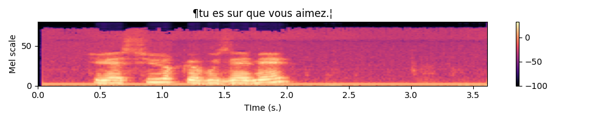

---
title:  'Automatic Speech Recognition'
author:
- Jeremy Fix
keywords: [PyTorch tutorial, Automatic Speech recognition, speech to text]
...

## Objectives

In this labwork, you will be experimenting with various recurrent neural networks for addressing the quite exciting problem of transcribing in text was is said in an audio file, a so called [Automatic Speech Recognition (ASR)](https://en.wikipedia.org/wiki/Speech_recognition) task.

The data we will be using are collected within the [Mozilla common voice](https://commonvoice.mozilla.org/) which are multi-language datasets of audio recordings and unaligned text transcripts. At the time of writing, there are almost 2000 hours in English and 700 hours in French. You can contribute yourself by either recording or validating recordings.

You will be experimenting with different models :

- Connectionist Temporal Classification (CTC) as introduced in [@Graves2014]
- Seq2Seq with attention as introduced in the Listen Attend and Spell [@Chan2016]

Through this labwork, you will also learn about dealing with the specific tensor representations of variable length sequences.

## Setting up the dataset

In the CommonVoice dataset, you are provided with MP3 waveforms, usually sampled at 48 kHz (sometimes, slightly less on the version 6.1 corpus) with their unaligned transcripts. Unaligned means the annotation does not tell you when each word has been pronounced. No worries, the two models from the literature can deal with non aligned sequence to sequence.

You will have to fill in the [data.py](./data/02-pytorch-asr/data.py) script but before doing so, let us discuss some details.

**Exercice** Complete the *data.py* script and write a little piece for testing which should : 1) access a minibatch of one of your dataloader, 2) plot the spectrograms associated with their transcripts. For the plot part, you can take inspiration from the following python code. Note you are provided with the `plot_spectro` function.

Below is an example expected output :

{width=75%}

## Connectionist Temporal Classification (CTC)

## Data augmentation with SpecAugment

It was recently suggested, in the [SpecAugment](https://arxiv.org/abs/1904.08779) paper [@Park2019] that a valuable data augmentation is to partially mask the spectrograms both in the frequency and time domains.

Fortunately, torchaudio already implements the necessary functions for masking both in the time and frequency domains. I invite to check the torchaudio documentation about the [FrequencyMasking](https://pytorch.org/audio/stable/transforms.html#frequencymasking) and [TimeMasking](https://pytorch.org/audio/stable/transforms.html#timemasking) transforms. 

Below is an example of the resulting spectrogram, masked in time for up to $0.5$ s. and the mel scale for up to $27$ scales.

{width=75%}

## Attention based recurrent neural network

## Going further

If you are interested in automatic speech recognition, you might be interested in the [End-to-End speech processing toolkit](https://github.com/espnet/espnet).

Also, to go further in terms of models, you might be interested in making use of a language model 
