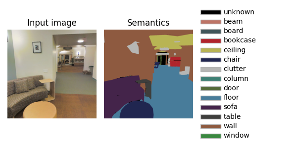

---
title:  'Semantic segmentation'
author:
- Jeremy Fix
keywords: [PyTorch tutorial, semantic segmentation, Stanford 2D-3D S]
...

## Objectives

The objective of this lab work is to implement and explore convolutional neural networks for semantic segmentation. **Semantic segmentation** seeks to learn a function $f$, parametrized by $\theta$ which takes as input a colored image $I$ of arbitrary shape $H\times W$ and outputs an images of labels of the same shape $H \times W$ than the input. Indeed, we seek to label every single pixel of the image as belonging to one of $K$ predefined classes.

In this labwork, we will be working with the large [Stanford 2D-3D S dataset](http://buildingparser.stanford.edu/dataset.html). This dataset is built from 3D scans of buildings with multiple annotation types (pixelwise depth, pixel class, pixelwise normals, scene category). We will consider only the pixelwise class labeling. The data have been collected in 6 different areas. 

| Area | Number of images|
| ---  | --- |
| 1    | 10,327 |
| 2    | 5,382 |
| 3    | 1,530 |
| 4    | 4,644 |
| 5    | 6,714 |
| 6    | 3,744 |
| **Total** | 25,434 |

Below is an example of the input RGB image and the associated labels 

{width=50%}

There are $14$ classes, the first being for the unlabeled pixels.

## Setup and predefined scripts

For this lab work, you are provided with environment setup files, either a [environment.yml](./data/01-pytorch-segmentation/environment.yml) if you are using conda and a [requirements.txt](./data/01-pytorch-segmentation/requirements.txt) file if you are a pipenv/pip/virtualenv/etc..

On the CentraleSupelec clusters, I advise you to use conda :

``` console
sh11:~:mylogin$ export PATH=PATH:/opt/conda/bin
sh11:~:mylogin$ conda env create -f environment.yml
sh11:~:mylogin$ source activate dl-lectures-pytorch-segmentation
```

If your enviromnent is correctly created and activated, the following should work 

```console
(dl-lectures-pytorch-segmentation) sh11:~:mylogin$ python -c "import torch; print(torch.__version__)"
1.10.1+cu113
```

Your are also provided with some base code :

- [data.py](./data/01-pytorch-segmentation/data.py) : script responsible for dataset and dataloader building
- [models.py](./data/01-pytorch-segmentation/models.py) : script holding the models zoo
- [metrics.py](./data/01-pytorch-segmentation/metrics.py) : script for the definition of custom metrics
- [main.py](./data/01-pytorch-segmentation/main.py) : the main script orchestrating the call to all your functions for training and inference
- [utils.py](./data/01-pytorch-segmentation/utils.py) : several utilitary functions for colorize segmentation masks


## Data exploration

TODO: ask them to load a minibatch check the input tensors, target tensors shape and content, plot a sample using the provided functions colorize, etc..

## Model implementation

TODO : ask them to implement UNet or some follow up ? Although 2015, UNet is probably a good starting point anyway. Other models will be given in the going further section

## Loss implementation

## Evaluation metrics

## Training on a small subset

TODO: ask them to train and monitor the training both qualitatively and quantitatively on a small subset of the data

TODO : give an idea of the training time over the whole data

## Inference

TODO: provide a pretrained network on the whole dataset

## Going further

### Models

### Losses

## A possible solution

## References
