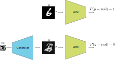
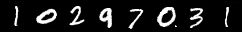
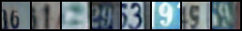
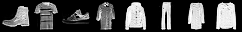

---
title:  'Deep Convolutional Generative Adversial Networks (DCGAN)'
author:
- Jeremy Fix
keywords: [PyTorch tutorial, WGAN, generative network, MNIST]
...

## Objectives

In this labwork, we aim at experimenting with generative networks and in particular the recently introduced Generative Adversial Networks [@Goodfellow2014]. Although other neural network architectures exist for learning to generate synthetic data from real observations (see for example this [OpenAI blogpost](https://openai.com/blog/generative-models/) which mentions some), the recently introduced GANs framework has shown to be efficient for [generating a wide variety of data](https://thisxdoesnotexist.com/). 

A GAN network is built from actually two networks that play a two player game :

- a generator which tries to generate images as real as possible, hopefully fooling the second player,
- a critic which tries to distinguish the real images from the fake images

Depending on the approach (e.g. GAN or WGAN), the second player is either called the discriminator or the critic. In the GAN framework we consider, this is a discriminator which tries to classify its inputs as being either real or generated.

{width=50%}


The loss used for training these two neural networks reflects the objective of the generator to fool the critic and of the critic to correctly separate the real from the fake.

The generator generates an image from a random seed, $z$, say drawn from a normal distribution $\mathcal{N}(0, 1)$. Let us denote $\mathcal{G}(z)$ the output image (for now, we slightly postpone the discussion about the architecture used to generate an image). Let us denote by $\mathcal{D}(x) \in [0, 1]$ the score assigned by the critic to an image where $\mathcal{D}(x) \approx 1$ if $x$ is real and $\mathcal{D}(x) \approx 0$ if $x$ is a fake. The critic solves a binary classification problem with a binary cross entropy loss and seeks to minimize :

$$
\mathcal{L}_c = \frac{1}{2m} \sum_{i=1}^m -\log(D(x_i)) - \log(1-D(G(z_i)))
$$

You may recognize the usual binary cross entropy loss where the labels of the $m$ real data is set to $y^x_i=1$ and the labels of the $m$ fake data is set to $y^z_i=0$. This loss is to be minimized with respect to the parameters of the critic $\theta_c$.

The generator on his side wants to fool the critic and therefore wants its samples to be considered as real data by the critic. Therefore, it seeks to minimize:

$$
\mathcal{L}_g = \frac{1}{m} \sum_{i=1}^m -\log(D(G(z_i)))
$$

This loss is to be minimised with respect to the parameters of the generator $\theta_g$. The original paper considered fully connected architectures for the critic and the generator but the later work of Deep Convolutional GAN (DCGAN, [@Radford2016]) proposed to use convolutional networks for the discriminator and the generator. 

Our aim is to generate fake data and you are free to choose between several datasets : MNIST, FashionMNIST, EMNIST or even the colored house numbers SVHN. The image below show you some examples of digits generated by the generator you will train in this labwork on MNIST and on SVHN

{width=40%}

{width=40%}

{width=40%}

{width=40%}

{width=40%}

## Lab work materials

You are provided with some starter code which already implements some functionalities :

- [data.py](./labs/03-pytorch-gan/data.py) : code performing the data loading 
- [models.py](./labs/03-pytorch-gan/models.py) : code defining the GAN 
- [main.py](./labs/03-pytorch-gan/main.py) : code containing the training and testing functions
- [mnist_generator.onnx](./data/03-pytorch-gan/mnist_generator.onnx) : a pretrained generator used for the end of the labwork pretrained on MNIST in ONNX format
- [emnist_generator.onnx](./data/03-pytorch-gan/emnist_generator.onnx) : a pretrained generator used for the end of the labwork pretrained on eMNIST in ONNX format
- [fashiomnist_generator.onnx](./data/03-pytorch-gan/fashionmnist_generator.onnx) : a pretrained generator used for the end of the labwork pretrained on Fashion MNIST in ONNX format
- [celeba_generator.onnx](./data/03-pytorch-gan/celeba_generator.onnx) : a pretrained generator used for the end of the labwork pretrained on CelebA in ONNX format
- [svhn_generator.onnx](./data/03-pytorch-gan/svhn_generator.onnx) : a pretrained generator used for the end of the labwork pretrained on SVHN in ONNX format

## Setup of the environment

For this lab work, you are provided with environment setup files [requirements.txt](./labs/03-pytorch-gan/requirements.txt) file if you are a pipenv/pip/virtualenv/etc..

On the CentraleSupelec clusters, I advise you to proceed as :

``` console
sh11:~:mylogin$ python3 -m venv $TMPDIR/venv
sh11:~:mylogin$ source $TMPDIR/venv/bin/activate
(venv) sh11:~:mylogin$ python -m pip install -r requirements.txt
```


## Implementing the Vanilla GAN

### Implementing the critic

The critic is a simple convolutional neural network which has to stay if the input image is a real or a fake. You are free to experiment with any architecture but I can suggest you one. Denote by `CBlock(k)` the following sequence of layers :

- $2 \times [$Conv($k$ channels, 3x3, stride=1, padding=same) - BatchNorm - LeakyRelu(0.2)$]$
- Conv($k$ channels, 3x3, stride=2, padding=same) - LeakyRelu(0.2) : this is a convolution downsampling. Do you see why ?
- Dropout(0.3)

The architecture for the discriminator I propose you is :

- CBlock(32) - CBlock(64) - CBlock(96) - Linear(1)

Every block is downsampling the representation so that with a $(B, 1, 28, 28)$ input, we end the convolutional part with a $(B, 96, 4, 4)$ and the linear layer has therefore $1536$ weights and $1$ bias for one output. The output of the network is the logit, i.e. before the application of the sigmoid which is actually embedded in the [BCEWithLogitsLoss](https://pytorch.org/docs/stable/generated/torch.nn.BCEWithLogitsLoss.html) we will be using.

We will inject a ganhack in the code. Indeed, we will smooth the target labels and hence we need to produce $2$ outputs and not only one.

**Exercice** Implement the critic in the `models.py` script. You have to define the neural network in the constructor Discriminator class and implement the forward method. Note that since every convolutional layer is followed by a batch-normalization, you can remove the bias from the convolutional layer that would anyway be canceled by the normalization (see the constructor of Conv2d). 

**Sanity check** : 

```{.python}

def test_discriminator():
    critic = Discriminator((1, 28, 28), dropout=0.5, base_c=32, dnoise=0.1, num_classes=2)
    X = torch.randn(64, 1, 28, 28)
    out = critic(X)
    assert(out.shape == torch.Size([64]))
```


### Implementing the generator

The generator takes as input a $(B, N_z)$ normally distributed tensor and has to produce a $28\times 28$ grayscale image. While the DCGAN paper suggested to use fractionnally strided convolutions (or transposed convolutions), this [can introduce artifacts](https://distill.pub/2016/deconv-checkerboard/) if not properly tuned. We rather consider the alternative proposed by [@Odena2016] which is to perform a bilinear upsampling followed by a convolution. 

Let us denote by `GBlock(k)` the following sequence of layers:

- [UpSample(scale_factor=2)](https://pytorch.org/docs/stable/generated/torch.nn.Upsample.html?highlight=upsample)
- Conv(k channels, 3x3, padding=same) - BatchNorm - ReLU
- Conv(k channels, 3x3, padding=same) - BatchNorm - ReLU

The proposed architecture of the generator is:

- Linear($8\times8\times256$) - ReLU
- GBlock(128)
- GBlock(64)
- Conv(1 channel, 1x1) - Tanh

If you use CelebA, you should be adding one more upsampling block because these images are $64 \times 64$.

In between the linear layer and the first convolution, note you will have to "reshape" the tensor (using the [Tensor.view](https://pytorch.org/docs/stable/tensors.html#torch.Tensor.view)) method. The tanh activation for the last layer is suggested in [@Radford2016] to be a good idea. 

**Exercice** Implement the generator in the `models.py` script. You have to create the network in the constructor of the Generator class and to implement the forward function. Note you can use the `up_conv_bn_relu` builder function provided in this script. The forward(X, batch_size) either takes as input a random vector $X$ or the number of samples you want. As for the critic, the bias is useless in the convolutional layers that are followed by a batch-normalization.

**Sanity check** : 

```{.python}

def test_generator():
	# Testing the generator for producing MNIST like data
	# Note: if you use SVHN, change these to (3, 32, 32)
	# Note: if you use CelebA, change these to (3, 64, 64)
	# and adapt below
    generator = Generator((1, 32, 32), latent_size=100, base_c=256)
    X = torch.randn(64, 100)
    out = generator(X, None)
    assert(out.shape == torch.Size([64, 1, 32, 32]))
    out = generator(None, 64)
    assert(out.shape == torch.Size([64, 1, 32, 32]))
```

Note that the generator is outputting values in $[-1, 1]$. You may also notice in the dataloaders that the real images are rescaled in $[-1, 1]$ to guarantee that both the real and fake images lie in the same range of values (do you see where in the code the pixel values of the images are projected into $[-1, -1]$ ?).

### Implementing the GAN

The GAN network is the discriminator along with the generator.

**Exercice** Fill in the missing code in the forward method of the GAN class. Note that the forward method has two modes, either accepting a tensor (that we expect are real images) or a number of images to sample. Its output is always the pair of logits and images. 

### Implementing the optimizers, losses and backprop

It is now time to implement the losses in the `main.py` script. The critic and the generator are trained separately, one after the other. Both training involves the binary cross entropy loss on the logits output of the critic :

- the discriminator wants to classify the real images as positive and the fake as negatives
- the generator wants its fake images to be classified as positive by the discriminator

When we train the discriminator, only the parameters of the discriminator are expected to be modified. When we train the generator (even though its loss goes through the discriminator network), only the parameters of the generators are expected to be modified. Therefore, two optimizers will be defined : one for the parameters of the critic, one for the parameters of the generator. For the loss, we need a binary cross entropy loss [taking as input the logits](https://pytorch.org/docs/stable/generated/torch.nn.BCEWithLogitsLoss.html)

**Exercice** Define the optimizers and loss in the `main.py` script. 

The next step is to compute the backward propagation on the right losses. If we denote $r_i$ and $f_i$ the logits assigned by the critic to respectively a minibatch $X$ of real images and a minibatch of size $b_i$ of fake images, the loss to be minimized by the critic is: 

$$
\mathcal{L}_c = \frac{1}{2m} \sum_{i=1}^m -\log(D(x_i)) - \log(1-D(G(z_i)))
$$

$$
\mathcal{L}_c = BCELoss(\begin{bmatrix}r_0 \\ \vdots \\ r_{b_i-1} \\ f_0 \\ \vdots \\ f_{b_i - 1}\end{bmatrix}, \begin{bmatrix} 1 \\ \vdots \\ 1 \\ 0 \\ \vdots \\ 0 \end{bmatrix}) = -\frac{1}{2b_i} (\sum_i \log(r_i) + \sum_k \log(1-f_i)) = \frac{BCELoss(\begin{bmatrix}r_0 \\ \vdots \\ r_{b_i-1} \end{bmatrix}, \begin{bmatrix}1 \\ \vdots \\ 1\end{bmatrix}) + BCELoss(\begin{bmatrix} f_0 \\ \vdots \\ f_{b_i - 1}\end{bmatrix}, \begin{bmatrix}0 \\ \vdots \\ 0\end{bmatrix}) }{2}
$$

**Exercice** Implement the above loss in the `main.py` script within the training loop. Note that you have two vectors named pos_labels and neg_labels containing respectively only ones and zeros. Implement also the three lines for the backward pass (reset the gradient accumulator, perform the backward pass, update the parameters).

Finally, for the generator, since it wants to fool the critic, denoting $f_i$ the logits assigned by the critic to a newly sampled set of fake images, the loss to be minimized by the generator is :

$$
\mathcal{L}_g = BCELoss(\begin{bmatrix} f_0 \\ \vdots \\ f_{b_i - 1}\end{bmatrix}, \begin{bmatrix} 1 \\ \vdots \\ 1 \end{bmatrix}) = -\frac{1}{b_i} (\sum_i \log(f_i)) 
$$

**Exercice** Implement the above loss in the `main.py` script within the training loop. Note that you have the vector named pos_labels containing respectively only ones. Implement also the three lines for the backward pass (reset the gradient accumulator, perform the backward pass, update the parameters) for the generator.

### Training

You can now start training your networks by running the main script. The default arguments given to argparse should be reasonably good. Do not forget to start the tensorboard and to look at it, at every epochs, some generated samples are written on it. During the first 5 epochs, you should already observe some kind of written digits. Your model should have almost 2.5M parameters and it takes 40s. per epoch on a Geforce 1080.

By default, the dataset used is MNIST but you can change this to the dataset you want (check the --dataset option of the main.py script). For example, for training on SVHN : 

```{.console}
(venv) mymachine:~:mylogin$ python main.py train --dataset SVHN
```

For the training parameters, you may need to slightly change them. For example, the following should be working :

```{.console}
mymachine:~:mylogin$ python3 main.py train --dataset SVHN --wdecay 0.0 --base_lr 0.0002 --batch_size 256
```


Below is an example of digits generated during a successful training with a noise vector defined once for all before training (i.e. we always plot the generated image associated with the same random inputs) on MNIST.

{width=25%}
{width=25%}
{width=25%}
{width=25%}

While training, you can move on the next section where you will load a **pretrained network**.

### Generating fake images

To generate new samples, we just need to evaluate the generator of normally distributed inputs. For every random input vector, you get a fake image that looks hopefully realistic.

**Exercice** Download one of the pretrained generators provided at the top of this page, that has been pretrained for $400$ epochs (which is by far more than necessary for most of the tasks). Fill in the code in the generate function of the `main.py` script and run some generation of fake images by issuing : 

```{.console}
mymachine:~:mylogin$ python3 main.py generate --modelpath generator.onnx
```

Note that the generated images have been already denormalized in the code you are provided.

### Interpolating in the latent space

There is an interesting property of the generator which is that if you move in the latent space you continuously move in the digits space. 

**Exercice** Generate two random vectors $z_1, z_2$ drawn from $\mathcal{N}(0, 1)$, compute their image through the generator $G(z_1), G(z_2)$ as well as the image of the linearly interpolated noise vectors $G(z_1 + \alpha (z_2 - z_1)), \alpha \in [0, 1]$.

## Going further

At the time of writing the subject, I'm quite surprised by the values of the losses and accuracies. Indeed, the generator seems to be outputting realistic images but the discriminator accuracy converges up to 96$\%$ which is really surprising since we may expect the discriminator to fail distinguishing the real from the fake. Apparently it succeeds to differentiate both even thought visually, the digits seems pretty realistic. As I understand it, it does not seem to be related to mode collapse because interpolating in the latent space shows a large diversity of samples. The generator loss is also unexpectedly staying high. This is surprising given the apparently realistic outputs produced by the generator but, at least, this is in agreement with the loss/accuracy of the discriminator which fails to be fooled by the generator.

GAN can have problems being trained. Sometimes, training is unstable. Sometimes, training leads to mode collapse, a situation where the generator fails to produce diversity in its output and the model gets locked in this mode. Variations, known as Wasserstein GAN (WGAN, [@Arjovsky2017]), Wasserstein GAN with gradient penalty [@Gulrajani2017] and others were introduced to fix these issues. However, a recent paper [@Lucic2018] suggests that with enough hyperparameters tuning, "even" the vanilla GAN can work as well as its variations. 

Finally, for evaluating the quality of the generated image, the literature is currently on the Fréchet Inception Distance introduced in [@Heusel2018].

## References
