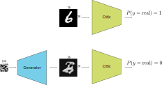

---
title:  'Generative Networks (WGAN)'
author:
- Jeremy Fix
keywords: [PyTorch tutorial, WGAN, generative network, MNIST]
...

## Objectives

In this labwork, we aim at experimenting with generative networks and in particular the recently introduced Generative Adversial Networks [@Goodfellow2014]. Although other neural network architectures exist for learning to generate synthetic data from real observations (see for example this [OpenAI blogpost](https://openai.com/blog/generative-models/) which mentions some), the recently introduced GANs framework has shown to be efficient for [generating a wide variety of data](https://thisxdoesnotexist.com/). 

A GAN network is built from actually two networks that play a two player game :

- a generator which tries to generate images as real as possible, hopefully fooling the second player,
- a critic which tries to distinguish the real images from the fake images

{width=50%}

The loss used for training these two neural networks reflect the objective of the generator to fool the critic and of the critic to correctly separate the real from the fake.

The generator generates an image from a random seed, $z$, say drawn from a normal distribution $\mathcal{N}(0, 1)$. Let us denote $\mathcal{G}(z)$ the output image (for now, we slightly postpone the discussion about the architecture used to generate an image). Let us denote by $\mathcal{D}(x) \in [0, 1]$ the score assigned by the critic to an image where $\mathcal{D}(x) \approx 1$ if $x$ is real and $\mathcal{D}(x) \approx 0$ if $x$ is a fake. The critic solves a binary classification problem with a binary cross entropy loss and seeks to minimize :

$$
\mathcal{L}_c = \frac{1}{2m} \sum_{i=1}^m -\log(D(x_i)) - \log(1-D(G(z_i))
$$

You may recognize the usual binary cross entropy loss where the labels of the real data is set to $y^x_i=1$ and the labels to fake image data is set to $y^z_i=0$. This loss is to be minimized with respect to the parameters of the critic $\theta_d$.

The generator on his side wants to fool the critic and therefore wants its samples to be considered as real data. Therefore, it seeks to minimize:

$$
\mathcal{L}_g = \frac{1}{m} \sum_{i=1}^m -\log(D(G(z_i)))
$$

The original paper considered fully connected architectures for the critic and the generator but the later work of Deep Convolutional GAN (DCGAN, [@Radford2016]) proposed to use 

## Lab work materials

You are provided with some starter code which already implements some functionalities :

## Implementing WGAN

### Implementing the critic

### Implementing the generator

### Training

While training, you can move on the next section where you will load a pretrained network.

## Experimenting WGAN

### Generating fake images

### Interpolating in the latent space

## Going further

GAN can have problems being trained. Sometimes, training is unstable. Sometimes, training leads to mode collapse, a situation where the generator fails to produce diversity in its output and the model gets locked in this mode. Variations, known as Wasserstein GAN (WGAN, [@Arjovsky2017]), Wasserstein GAN with gradient penalty [@Gulrajani2017] and others were introduced to fix these issues. However, a recent paper [@Lucic2018] suggests that with enough hyperparameters tuning, "even" the vanilla GAN can work as well as its variations. 

Finally, for evaluating the quality of the generated image, the literature is currently on the Fréchet Inception Distance introduced in [@Heusel2018].

## References
