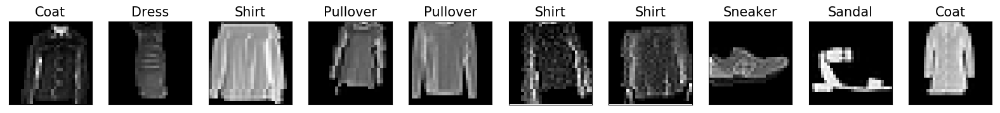
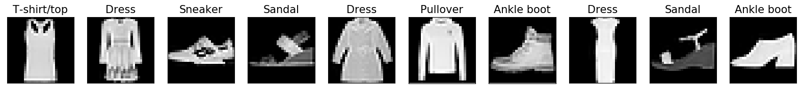
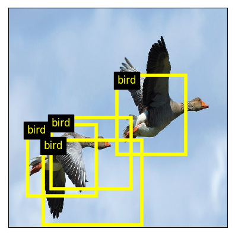
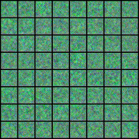
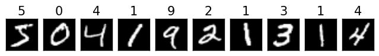

<a href="https://jeremyfix.github.io/deeplearning-lectures/">Deep learning lectures</a> © 2018 by <a href="https://jeremyfix.github.io">Jeremy Fix</a> is licensed under <a href="https://creativecommons.org/licenses/by-nc-sa/4.0/">CC BY-NC-SA 4.0</a>

**Forewords** These pages are written in markdown format and
generated with [quarto](https://quarto.org). The generation is performed using the github workflows. Thank you all for these very helpful tools.

These pages contain the subjects and codes for the labs in the deep learning lectures 3MD4040 taking place at CentraleSupélec. Most the work is done in pytorch although you will find one lab using Keras.

## Labs

<h3>PyTorch Labs</h3>

<a href="pytorch/fashionMNIST/" class="lab-card pytorch-card">

FashionMNIST Classification

First steps in PyTorch: classifying fashion objects with neural networks

</a>

<a href="pytorch/intro/" class="lab-card pytorch-card">

FashionMNIST Classification

First steps in PyTorch: classifying fashion objects with neural networks

</a>

<a href="pytorch/object-detection/" class="lab-card pytorch-card">

Object Detection

Transfer learning and object detection on Pascal VOC dataset

</a>

<a href="pytorch/segmentation/" class="lab-card pytorch-card">

Semantic Segmentation

UNet and semantic segmentation on Pascal VOC with dense pixel labeling

</a>

<a href="pytorch/asr/" class="lab-card pytorch-card">

Speech Recognition

Automatic speech recognition on Mozilla Common Voice using CTC models

</a>

<a href="pytorch/gan/" class="lab-card pytorch-card">

Generative Networks (GAN)

Deep convolutional generative adversarial networks for image generation

</a>

<a href="pytorch/nir-ecg/" class="lab-card pytorch-card">

Neural Implicit Representations

Using Neural Networks for implicitly encoding data : images and spatio temporal cardiac MRI

</a>

<h3>Keras Labs</h3>

<a href="keras/mnist/" class="lab-card keras-card">

MNIST Classification

First steps in Keras: classifying handwritten digits with various architectures

</a>

<a href="keras/cifar/" class="lab-card keras-card">

🎤

CIFAR-100 Classification

</a>

## Additional ressources

### Practicals/Lectures

- [Oxford’s CNN practicals](http://www.robots.ox.ac.uk/~vgg/practicals/cnn/)
- [Nando de Freitas lectures and practicals](https://www.cs.ox.ac.uk/people/nando.defreitas/machinelearning/)
- [Stanford A. Karpathy practicals](http://cs231n.github.io/>)
- [Master Data Science Paris Saclay](https://github.com/m2dsupsdlclass/lectures-labs>)
- [Fast.ai, J. Howard](https://www.fast.ai/)

### Blog posts

- [An overview of gradient descent algorithms](http://ruder.io/optimizing-gradient-descent/)
- [Revisiting sequence to sequence learning, with focus on implementation details](http://suriyadeepan.github.io/2016-12-31-practical-seq2seq/)
- [The unreasonnable effectivness of recurrent neural networks](http://karpathy.github.io/2015/05/21/rnn-effectiveness/)
- [Theories of Deep learning](https://stats385.github.io/)

