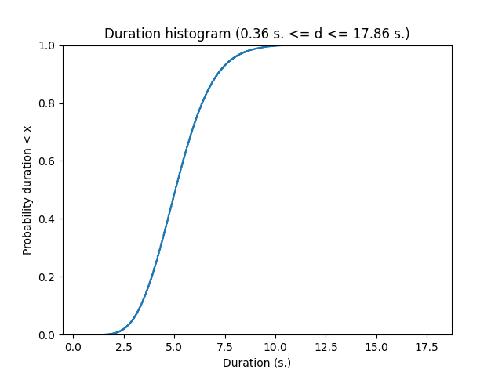
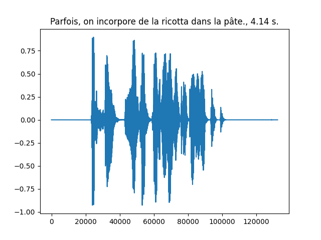
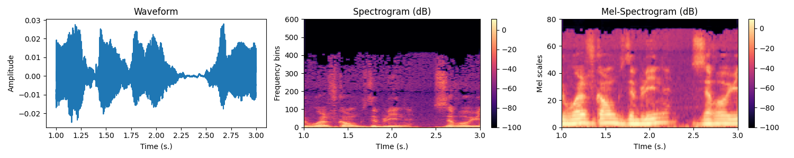
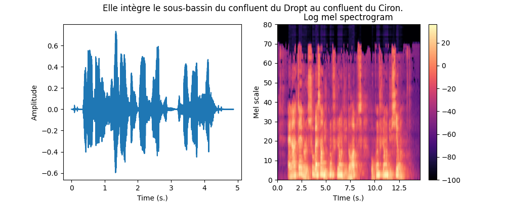
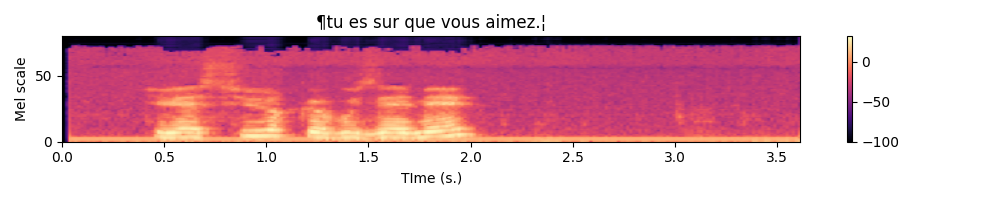
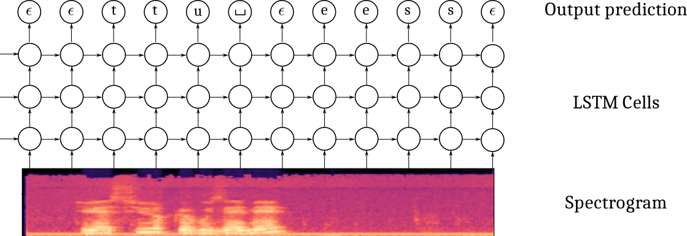
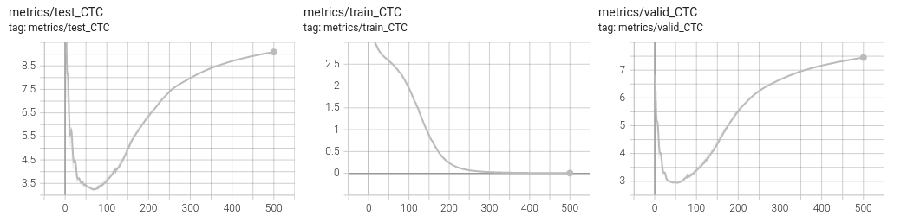
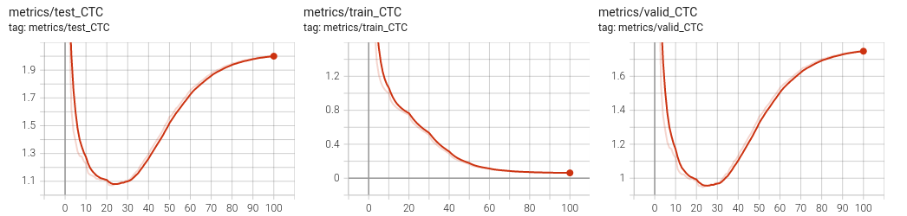
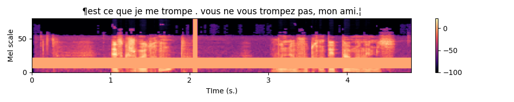

<a href="https://jeremyfix.github.io/deeplearning-lectures/">Deep learning lectures</a> © 2018 by <a href="https://jeremyfix.github.io">Jeremy Fix</a> is licensed under <a href="https://creativecommons.org/licenses/by-nc-sa/4.0/">CC BY-NC-SA 4.0</a>

## Objectives

In this labwork, you will be experimenting with various recurrent neural networks for addressing the quite exciting problem of transcribing in text what is said in an audio file, a so called [Automatic Speech Recognition (ASR)](https://en.wikipedia.org/wiki/Speech_recognition) task.

The data we will be using are collected within the [Mozilla common voice](https://commonvoice.mozilla.org/) which are multi-language datasets of audio recordings and unaligned text transcripts. At the time of writing, the v24 corpus contains $2750$ hours in English 🇬🇧, almost $1100$ hours in French 🇫🇷 and $100$ hours in Ukrainian 🇺🇦. You can contribute yourself by either recording or validating recordings. Although we will be using Common Voice, there are [several other datasets you might be interested in](https://www.afcp-parole.org/ressources/corpus-et-outils/corpus/) if you work on ASR.

You will be experimenting with the Connectionist Temporal Classification model (CTC) as introduced in [@Graves2014], which is the basis of the Deep Speech models (proposed by Baidu research[@Amodei2015] and also implemented by [Mozilla](https://github.com/mozilla/DeepSpeech)). Sooner or later, this labwork might be extended to encompass Seq2Seq with attention as introduced in the Listen Attend and Spell [@Chan2016].

Throughout this labwork, you will also learn about dealing with the specific tensor representations of variable length sequences.

## Lab work materials

### Starter code

During this lab work, it is unreasonable to ask you to code everything from scratch. Therefore, we provide you with some starter code that is supposed to help you to work on the interesting parts. The base code is the [asrlab-kit.tar.gz](../../assets/asrlab-kit.tar.gz). To get and use that code:  

```bash
wget https://jeremyfix.github.io/deeplearning-lectures/assets/asrlab-kit.tar.gz
tar -zxvf asrlab-kit.tar.gz
```

This code is organized as a Python library `asrlab` to be installed and used out of source. It contains all the required modules for running your experiments. If you want to add a feature, you need to modify that library.

To install the library, you should 1) create a virtual environment and 2) install it in developer mode.

**If you use the DCE of CentraleSupélec**, you can use pre-installed virtual environments that already ship several required packages:

```bash
/opt/dce/dce_venv.sh /mounts/datasets/venvs/torch-2.7.1 $TMPDIR/venv
source $TMPDIR/venv/bin/activate
```

**Otherwise**, you need to create your own venv, for example using the built-in Python venv module:

```bash
python3 -m venv /tmp/venv
source /tmp/venv/bin/activate
```

Then, to install the library in developer mode:

``` bash
python -m pip install -e asr
```

You can verify that the library is installed by running:

``` bash
python -c "import asrlab; print(f'Library available at {asrlab.__file__}')"
```

You are also provided index files which contain the duration of the audio clips of the v24 FR version of CommonVoice. These `idx` files must be placed where you execute your code.

- [train-fr-v24.0.idx](train-fr-v24.0.idx), [dev-fr-v24.0.idx](dev-fr-v24.0.idx), [test-fr-v24.0.idx](test-fr-v24.0.idx)

These index files can be used to quickly filter the samples, only considering some that have a specific duration. 

## Setting up the dataloaders

In the CommonVoice dataset, you are provided with MP3 waveforms, usually sampled at 48 kHz (sometimes, slightly less on the version 6.1 corpus) with their unaligned transcripts. Unaligned means the annotation does not tell you when each word has been pronounced. No worries, the CTC model is designed to deal with non aligned sequence to sequence. The Common Voice dataset contains small snippets of speech from half a second up to 18 seconds for the French dataset v24. Below is a plot of the cumulative distribution of the speech duration on the train fold.

{width=50%}

The data are therefore : a waveform as input and a sequence of characters for the output. These two signals will be processed :

- instead of taking as input the waveform (that we will resample at 16kHz), we will be computing a spectrogram in Mel scale
- the characters will be filtered (to remove some variability) and converted to lists of integers

And these signals need to be stacked in mini-batch tensors. For doing so, you will have to fill in code in the `asrlab/data` module. This module is more complex than what we did in the other labs. It is based on :

- `dataset.py` which offers a function to load the CommonVoice dataset and to filter it based on the duration of the recordings,
- `charmap.py` which deals with the encoding/decoding of the transcripts,
- `waveform.py` which deals with the computation of the spectrogram from the waveform,
- `dataloader.py` which sticks together the previous two elements in addition to deal with the sequences of varying length.

The end result of this module is still the `get_dataloaders` which, by making use of the other functions/objects, build up the iterable minibatch collections. 

### Dataset exploration

We begin by looking at the content of the data. The [Common Voice](https://docs.pytorch.org/audio/main/generated/torchaudio.datasets.COMMONVOICE.html) dataset is made of :

- a waveform which is the audio recording,
- the sampling rate (in Hz),
- a dictionnary with metadata such as speaker ids, transcripts, etc...

**Exercice** By completing the code in `data/dataset.py` in the `dataset_exploration` function, can you get one sample and:

- display the transcripts of what is said by the speaker 
- compute the duration, in seconds, of the sample ? (This may require to combine the length of the waveform and the sampling rate, isn't it ?)

If you want to listen to this audio clip, the path to the MP3 file can be built as :

```python
ds = load_dataset(...)

idx = 0
line = ds._walker[idx]
mp3path = os.path.join(ds._path, ds._folder_audio, line[1])
```

An example waveform with its transcript and duration is shown below 

{width=50%}

### Integer representations of the transcripts

The transcripts are encoded into integers and decoded from integers thanks to a vocabulary in the CharMap object, represented as the `char2idx` dictionary and `idx2char` list. Let us play a little bit with this object.

For this part, we will work on the `data/charmap.py` script. This submodule is responsible for encoding/decoding transcripts.  

**Exercice** Let us practice this encoding. Answer the following questions :

- Which function call gives you the vocabulary size ? 
- What is this vocabulary size ? 
- What is the encoding of the sentence "Je vais m'éclater avec des RNNS!". 
- What do you obtain if you decode the encoded sentence ? Does it make sense to you ?  Do you see differences and some specific characters at the beginning and at the end of the decoded sentence ?

::: {.callout-warning}

To answer this question, you are provided with a base code to complete in the `data/charmap.py` submodule :

```python
def test_charmap():
    charmap = CharMap()

    # Get the vocabulary size
    vocab_size = 0

    ....
```
:::

<!--

vocab_size : 44
"[16, 27, 22, 1, 39, 18, 26, 36, 1, 30, 3, 22, 20, 29, 18, 37, 22, 35, 1, 18, 39, 22, 20, 1, 21, 22, 36, 1, 35, 31, 31, 36, 1, 5, 2]"
"¶je vais m'eclater avec des rnns .|"
-->

As you may have noticed in the functioning of the `CharMap` object, there are some design choices that have been made to limit the number of characters in our dataset : French accents, punctuation and case marks are removed.

### Transforming the waveforms into spectrograms

Let us now have a look to the waveforms. Usually the models do not take the raw waveforms as input but preprocess them by computing a spectrogram using a short time fourier transform (STFT). The amplitude of the complex spectrogram is then converted in mel scale and then in decibels using a log. 

The STFT is a Fourier transform applied on a local little temporal segment of the signal (hence Short Time). That segment is obtained by windowing the signal. By default, torchaudio [Spectrogram](https://pytorch.org/audio/stable/transforms.html#spectrogram) function uses the [Hann Function](https://en.wikipedia.org/wiki/Hann_function). The Fourier transform returns a complex valued signal from which we only take the magnitude as is usually done. Then, the real valued magnitude is converted in logmel scale which better reflects the sensitivity of the human ear. Remember, this preprocessing aims to better highlight important features for decoding what is said, therefore it makes sense 


The MEL scale is a frequency scale that gives more importance to the frequency bands humans are most sensitive to. 

{width=100%}

**Exercice** In the `data/waveform.py`, WaveformProcessor object, fill-in the code in the constructor for initializing the `transform` attribute. It must be a `torch.nn.Sequential` with the [MelSpectrogram](https://pytorch.org/audio/stable/transforms.html#melspectrogram) followed by a [conversion to DB](https://pytorch.org/audio/stable/transforms.html#amplitudetodb). 


::: {.callout-warning}

To validate your implementation, you are provided with a test function in the `data/waveform.py` script. You simply need to run :

```bash
(venv) mymachine:~:mylogin$ python -m asrlab.data.waveform
```

:::


### Wrapping the spectrogram computation and transcript encoding

We can now combine the two previous steps to get a Mel spectrogram from the waveform as well as the encoding of the transcript. The function is already given to you in the `data/__main__.py` script that you can call with :


```bash
(venv) mymachine:~:mylogin$ python -m asrlab.data
```

An example is shown below.

{width=85%}


### Collating variable size spectrograms and transcripts in minibatches

We can convert the transcripts into tensors of integers and waveforms into spectrograms, it remains to collate together multiple samples into minibatches but there are two difficulties :

- the waveforms have different durations, hence their spectrograms also have different durations,
- the transcripts have different durations.

These can be represented by using "normal" tensors. As tensors are dense structures, you can pad the shortest sequences of a minibatch so that all the sentences have the same size. But this is not very efficient, especially if you have a large span of sizes. To represent sequences of variable length in a more efficient way, pytorch provides you with the [PackedSequence](https://pytorch.org/docs/stable/generated/torch.nn.utils.rnn.PackedSequence.html) datatype. Roughly speaking, a `PackedSequence` is created by concatenating multiple sequences along the time dimension. In order to split that concatenated sequence back into the individual sequences, a `PackedSequence` also memorizes the time indices where to cut that concatenated sequence. To go from `PackedSequences` to padded sequences and vice versa, we use the [pad_packed_sequence](https://pytorch.org/docs/stable/generated/torch.nn.utils.rnn.pad_packed_sequence.html) and [pack_padded_sequence](https://pytorch.org/docs/stable/generated/torch.nn.utils.rnn.pack_padded_sequence.html) functions. Let us see these in actions on one example :

```{.python}

def ex_pack():
    import random
    from torch.nn.utils.rnn import pad_sequence, pack_padded_sequence, pad_packed_sequence

    batch_size = 10
    n_mels = 80
    max_length = 512

    # We create a collection of variable sizes sequences
    # Each element is of shape (Ti, n_mels) with Ti different
    # for each sequence
    tensors = [torch.randn(random.randint(1, max_length), n_mels) for i in range(batch_size)]

    # 1- To be packed, the tensors need to be sorted by
    #    decreasing length (see the doc of pack_padded_sequence)
    tensors = sorted(tensors,
                     key=lambda tensor: tensor.shape[0],
                     reverse=True)
    lengths = [t.shape[0] for t in tensors]

    # 2- We then pad the sequences to the length
    #    of the longest sequence
    tensors = pad_sequence(tensors)
    # tensors is (T, batch_size, n_mels)
    # note T is equal to the maximal length of the sequences

    # 3- Padded sequences can then be packed
    #    Note we need to provide the durations of the individual tensors
    packed_data = pack_padded_sequence(tensors, lengths=lengths)

    # Later, we can unpack the sequence
    # Note we recover the lengths that can be used to slice the "dense"
    # tensor unpacked_data appropriatly
    unpacked_data, lens_data = pad_packed_sequence(packed_data)

```

Note that you may want to use usual "dense" tensors, padding at the end your tensors of variable size, but that is not a good idea because 1) the processing on the GPU can be limited to just the right amount if it knows the length of the sequences, 2) padding at the end is not a big deal with unidirectional RNNs but can possibly be a problem with bidirectional RNNs.

Collating together samples is the business of the dataloader. The torch dataloader has a default function for sticking together samples into a minibatch, see [default_collate](https://docs.pytorch.org/docs/stable/data.html#torch.utils.data.default_collate). As we are dealing with sequences of varying length, we have some specific code to implement. We will therefore implement our own `collate_fn`

**Exercice** Equipped with these new PackedSequence tools, you now have to work on the build up of the minibatches by filling in the missing code in the `BatchCollate` class in the `data/dataloader.py` script. You only have $5$ lines to write which is basically :

- `pad` the waveforms, compute their spectrogram and `pack` them. The lengths of the unpadded spectrograms are given in the `spectro_lengths` list provided to you,
- `pad` and `pack` the encoded transcripts.

::: {.callout-warning}

To validate your implementation, you are given a test function in the `data/dataloader.py` script that you can call with :

```bash
(venv) mymachine:~:mylogin$ python -m asrlab.data.dataloader
```

:::


After completion, write a little piece for testing which should : 1) access a minibatch of one of your dataloader, 2) plot the spectrograms associated with their transcripts. For the plot part, you can make use of the `plot_spectro` function (in data.py).

Below is an example expected output :

{width=100%}

### Normalizing the spectrograms

As a final note on the data loading part, you may notice that in the `get_dataloaders` function, the BatchCollate object are created with **normalization coefficients** of the spectrogram. These can be given in the configuration dictionnary of the dataloaders under the `mean_spectro` and `std_spectro` keys. I already computed these values on the train fold of the v24 of the French dataset, these are :

- `mean_spectro = -53`
- `std_spectro = 29`

You can provide these values in the configuration dictionnary. If you do not provide them, they will be recomputed if `normalize` is set to True. Computing these values can take up to $13$ minutes.

## Connectionist Temporal Classification (CTC)

Now that our data are ready, it is time to setup our first model. The Connectionist Temporal Classification approach is based on a multi-layer recurrent neural network taking as input the successive frames of the spectrogram and outputting, at every time step, a probability distribution over the vocabulary to which we add a $\epsilon$ blank character. The CTC model is outputting one character at every iteration, therefore, it produces an output sequence of the same length of the input sequence, possibly with some $\epsilon$ blank characters and also some duplicated characters. The labeling, though, is constrained to be of length smaller than the input (the RNN transducer overcomes that possible constraint).

{width=100%}

It also uses a specific loss which estimates the likelihood of the transcript, conditioned on the spectrogram, by summing over the probabilities of all the possible alignments with the blank character. Given a spectrogram $x$ and a transcript $y$ (e.g. ['t','u','_', 'e', 's']), its probability is computed as :

$$
p(y | x) = \sum_{a \in \mathcal{A}_{|x|}(y)} h_\theta(a | x) = \sum_{a_j \in \mathcal{A}_{|x|}(y)} \prod_t h_\theta(a_t | x)
$$

where $A_n(y)$ is the set of all the possible alignments of length $n$ of the sequence $y$. For example, for the sequence $y=(t,u,\_, e, s)$, some elements of $A_6(y)$ are $(\epsilon, \epsilon, t, u, \_, e, s), (\epsilon, t, \epsilon, u, \_,e,s), (t, \epsilon, u, \_,e,\epsilon, s), (t, t, \epsilon, u, \_, e, s), ...$ and this is tricky to compute efficiently. Fortunately, the CTC loss is [provided in pytorch](https://pytorch.org/docs/stable/generated/torch.nn.CTCLoss.html).


### Defining the model

The model is built from:

- a spatial feature extraction stage with several 2D convolutional layers
- a temporal part with a bidirectionnal recurrent neural network
- a classification output stage 

One difficulty in defining this architecture in pytorch is that you must be specifying the "number of features" in the previous layer when you define your Conv2D, GRU and Linear layers. But have a breath or two and let us go.

#### The convolution stage

I propose you to use the implement the following architecture :

- **Spatial feature extraction** : 
	- Conv2D(32 kernels of size (41, 11), stride=(2,2), padding=(20, 5)) - BatchNorm - HardTanh(0, 20)  
	- Conv2D(32 kernels of size (21, 11), stride=(2,1), padding=(10, 5)) - BatchNorm - HardTanh(0, 20)  

**Exercice** If you spectrogram is a tensor of shape $(B=1, C=1, T=122, Mels=80)$, meaning one sample with one channel, $122$ time samples for $80$ mel scale frequencies, what is the size of the tensor you expect after forward propagating through the convolutional part ?

<!--
 
So in general, for (B, 1, Tx, nmels) , the output tensor is (B, 32, Tx//4, nmels//2)
because the time downsampling is 4 and the frequency downsampling is 2.

-->

**Exercice** Define in the constructor the *cnn* attribute. Test your implementation by calling `test_implementation.py`, the corresponding test should pass.


#### The recurrent stage

I propose you to use the implement the following architecture :

- **Recurrent neural network** :
	- 4 layers of bidirectionnal GRU with 1024 units in every layer

Note that, as usual, when you instantiate the RNN module, you need to provide the size of the its inputs. In the case of recurrent layers, even thought the input tensors do contain a temporal dimension, you do not count it when specifying the size of the input to the RNN. In other words, if your input tensors are $(B, T, C)$, the RNN constructor expects the input_size $C$.

**Exercice** Define in the constructor the *rnn* attribute. Test your implementation by calling `test_implementation.py`, the corresponding test should pass.

<!--

The RNN must be defined as GRU(32 * n_mels//2, ...)

-->

#### The output stage

I propose you to use the implement the following architecture :

- **Output classification**:
	- Linear(vocab\_size)

You also need to properly specify the input_size of the linear layer. Remember that you have bidirectional RNN layers. Note also that if the output tensor of the RNN is $(B, T, C)$, the expected input_size of the linear layer is $C$ since a prediction is produced at every time step.

**Exercice** Define in the constructor the *char_lin* attribute. Test your implementation by calling `test_implementation.py`, the corresponding test should pass.


### Forward propagation through the model

Now that the different parts of the model are defined, we need to handle the forward propagation which is almost straightforward except that we have to deal with the PackedSequences. The tensors should be unpacked before feeding in the feedforward components (convolutional, fully connected classification) and packed otherwise. Below is a depiction of the Tensor shapes through the pipeline.

{.bordered width=100%}


**Exercice** Fill in the forward method of the `models.py` script. Test your implementation by calling `test_implementation.py`, the corresponding test should pass.


### Instantiating the model and defining the optimizer

All right, we now move on the `main_ctc.py` script. This script will allow you to train and test your networks. You can open, read and run this script. It provides : 

- a training function for training a network with possibly customized parameters
- a testing function for testing a pretrained network on a waveform
- a main function handling the parameters

The script is almost complete, three steps remain to be done :

- instantiate your model in the `train` function  
- define an optimizer (I suggest you to use an Adam optimizer)

The other code should be already familiar. 

**Exercice** Instantiate the model and define the optimizer in the `train` function of the `main_ctc.py` script. For the parameters, have a look at the beggining of the `train` function.

## Experimentation with the CTC model

It is now time to experiment. I suggest you to proceed this way :

1- Try to overfit a single minibatch

2- Try to overfit the training by disabling any sort of regularization and finding an appropriate architecture

3- Try to improve the generalization performances by appropriately setting the regularization

These three steps are described in the next subsections.

### Overfitting a single minibatch

In order to ensure you do not have bugs in your implementation, a sanity check is to check you can overfit a single minibatch of your training set. If you are unable to fit a single minibatch, you are guaranteed to have an issue in your code. To just load one single minibatch, you can pass in the `--debug` argument when calling `main_ctc.py` :

```bash
mymachine:~:mylogin$ python3 main_ctc.py train --debug --batch_size 16
```

You should pretty "quickly" see a null loss on the training set with a perfect decoding. Note that it still takes 2s. per minibatch and a hundred epochs for overfitting.

{.bordered}

### Overfitting the training set

The next step is to design a sufficiently rich architecture to overfit the training set when any sort of regularization is disabled (L2/L1, dropout, data augmentation, ...) :

```bash
mymachine:~:mylogin$ python3 main_ctc.py train --scheduler
```

It takes approximately 11 minutes per epoch. The `--scheduler` activates the learning rate scheduling policy. It was disabled for the previous experiment, when overfitting a single minibatch, as it was decreasing the learning rate too quickly. The learning rate scheduler is applied every epoch, hance for every minibatch in the experiment of the previous section. Here, for overfitting the training set, it turns out it is necessary to activate the learning rate policy.

You should be able to get a null loss on the training set. Have a look on the tensorboard to observe overfitting. See below an example run.

{.bordered}

### Improving the generalization

#### Data augmentation with SpecAugment

It was recently suggested, in the [SpecAugment](https://arxiv.org/abs/1904.08779) paper [@Park2019] that a valuable data augmentation is to partially mask the spectrograms both in the frequency and time domains.

Fortunately, torchaudio already implements the necessary functions for masking both in the time and frequency domains. I invite you to check the torchaudio documentation about the [FrequencyMasking](https://pytorch.org/audio/stable/transforms.html#frequencymasking) and [TimeMasking](https://pytorch.org/audio/stable/transforms.html#timemasking) transforms. 

These transforms can be implemented within the data.WaveformProcessor object. Just be sure to add a flag to the constructor to decide if you want or not to include these transforms. These transforms should probably be included only in the training set.

Below is an example of the resulting spectrogram, masked in time for up to $0.5$ s. and the mel scale for up to $27$ scales.

{width=100%}

SpecAugment is already implemented in the `data.py` script. Have a look to the transform_augment attribute of WaveformProcessor. To use it, simply add the `--train_augment` argument when you call the main_ctc script.

#### Dropout

In the DeepSpeech paper, the authors suggest to add dropout layers in the convolutional part. The constructor of CTCModel receives a dropout argument which you can use to add Dropout2D layers after every HardTanh.

#### L1/L2 Regularization

To add L2 regularization, you can use the [AdamW](https://docs.pytorch.org/docs/stable/generated/torch.optim.AdamW.html) optimizer instead of Adam and specifies the `weight_decay` argument.

You could also implement a `penalty()` function in your CTCModel called from the training function.

## Testing on a new audioclip

🚧🚧🚧🚧🚧🚧🚧🚧🚧🚧🚧🚧🚧🚧🚧🚧🚧🚧🚧🚧🚧🚧🚧🚧🚧🚧🚧🚧🚧

Refactoring in progress

🚧🚧🚧🚧🚧🚧🚧🚧🚧🚧🚧🚧🚧🚧🚧🚧🚧🚧🚧🚧🚧🚧🚧🚧🚧🚧🚧🚧🚧

To test of an audio clip, you can record yourself as a mp3 and call the `asrlab` library with a path to the log directory and the path to the recording. In its current version, the model is saved as a `pt` file and therefore we need to recreate the model before loading its parameters. And to create the model, we need the parameters (number of layers, hidden units, ...) used to create it in the first place.

```bash
(venv) mymachine:~:mylogin$ python -m asrlab.main test logdir audiofile.mp3
```

If you prefer to use a file provided by CommonVoice, you can pick one of the sample audioclip listed in the `test.tsv` file of the CommonVoice dataset. 

Inference is actually an approximate inference. Indeed, we would like in principle to get the output sequence of tokens that maximizes the loglikelihood which would require to evaluate a lot of possible sequences. For an output sequence of length $T$ and a vocabulary of size $V$, this is actually $V^T$ possibilities which is far too much. The base code provided to you allows to perform approximate inference in two ways : greedy or beam search. To know more about beam search, have a look to the [distill.pub/2017/ctc](https://distill.pub/2017/ctc/) blog post.

With our code, you can specify beam search within the `config.yaml` file :

```.yaml
decoding:
  beamwidth: 10
  beamsearch: True
```

The beam width is the number of paths that are evaluated in parallel.

If you do not have yet a trained model, you can download [the best_ctc_42077.pt](https://centralesupelec-my.sharepoint.com/:u:/g/personal/jeremy_fix_centralesupelec_fr/EScVCV_zdYZDpWXBlynPmMYBjCbXVDc0SkTuS6JRn43CSg?e=u7eUWF) checkpoint. This model can be tested with the command line below :

```bash
(venv) mymachine:~:mylogin$ python -m asrlab.main test logdir /mounts/datasets/datasets/CommonVoice/v24.0/fr/clips/common_voice_fr_37118026.mp3
Log prob    Sequence
7.82      ¶une contrefa❌on fut publiee en belgique.¦
```

The summary file of this run is given below. This model has been trained with SpecAugment, Dropout(0.5), L2 regularization (0.0001), gradient norm clipping with all the available audio clips. The training was performed for almost 4 days.

```markdown
**TO BE UPDATED**
```

## Extras

### Metrics

In this lab, we are definitely very restrictive on the metrics we evaluate, we should add many more. In particular, popular metrics are the Word-Error-Rate (WER) which in our case would be a Character-Error-Rate. See [Word error rate](https://en.wikipedia.org/wiki/Word_error_rate).

If you ever implement it in the base code, feel free to make a PR on the code.

### ESP-Net

If you are interested in automatic speech recognition, you might be interested in the [End-to-End speech processing toolkit](https://github.com/espnet/espnet).

### CTCLoss example

The CTC loss of pytorch accepts tensors of probabilities of shape $(T_x, Batch, vocab\_size)$ and tensors of labels of shape $(batch, T_y)$ with $T_x$ respectively the maximal sequence length of the spectrogram and $T_y$ the maximal length of the transcript. An example call is given below : 

```{.python}

def ex_ctc():
    # The size of our minibatches
    batch_size = 32
    # The size of our vocabulary (including the blank character)
    vocab_size = 44
	# The class id for the blank token (we take the default of the CTC loss)
    blank_id = 0

    max_spectro_length = 50
    min_transcript_length = 10
    max_transcript_length = 30

    # Compute a dummy vector of probabilities over the vocabulary (including the blank)
    # log_probs is (Tx, Batch, vocab_size)
    log_probs = torch.randn(max_spectro_length, batch_size, vocab_size).log_softmax(dim=2)
    spectro_lengths = torch.randint(low=max_transcript_length,
                                    high=max_spectro_length,
                                    size=(batch_size, ))

    # Compute some dummy transcripts
	# longer than necessary. The true length of the transcripts is given
	# in the target_lengths tensor
	# targets is here (batch_size, Ty)
    targets = torch.randint(low=0, high=vocab_size,  # include the blank character
                            size=(batch_size, max_transcript_length))
    target_lengths = torch.randint(low=min_transcript_length,
                                   high=max_transcript_length,
                                   size=(batch_size, ))
    loss = torch.nn.CTCLoss(blank=blank_id)

    # The log_probs must be given as (Tx, Batch, vocab_size)
    vloss = loss(log_probs,
                 targets,
                 spectro_lengths,
                 target_lengths)

    print(f"Our dummy loss equals {vloss}")

```

## A possible solution

You will find a possible solution at [asrlab-sol.tar.gz](../../assets/asrlab-sol.tar.gz).

## References

::: {#refs}
:::
