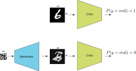
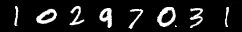
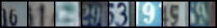
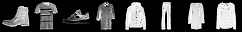
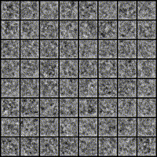
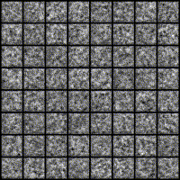
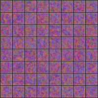

<a href="https://jeremyfix.github.io/deeplearning-lectures/">Deep learning lectures</a> © 2018 by <a href="https://jeremyfix.github.io">Jeremy Fix</a> is licensed under <a href="https://creativecommons.org/licenses/by-nc-sa/4.0/">CC BY-NC-SA 4.0</a>

## Objectives

In this labwork, we aim at experimenting with generative networks and in particular the recently introduced Generative Adversarial Networks [@Goodfellow2014]. Although other neural network architectures exist for learning to generate synthetic data from real observations (see for example this [OpenAI blogpost](https://openai.com/blog/generative-models/) which mentions some), the recently introduced GANs framework has shown to be efficient for [generating a wide variety of data](https://thisxdoesnotexist.com/). 

A GAN network is built from actually two networks that play a two-player game:

- a generator which tries to generate images as real as possible, hopefully fooling the second player,
- a critic which tries to distinguish the real images from the fake images

Depending on the approach (e.g. GAN or WGAN), the second player is either called the discriminator or the critic. In the GAN framework we consider, this is a discriminator which tries to classify its inputs as being either real or generated.

{width=50%}


The loss used for training these two neural networks reflects the objective of the generator to fool the critic and of the critic to correctly separate the real from the fake.

The generator generates an image from a random seed, $z$, say drawn from a normal distribution $\mathcal{N}(0, 1)$. Let us denote $\mathcal{G}(z)$ the output image (for now, we slightly postpone the discussion about the architecture used to generate an image). Let us denote by $\mathcal{D}(x) \in [0, 1]$ the score assigned by the critic to an image where $\mathcal{D}(x) \approx 1$ if $x$ is real and $\mathcal{D}(x) \approx 0$ if $x$ is a fake. The critic solves a binary classification problem with a binary cross entropy loss and seeks to minimize :

$$
\mathcal{L}_c = \frac{1}{2m} \sum_{i=1}^m -\log(D(x_i)) - \log(1-D(G(z_i)))
$$

You may recognize the usual binary cross entropy loss where the labels of the $m$ real data is set to $y^x_i=1$ and the labels of the $m$ fake data is set to $y^z_i=0$. This loss is to be minimized with respect to the parameters of the critic $\theta_c$.

The generator on its side wants to fool the critic and therefore wants its samples to be considered as real data by the critic. Therefore, it seeks to minimize:

$$
\mathcal{L}_g = \frac{1}{m} \sum_{i=1}^m -\log(D(G(z_i)))
$$

This loss is to be minimized with respect to the parameters of the generator $\theta_g$. The original paper considered fully connected architectures for the critic and the generator but the later work of Deep Convolutional GAN (DCGAN, [@Radford2016]) proposed to use convolutional networks for the discriminator and the generator. 

Our aim is to generate fake data and you are free to choose between several datasets: MNIST, FashionMNIST, EMNIST or even the colored house numbers SVHN. The image below shows you some examples of digits generated by the generator you will train in this labwork on MNIST and on SVHN

{width=40%}

{width=40%}

{width=40%}

{width=40%}

{width=40%}

## Setup and predefined scripts

For this lab, you are provided a base code to complete : [ganlab-kit.tar.gz](../../assets/ganlab-kit.tar.gz). To get and use that code :  

```
wget https://jeremyfix.github.io/deeplearning-lectures/assets/ganlab-kit.tar.gz
tar -zxvf ganlab-kit.tar.gz
```

This code is organized as a python library `ganlab` to be installed and used out of source. It contains all the required modules for running your experiments. If you want to add a feature, you need to modify that library.

To install the library, you need to install it in 1) a virtual environment and 2) in developer mode.

**If you use the DCE of CentraleSupélec**, you can use pre-installed virtual environments that already ship several required packages :

```bash
mymachine:~:mylogin$ /opt/dce/dce_venv.sh /mounts/datasets/venvs/torch-2.7.1 $TMPDIR/venv
mymachine:~:mylogin$ source $TMPDIR/venv/bin/activate
```

**otherwise**, you need to create your own venv, for example using the built-in python venv module :

```bash
mymachine:~:mylogin$ python3 -m venv /tmp/venv
mymachine:~:mylogin$ source /tmp/venv/bin/activate
```

Then, to install the library in developer mode :

``` bash
(venv) mymachine:~:mylogin$ python -m pip install -e gan
```

You can verify that the library is installed by running :

``` bash
(venv) mymachine:~:mylogin$ python -c "import ganlab; print(f'Library available at {ganlab.__file__}')"
```

This basic code base offers you several modules that **we will cover step by step** :

- data.py : data loading from the datasets to learn from (MNIST, FashionMNIST, SVHN, CelebA, EMNIST),
- models/ : contains our DCGAN implementation,
- utils.py : contains several utility functions such as the training and test loops, saving the best models, etc..
- main.py: the main script which will run training and testing.

## Implementing the critic

The critic is a simple convolutional neural network which has to state whether the input image is real or fake. You are free to experiment with any architecture but I can suggest you one. Denote by `CBlock(k)` the following sequence of layers :

- $2 \times [$Conv($k$ output channels, 3x3, stride=1, padding=1) - BatchNorm - LeakyRelu(0.2)$]$
- Conv($k$ output channels, 3x3, stride=2, padding=1) - LeakyRelu(0.2) : this is a convolution downsampling. Do you see why ?
- Dropout(0.3)

The architecture for the discriminator I propose you is :

- CBlock($k=32$) - CBlock($k=64$) - CBlock($k=96$) - Linear(2)

Every block is downsampling the representation so that with a $(B, 1, 28, 28)$ input, we end the convolutional part with a $(B, 96, 4, 4)$ and the linear layer has therefore $1536$ weights and $1$ bias for one output. The output of the network is the logit, i.e. before the application of the sigmoid which is actually embedded in the [BCEWithLogitsLoss](https://pytorch.org/docs/stable/generated/torch.nn.BCEWithLogitsLoss.html) we will be using.

We will inject a [GAN hack](https://github.com/soumith/ganhacks) in the code. Indeed, we will smooth the target labels and hence we need to produce $2$ outputs and not only one.

**Exercise** Implement the critic in the `models.py` script. You have to define the neural network in the constructor Discriminator class and implement the forward method. Note that since every convolutional layer is followed by a batch-normalization, you can remove the bias from the convolutional layer that would anyway be canceled by the normalization (see the constructor of Conv2d). 

::: {.callout-warning}

To test your implementation, a test function is provided in the `models/__main__.py` script. This test function `test_discriminator` is callable with :

``` bash
(venv) mymachine:~:mylogin$ python -m ganlab.models
```

The test function is the following :

```{.python}
def test_discriminator():
    critic = Discriminator((1, 28, 28), dropout=0.5, base_c=32, dnoise=0.1, num_classes=2)
    X = torch.randn(64, 1, 28, 28)
    out = critic(X)
    assert(out.shape == torch.Size([64, 2]))
```

:::

## Implementing the generator

The generator takes as input a $(B, N_z)$ normally distributed tensor and has to produce a $28\times 28$ grayscale image. While the DCGAN paper suggested to use fractionally strided convolutions (or transposed convolutions), this [can introduce artifacts](https://distill.pub/2016/deconv-checkerboard/) if not properly tuned. We rather consider the alternative proposed by [@Odena2016] which is to perform a bilinear upsampling followed by a convolution. 

Let us denote by `GBlock(k)` the following sequence of layers:

- [UpSample(scale_factor=2)](https://pytorch.org/docs/stable/generated/torch.nn.Upsample.html)
- Conv($c_{out}=k$, size=$3\times 3$, padding=1) - BatchNorm - ReLU
- Conv($c_{out}=k$, size=$3\times3$, padding=1) - BatchNorm - ReLU

The proposed architecture of the generator is:

- Linear($8\times8\times256$) - ReLU
- GBlock($k=128$)
- GBlock($k=64$)
- Conv($c_{out}=1$, size=$1\times1$) - Tanh

If you use CelebA, you should be adding one more upsampling block because these images are $64 \times 64$.

In between the linear layer and the first convolution, note you will have to "reshape" the tensor (using the [Tensor.view](https://pytorch.org/docs/stable/tensors.html#torch.Tensor.view)) method to transform the 2D tensor into a 4D tensor. The tanh activation for the last layer is suggested in [@Radford2016] to be a good idea 🧙. 

**Exercise** Implement the generator in the `models.py` script. You have to create the network in the constructor of the Generator class and to implement the forward function. Note you can use the `up_conv_relu_bn` builder function provided in this script. The forward(X, batch_size) takes as input either:

- a random vector $X$,
- or the number of samples you want. 

As for the critic, the bias is useless in the convolutional layers that are followed by a batch-normalization.

::: {.callout-warning}

To test your implementation, a test function is provided in the `models/__main__.py` script. This test function `test_discriminator` is callable with :

``` bash
(venv) mymachine:~:mylogin$ python -m ganlab.models
```

This test function is the following :

```{.python}
def test_generator():
	# Testing the generator for producing MNIST like data
	# Note: if you use SVHN, change these to (3, 32, 32)
	# Note: if you use CelebA, change these to (3, 64, 64)
	# and adapt below
    generator = Generator((1, 28, 28), latent_size=100, base_c=256)
    X = torch.randn(64, 100)
    out = generator(X, None)
    assert(out.shape == torch.Size([64, 1, 28, 28]))
    out = generator(None, 64)
    assert(out.shape == torch.Size([64, 1, 28, 28]))
```

:::

Note that the generator is outputting values in $[-1, 1]$. You may also notice in the dataloaders that the real images are rescaled in $[-1, 1]$ to guarantee that both the real and fake images lie in the same range of values (do you see where in the code the pixel values of the images are projected into $[-1, 1]$ ?).

## Implementing the GAN

The GAN network is the discriminator along with the generator.

**Exercise** Fill in the missing code in the forward method of the GAN class. Note that the forward method has two modes, either accepting a tensor (that we expect are real images) or a number of images to sample. Its output is always the pair of logits and images. 

## Implementing the optimizers, losses and backprop

It is now time to implement the losses in the `main.py` script. The critic and the generator are trained separately, one after the other. Both trainings involve the binary cross entropy loss on the logits output of the critic :

- the discriminator wants to classify the real images as positive and the fake as negatives
- the generator wants its fake images to be classified as positive by the discriminator

When we train the discriminator, only the parameters of the discriminator are expected to be modified. When we train the generator (even though its loss goes through the discriminator network), only the parameters of the generator are expected to be modified. Therefore, two optimizers will be defined : one for the parameters of the critic, one for the parameters of the generator. For the loss, we need a binary cross entropy loss [taking as input the logits](https://pytorch.org/docs/stable/generated/torch.nn.BCEWithLogitsLoss.html)

**Exercise** Define the optimizers and loss in the `main.py` script. 

The next step is to compute the backward propagation on the right losses. If we denote :

- $r_i$ the logits assigned by the critic to a minibatch $X$ of real images,
- $f_i$ the logits assigned by the critic to a minibatch of size $b_i$ fake images.

The loss to be minimized by the critic is: 

$$
\mathcal{L}_c = \frac{1}{2m} \sum_{i=1}^m -\log(D(x_i)) - \log(1-D(G(z_i)))
$$

Remember that the cross-entropy loss is the average of $-\log$ of the probabilities assigned by your model to the labeled class.

$$
\begin{eqnarray}
\mathcal{L}_c &=& BCELoss(\begin{bmatrix}r_0 \\ \vdots \\ r_{b_i-1} \\ f_0 \\ \vdots \\ f_{b_i - 1}\end{bmatrix}, \begin{bmatrix} 1 \\ \vdots \\ 1 \\ 0 \\ \vdots \\ 0 \end{bmatrix}) \\
&=& -\frac{1}{2b_i} (\sum_i \log(r_i) + \sum_k \log(1-f_i)) \\
&=& -\frac{1}{2} (\frac{1}{b_i} \sum_i \log(r_i) + \frac{1}{b_i} \sum_k \log(1-f_i)) \\
&=& \frac{BCELoss(\begin{bmatrix}r_0 \\ \vdots \\ r_{b_i-1} \end{bmatrix}, \begin{bmatrix}1 \\ \vdots \\ 1\end{bmatrix}) + BCELoss(\begin{bmatrix} f_0 \\ \vdots \\ f_{b_i - 1}\end{bmatrix}, \begin{bmatrix}0 \\ \vdots \\ 0\end{bmatrix}) }{2}
\end{eqnarray}
$$

Therefore, the loss is the average of two losses : one BCE with positive targets when the samples are real and one BCE with negative targets when the images are fake.

**Exercise** Implement the above loss in the `main.py` script within the training loop. Note that you have two vectors named pos_labels and neg_labels containing respectively only ones and zeros. Implement also the three lines for the backward pass (reset the gradient accumulator, perform the backward pass, update the parameters).

Finally, for the generator, since it wants to fool the critic, denoting $f_i$ the logits assigned by the critic to a newly sampled set of fake images, the loss to be minimized by the generator is :

$$
\mathcal{L}_g = BCELoss(\begin{bmatrix} f_0 \\ \vdots \\ f_{b_i - 1}\end{bmatrix}, \begin{bmatrix} 1 \\ \vdots \\ 1 \end{bmatrix}) = -\frac{1}{b_i} (\sum_i \log(f_i)) 
$$

**Exercise** Implement the above loss in the `main.py` script within the training loop. Note that you have the vector named pos_labels containing respectively only ones. Implement also the three lines for the backward pass (reset the gradient accumulator, perform the backward pass, update the parameters) for the generator.

## Training

You can now start training your networks by running the main script. To run a training, you need to provide a `config.yaml` file. One example is given below :

```yaml
data: 
  dataset: "MNIST" # SVHN, EMNIST, FashionMNIST, CelebA
  rootdir: "/mounts/datasets/datasets/"
  debug: False
  batch_size: 256

optim:
  base_lr: 0.0002
  wdecay: 0.0
  lblsmooth: 0.2

nepochs: 200

logging:
  logdir: "./logs"  # Better to provide the full path, especially on the cluster

model:
  dnoise: 0.1
  discriminator_base_c: 32
  generator_base_c: 256
  latent_size: 100
  dropout: 0.5
```

Then, you run a training using :

```bash
(venv) mymachine:~:mylogin$ python -m ganlab.main train config.yaml
```

Successful training of a GAN is not always guaranteed. The trainings are very sensitive to the hyperparameters. In principle, the parameters provided above should be good default values. Do not forget to start the tensorboard and to look at it, at every epoch, some generated samples are written on it. During the first 5 epochs, you should already observe some kind of written digits. Your model should have almost 2.5M parameters and it takes about 40s per epoch on a Geforce 1080.

Below are examples of generated images during a successful training with a noise vector defined once and for all before training (i.e. we always plot the generated image associated with the same random inputs) on MNIST.

{width=24%}
{width=24%}
{width=24%}
{width=24%}

While training, you can move on the next section where you will load a **pretrained network**.

## Generating fake images

To generate new samples, we just need to evaluate the generator of normally distributed inputs. For every random input vector, you get a fake image that looks hopefully realistic.

If you were able to train generators, you can use the ONNX file saved during training. Otherwise, we provide you with pre-trained generators :

- [mnist_generator.onnx](mnist_generator.onnx) : a pretrained generator used for the end of the labwork pretrained on MNIST in ONNX format
- [emnist_generator.onnx](emnist_generator.onnx) : a pretrained generator used for the end of the labwork pretrained on eMNIST in ONNX format
- [fashionmnist_generator.onnx](fashionmnist_generator.onnx) : a pretrained generator used for the end of the labwork pretrained on Fashion MNIST in ONNX format
- [celeba_generator.onnx](celeba_generator.onnx) : a pretrained generator used for the end of the labwork pretrained on CelebA in ONNX format
- [svhn_generator.onnx](svhn_generator.onnx) : a pretrained generator used for the end of the labwork pretrained on SVHN in ONNX format


**Exercise** Download one of the pretrained generators provided at the top of this page, that has been pretrained for $400$ epochs (which is by far more than necessary for most of the tasks). Fill in the code in the generate function of the `main.py` script and run some generation of fake images by issuing : 

``` bash
(venv) mymachine:~:mylogin$ python -m ganlab.main generate path/to/generator.onnx
```

Note that the generated images have been already denormalized in the code you are provided.

## Interpolating in the latent space

There is an interesting property of the generator which is that if you move in the latent space you continuously move in the digits space. 

**Exercise** Generate two random vectors $z_1, z_2$ drawn from $\mathcal{N}(0, 1)$, compute their image through the generator $G(z_1), G(z_2)$ as well as the image of the linearly interpolated noise vectors $G(z_1 + \alpha (z_2 - z_1)), \alpha \in [0, 1]$.

You could even go further and consider three latent vectors $z_1$, $z_2$ and $z_3$. From there, we can define a basis with the origin $z_1$ and two vectors $\vec{v}_1 = z_2 - z_1$ and $\vec{v}_2 = z_3 - z_1$. Finally, considering two weights $\alpha, \beta \in [0, 1]^2$, we can generate images as $G(z_1 + \alpha \vec{v}_1 + \beta \vec{v}_2)$.

**Exercise** Implement a grid interpolation from one of the generators. An example grid is shown below. 

{width=80%}

## Going further

At the time of writing the subject, I'm quite surprised by the values of the losses and accuracies. Indeed, the generator seems to be outputting realistic images but the discriminator accuracy converges up to 96$\%$ which is really surprising since we may expect the discriminator to fail distinguishing the real from the fake. Apparently it succeeds to differentiate both even though visually the digits seem pretty realistic. As I understand it, it does not seem to be related to mode collapse because interpolating in the latent space shows a large diversity of samples. The generator loss is also unexpectedly staying high. This is surprising given the apparently realistic outputs produced by the generator but, at least, this is in agreement with the loss/accuracy of the discriminator which fails to be fooled by the generator.

GAN can have problems being trained. Sometimes, training is unstable. Sometimes, training leads to mode collapse, a situation where the generator fails to produce diversity in its output and the model gets locked in this mode. Variations, known as Wasserstein GAN (WGAN, [@Arjovsky2017]), Wasserstein GAN with gradient penalty [@Gulrajani2017] and others were introduced to fix these issues. However, a recent paper [@Lucic2018] suggests that with enough hyperparameter tuning, "even" the vanilla GAN can work as well as its variations. 

Finally, for evaluating the quality of the generated image, the literature is currently on the Fréchet Inception Distance introduced in [@Heusel2018].

## A possible solution

You will find a possible solution at [ganlab-sol.tar.gz](../../assets/ganlab-sol.tar.gz).

## References

::: {#refs}
:::
