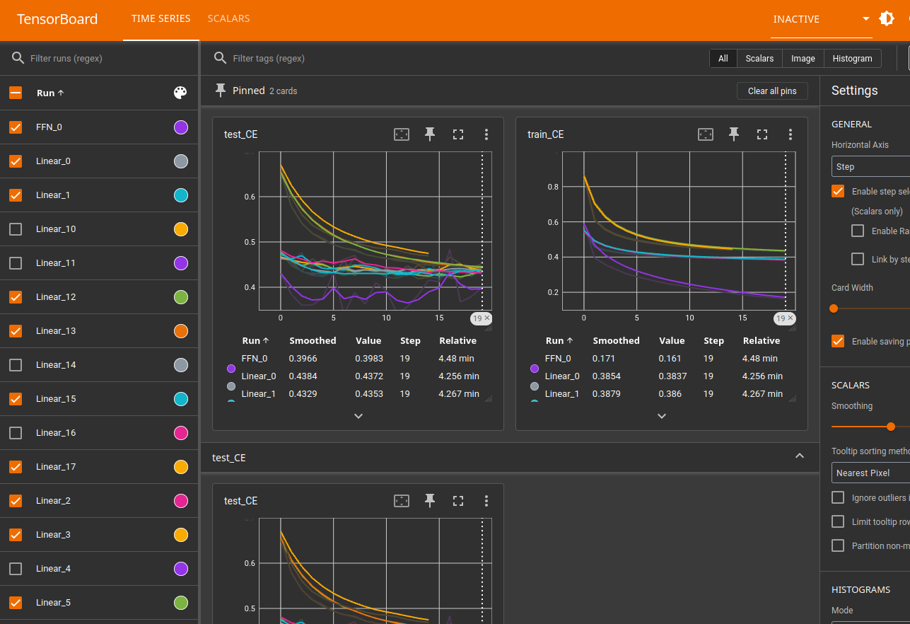

<a href="https://jeremyfix.github.io/deeplearning-lectures/">Deep learning lectures</a> © 2018 by <a href="https://jeremyfix.github.io">Jeremy Fix</a> is licensed under <a href="https://creativecommons.org/licenses/by-nc-sa/4.0/">CC BY-NC-SA 4.0</a>

## Objectives

In this practical, we will make our first steps with PyTorch and train our first models for classifying the [fashion dataset of zalando](https://github.com/zalandoresearch/fashion-mnist) which is made of :

- $60000$ $28\times28$ grayscale images in the training set
- $10000$ $28\times28$ grayscale images in the test set
- belonging to 10 classes (Tshirt, Trouser, Pullover, Dress, Coat, Sandal, Shift, Sneaker, Bag, Ankle boot)

Some samples of the dataset are represented below :

{.bordered width="100%"}

It should be noted that this dataset has been devised in order to replace the traditional MNIST dataset which is by far too easy now (a simple CNN can reach a test accuracy higher than $99.5\%$). We may have used MNIST for this introductory practical but well ... let us have fun with fashion, why not ?!

As you enter the universe of Pytorch, you might be interested in looking at [dedicated pytorch tutorials](https://pytorch.org/tutorials/).

The models you will train are :

- a linear classifier (logistic regression)
- a fully connected neural network with two hidden layers
- a vanilla convolutional neural network (i.e. a LeNet like convnet)
- some fancier architectures (e.g. ConvNets without fully connected layers)

As we progress within this tutorial, you will also see some syntactic
elements of PyTorch to :

- load the datasets,
- define the architecture, loss, optimizer,
- save/load a model and evaluate its performances
- monitor the training progress by interfacing with a dedicated web server

::: {.callout-important}
**VERY VERY Important**: You are provided with a code base. We will walk througth the code together. You should not read all the files before starting to code. However, when we discuss about coding in a function, you should also take the time to consider the surrounding code, where is that function called, which are the arguments of the function.
:::

::: {.callout-note}
The modular code base proposed in this lab comes from [https://github.com/jeremyfix/pytorch_template_code](https://github.com/jeremyfix/pytorch_template_code).

It is, I consider, a reasonnable starting point for experimenting with pytorch. It features modularity and minimal guarantees of reproducibility. This is obviously highly customizable, feel free to adapt it for your own works. You may even consider contributing to that code base by sending pull requests, raising issues, etc.., feel free, it is open source released under GPL 3 :)
:::


## Setup and predefined scripts

For this lab, you are provided base code to complete: [fashionmnit-kit.tar.gz](../../assets/introlab-kit.tar.gz). To get and use that code: 

``` bash
wget https://jeremyfix.github.io/deeplearning-lectures/assets/introlab-kit.tar.gz
tar -zxvf introlab-kit.tar.gz
```

This code is organized as a Python library `introlab` to be installed and used out of source. It contains all the required modules for running your experiments. If you want to add a feature, you need to modify that library.

To install the library, you should 1) create a virtual environment and 2) install it in developer mode.

**If you use the DCE of CentraleSupélec**, you can use pre-installed virtual environments that already ship several required packages:

``` bash
/opt/dce/dce_venv.sh /mounts/datasets/venvs/torch-2.7.1 $TMPDIR/venv
source $TMPDIR/venv/bin/activate
```

**Otherwise**, you need to create your own venv, for example using the built-in Python venv module:

``` bash
python3 -m venv /tmp/venv
source /tmp/venv/bin/activate
```

Then, to install the library in developer mode:

``` bash
python -m pip install -e introlab
```

You can verify that the library is installed by running:

``` bash
python -c "import introlab; print(f'Library available at {introlab.__file__}')"
```

This basic code base offers you several modules that **we will cover step by step**:

- data.py: deals with data loading,
- models: submodule containing our neural networks,
- utils.py: contains several utility functions such as the training and test loops, saving the best models, etc.
- main.py: the main script which will run training and testing.

## Data loading in the data submodule

### Minimal test definition

Our objective, in this part on the data, is to offer a function `get_dataloaders` which returns the dataloaders for training, validation, the dimensionality of the input and target as well as some other usefull things such as the classes names. That's the contract. In order to ensure that contract is fullfilled, we define a minimal test function.

::: {.callout-tip}
In the `data.py` script, **write** the following test :

```python 

def test_dataloaders():
    data_config = {
        "root_dir": "./data",
        "valid_ratio": 0.2,
        "batch_size": 32,
        "num_workers": 0,
    }
    use_cuda = torch.cuda.is_available()

    train_loader, valid_loader, input_size, num_classes, classes = get_dataloaders(
        data_config, use_cuda
    )

    X, y = next(iter(train_loader))
    grid = make_grid(X, nrow=8)
    show(grid)
    plt.tight_layout()
    plt.savefig("fashionMNIST_grid.png", bbox_inches='tight')

```

**What do you expect** from this function ? 
:::

We want this local test to be called when invoking `python -m introlab.data`. For this to happen, we need the following lines at the end of the `data.py` script :

```python
if __name__ == "__main__":
    logging.basicConfig(level=logging.INFO)
    test_dataloaders()
```

Now, in the next sections, we explain how to write the `get_dataloaders` function. Anytime you want to test it, you just need to the data submodule : `python -m introlab.data`.

### Construction of the datasets for training and validation

In the `data.py` submodule, the function `get_dataloaders` has to build and return the dataloaders for training and validation as well as some additional info. To do so, we first need a data. 

::: {.callout-tip}
**Complete** the construction of the dataset :

```python
# vvvvvvvvvvvvvvvvvvvvvvvvvvvvvvvvvvvvvvvvvvvvvvvvvvvvvvvvv
# TODO: Create the FashionMNIST dataset
#       The variable rootdir is useful
base_dataset = None
# ^^^^^^^^^^^^^^^^^^^^^^^^^^^^^^^^^^^^^^^^^^^^^^^^^^^^^^^^^
```

so that `base_dataset` is an instance of the [torchvision.datasets.FashionMNIST](https://pytorch.org/vision/main/generated/torchvision.datasets.FashionMNIST.html) dataset. Pay attention to the beginning of the function, some variables might be useful, such as the `root_dir`.
:::


Once done, we proceed by splitting the dataset into two folds : one for validation, a fraction `valid_ratio` of the total number of samples, and one for training.

::: {.callout-tip}
**Build** the two folds for training and validation. For this, you need to complete the code below. Pytorch offer you the [torch.utils.data.Subset](https://docs.pytorch.org/docs/stable/data.html#torch.utils.data.Subset) dataset class. 

```python
# vvvvvvvvvvvvvvvvvvvvvvvvvvvvvvvvvvvvvvvvvvvvvvvvvvvvvvvvvvvvvvvvvvvvv
# TODO : Create the train and valid splits. The torch.utils.data.Subset
#        class is useful for this purpose
train_dataset = None
valid_dataset = None
# ^^^^^^^^^^^^^^^^^^^^^^^^^^^^^^^^^^^^^^^^^^^^^^^^^^^^^^^^^^^^^^^^^^^^^
```
:::

::: {.callout-note}
Just after building the splits, some transforms are declared in the code. We do not detail that part of the code for now. We will go back to that sections once we will discuss augmentation transforms. Still, you may take a minute or two understanding this simple pipeline which reduces to :


```python
preprocess_transforms = [
    v2.ToImage(),
    v2.ToDtype(torch.float32, scale=True),
]
train_transforms = v2.Compose(preprocess_transforms)
train_dataset = WrappedDataset(train_dataset, train_transforms)

valid_transforms = v2.Compose(preprocess_transforms)
valid_dataset = WrappedDataset(valid_dataset, valid_transforms)
```

`ToImage` transforms the PIL image into a torchvision Image tensor (C, H, W), converts the int8 values to floating points values, scaling $[0, 255]$ to $[0.0, 1.0]$.

The use of `WrappedDataset` is to keep a degree of freedom to apply different transform pipelines for the train and valid folds, e.g. the augmentations.

:::

### The dataloaders

We are almost done. Now that we have our dataset objects, it is straightforward to construct dataloaders using the [torch.utils.data.DataLoader](https://pytorch.org/docs/stable/data.html#torch.utils.data.DataLoader) functions.

::: {.callout-tip}
**Proceed by completing** the construction of the dataloaders :

```python
# vvvvvvvvvvvvvvvvvvvvvvvvvvvvvvvvvvvvvvvvvvvvv
# TODO: Create the train and valid dataloaders
# from their respective datasets
train_loader = None
valid_loader = None
# ^^^^^^^^^^^^^^^^^^^^^^^^^^^^^^^^^^^^^^^^^^^^^
```
:::

### Running the test

If you correctly filled in the functions in the previous sections, you should be able to run the minimal test with the command :

```bash
python -m introlab.data
```

which is expected to produce an image with some samples of the FashionMNIST dataset in `fashionMNIST_grid.png` as below.

{width=50% .lightbox}

If you notice weird pixels, like oversaturated ones, you should probably consider **temporarily** remove the normalization of the pixels. This normalization brings your pixels from $[0.0, 1.0]$ to $[-1.0, 1.0]$ which matplotlib clips to $[0.0, 1.0]$, hence the loss of information.

## Definition of a neural network in the `models` submodule

Now that have our data, we need to design a predictor. The predictors will be built in the `models` submodule.  This submodule is our library of models. The contract for this submodule is to offer an instance of the [nn.Module](https://pytorch.org/docs/stable/generated/torch.nn.Module.html) class whether it is a convolutional neural network, a transform, a linear model, a capsule net, etc...

The interface with the `models` submodule is through the `build_model` function defined in the `mdels/__init__.py` script. 

``` python
def build_model(cfg, input_size, num_classes):
    return eval(f"{cfg['class']}(cfg, input_size, num_classes)")
```

We will in the next subsection which are these parameters, in particular the `cfg` dictionnary. This is actually the key to allow the creation of models with different numbers and types of arguments in their constructor.

A model, in the pytorch sense, is an instance of `torch.nn.Module`. This class is the mother class of all the models in pytorch. The forward propagation of the model is to be implemented in the `forward` method, and pytorch will wrap that forward method in the `__call__` method so that a model can be conveniently called on some inputs `y = model(x)`.

There are mainly three approaches to define a model :

- you directly instanciate a pytorch model, for example a [torch.nn.Linear](https://pytorch.org/docs/stable/generated/torch.nn.Linear.html) for a linear model, [torch.nn.Transfomer](https://pytorch.org/docs/stable/generated/torch.nn.Transformer.html) for a transformer, etc..,
- you stack layers in a sequential container [torch.nn.Sequential](https://pytorch.org/docs/stable/generated/torch.nn.Sequential.html), 
- you define your own class inheriting from the `torch.nn.Module` class and implement the `forward` method.


### Minimal test definition

As for the data, we start by defining a minimal test we expect to work. That's again a contract. Since we have a submodule, we will implement this test in the `models/__main__.py` script. An example of such a test, in the case of a linear model, would be :

``` python
def test_linear():
    cfg = {"class": "Linear"}
    input_size = (3, 128, 128)
    batch_size = 16
    num_classes = 18
    model = build_model(cfg, input_size, num_classes)

    input_tensor = torch.randn(batch_size, *input_size)
    output = model(input_tensor)
    # vvvvvvvvvvvvvvvvvvvvvvvvvvvvvvvvvvvvvvvvvvvvvv
    # TODO
    # Fill in the expected output size
    expected_output_size = None
    # ^^^^^^^^^^^^^^^^^^^^^^^^^^^^^^^^^^^^^^^^^^^^^^
    expected_output_size = (batch_size, num_classes)  # @SOL@
    assert expected_output_size == output.shape
    print(f"Output tensor of size : {output.shape}")

if __name__ == "__main__":
    logging.basicConfig(level=logging.INFO)
    test_linear()
```

This basic test is simply calling the model building function, forward propagating a dummy tensor through it and checking that the output shape is of the expected dimensions. Notice the `cfg` dictionnary which is provided to `build_model`. Remember, `build_model` is defined as :

``` python
def build_model(cfg, input_size, num_classes):
    return eval(f"{cfg['class']}(cfg, input_size, num_classes)")
```

Given the dictionnary `cfg` of the `test_linear` function, the string in the `eval` call is evaluated as `"Linear(cfg, input_size, num_classes)"` and then python interprets that string calling the right constructor. This is the python magic avoiding to write the long alternative, although equivalent :

``` python
def build_model(cfg, input_size, num_classes):
  if cfg['class'] == "Linear":
    return Linear(cfg, input_size, num_classes)
  elif cfg['class'] = ... 
    ...
```

Running the test is done by invoking :

``` bash
python -m introlab.models
```

### A linear neural network

::: {.callout-tip}
**Complete** the `Linear` function of `models/base_models.py` so that it returns a linear model. You will have to use the layers [torch.nn.Linear](https://pytorch.org/docs/stable/generated/torch.nn.Linear.html) and [torch.nn.Flatten](https://pytorch.org/docs/stable/generated/torch.nn.Flatten.html), stacked in a `torch.nn.Sequential`.
:::

Why the flatten layer ? Because the input that will feed the network is of shape `(B, C, H, W)` and the linear layer must operate on tensors of shape `(B, C \times H \times W)`.

::: {.callout-tip}
**Complete** the minimal test with the missing `expected_output_size` and check that the test is running successfully.
:::

::: {.callout-tip}
**How many** trainable parameters does that model possess ?
:::

::: {.callout-important}
We are constructing classification networks. It is expected to output class probabilities. Still, you never add the output transfer function. Why ? Because the implemented of the CrossEntropyLoss in pytorch we will use is combining the softmax and the negative log likelihood which is more numerically stable than applying both operations independently.
:::

### A fully connected feedforward neural network

Now, your job is to implement a second model, a fully connected multi layer feedforward neural network. 

::: {.callout-tip}
**Define** a minimal test in the `models/__main__.py` script to test that implementation and **complete** the `FFN` function in `models/base_models.py`. It receives $3$ arguments : 

- `num_layers`: the number of layers to stack,
- `num_hidden`: the number of units in each layer,
- `use_dropout`: wheter or not to inject dropout between the layers, a parameter we will use later in the lab.
::: 

::: {.callout-tip}
**How many** trainable parameters does that model possess ?
:::

## The main script `main.py`

Alright, we have our dataloaders providing minibatches of inputs/outputs as well as two predictors to train. It is now time to move on the training script. It is defined in the `main.py` script. 

The `main.py` script is constructed with :

``` python

def train(config):
    ...

if __name__ == "__main__":
    logging.basicConfig(stream=sys.stdout, level=logging.INFO, format="%(message)s")

    if len(sys.argv) != 3:
        logging.error(f"Usage : {sys.argv[0]} <train|test> config.yaml")
        sys.exit(-1)

    command = sys.argv[1]
    logging.info("Loading {}".format(sys.argv[1]))
    config = yaml.safe_load(open(sys.argv[2], "r"))

    eval(f"{command}(config)")
```

So that we can call it :

``` bash
python -m introlab.main train config.yaml
```

We will go back to the content of the `config.yaml` when we will run our first trainings. 

An overview of the `train` function, it :

- loads the data and build the dataloaders,
- define the model,
- define the loss function and optimizer,
- define the callbacks such as checkpointing the best model, logging, etc...
- loops over the minibatches and perform the updates of the model's parameters.

In the next sections, you will complete the missing elements of this script.

## Loss function and optimizer

The definition of the loss function and optimizer are in the `main.py` script. For the loss function, I suggest you to cimplement a [cross entropy loss](https://pytorch.org/docs/stable/generated/torch.nn.CrossEntropyLoss.html). 

Let us remind what the cross entropy loss is in pytorch. In Pytorch, it is a combination of a softmax and the negative log likelihood. Both are combined because the combination benefits from numerical stability tricks (log-sum-exp). Consider the python snippet below :

``` python

import torch
import torch.nn as nn

# On définit un modèle linéaire
logits = torch.Tensor([[-100., 10., 0.],[10., 15., 3.14]])
targets = torch.Tensor([1, 2]).long()

# On définit la perte cross-entropique
loss = nn.CrossEntropyLoss()

# On calcule la perte
output = loss(logits, targets)
print(f"Loss value :{output.item()}")
```

In this code, we have two vectors of logits $[-100, 10, 0]$ and $[10, 15, 3.14]$ as well as the targets $[1, 2]$. It means the logits of the classes to predict are $10$ for the first sample and $3.14$ for the second sample. So, the computation performed is :

$$
5.93... = \frac{1}{2} (-\log(\frac{e^{10}}{e^{-100}+e^{10} + e^{0}}) -\log(\frac{e^{3.14}}{e^{10}+e^{15} + e^{3.14}}))
$$

The logits are tensors of shape $(B, K)$ where $B$ is the batch size and $K$ the number of classes and the tensor of targets is of shape $(B,)$, providing the class to be predicted for every sample.

**Complete** the definition of the loss function and optimizer in the `main.py` script. The loss function is [torch.nn.CrossEntropyLoss](https://pytorch.org/docs/stable/generated/torch.nn.CrossEntropyLoss.html) as discussed above. For the optimizer, choose among the [optimizers implemented in pyotorch](https://pytorch.org/docs/stable/optim.html#algorithms).

``` python

# Build the loss
logging.info("= Loss")
# vvvvvvvvvvvvvvvvvvvvvvvvvvvvvvvvv
# TODO : Define the loss function
loss = None
# ^^^^^^^^^^^^^^^^^^^^^^^^^^^^^^^^^

# vvvvvvvvvvvvvvvvvvvvvvvvvvvvvvvvvvvvvv
# TODO : Define the optimizer
optimizer = None
# ^^^^^^^^^^^^^^^^^^^^^^^^^^^^^^^^^

```

## Training and inference loops in the `utils` submodule

We can proceed implementing the training and inference loops.

### Training loop

The training loop is implemented in the `main.py` script. Its overall structure is :

``` python
for e in range(config["epochs"]):
    # Training on the training split for 1 full epoch
    ...

    # Testing on the validation split
    ...

    # Checkpointing the model if improved
    ...

    # Logging the metrics
    ...
```

The training over one epoch is defined in the `utils.py` script. 

::: {.callout-tip}
**Read, decipher, understand** the `train_one_epoch` function in the `utils.py` script.
:::

### Test loop

The inference function `test` is defined in the `utils.py` script. Its role is to evaluate the predictions of a model. In this function there is no parameter update. There is also **one major difference** :

- during training, the model is switched to *train mode* : 

``` python
model.train()
```

- during inference, the model is switched to *test mode* :

``` python
model.eval()
```

That one line is super important. Some layers indeed perform different computations whether they are applied during training or testing such as the dropout layers, batch normalization, ...

::: {.callout-tip}
**Read, decipher, understand** the `test` function in the `utils.py` script.
:::

### Checkpointing the best model

The best model is the one minimizing our estimate of the real risk. **There is no reason** to assume that the best model is the one obtained asymptotically at the end of the optimization process. The optimization process seeks to minimize the empirical risk on the training fold, not the real risk.

The real risk is evaluated on the validation fold with the `test` function. That function outputs the test_loss that is used to decide if an improvement has been achieved after an epoch of training :

``` python
test_loss = utils.test(model, valid_loader, loss, device)
```

The checkpointing is already implemented as the `ModelCheckpoint` class in the `utils.py` submodule. It is created and called in the `main.py` script : 

```python

# Define the early stopping callback
model_checkpoint = utils.ModelCheckpoint(
    model, str(logdir / "best_model.pt"), min_is_best=True
)

...

# During training
for e in range(config["epochs"]):
    ... 
    updated = model_checkpoint.update(test_loss)
```

::: {.callout-tip}
**Read, decipher, understand** the `train_one_epoch` function in the `utils.py` script.
:::

## Our first trainings

### Running a training

All the elements are in place to start a first training on the FashionMNIST dataset. For this, we need to submit a yaml script `config.yaml` to the `introlab` main script. As an example, the script below will configure a training of a Linear model for $20$ epochs with a batch size of $32$, $20\%$ of the data being used for validation.

```yaml
data:
  root_dir: './data'
  batch_size: 32
  num_workers: 4
  valid_ratio: 0.2
  normalize: False

nepochs: 20

logging:
  logdir: "./logs"

model:
  class: Linear
```

If you save this file in `config.yaml`, you can then proceed running a training :

```bash
python -m introlab train config.yaml
```

::: {.callout-tip}
**Run** several trainings of the models you implemented either `Linear` and `FFN`.
:::

Notice that a dedicated logging directory (subdirectory of `./logs`) is created anytime you run a new training. That logging directory is expected to gather all the assets of one experiment. For now, it contains a copy of the config file, a textual summary of the experiment and the log file of tensorboard we will visualize in the next section.

### Visualization of the results with Tensorboard

The training script contains functions to record logs during training. In particular, in the `main.py` script, you will notice :

``` python
# On the tensorboard
for key, value in metrics.items():
    tensorboard_writer.add_scalar(key, value, e)
```

When you run a training, a specific file called `events.out.tfevents.xxxxx` is created and the information saved by the `tensorboard_writer` are written in this file. This file contains all the tensorboard logs of your run. With [tensorboard](https://pytorch.org/docs/stable/tensorboard.html), you can save images, audio, scalars, histograms, graphs, etc... 

In order to visualize the logs, you just need to start the tensorboard web client and connect to it with a browser at [http://localhost:6006](http://localhost:6006).

```bash
$ tensorboard --logdir logs

Serving TensorBoard on localhost; to expose to the network, use a proxy or pass --bind_all
TensorBoard 2.21.0 at http://localhost:6006/ (Press CTRL+C to quit)
```

{width=70% .lightbox}

### The impact of normalization

The preprocessing of the data is defined in the `data.py` submodule. For now, it is defined as :

``` python
preprocess_transforms = [
    v2.ToImage(),
    v2.ToDtype(torch.float32, scale=True),
]
```

When loading an image, the pipeline is the following :

- an image is loaded from disk as a PIL (Pillow) Image, with an unsigned int data types for the pixels with discrete values in $[0, 255]$,
- the [v2.ToImage](https://docs.pytorch.org/vision/main/generated/torchvision.transforms.v2.ToImage.html) converts the PIL image to a [pytorch image tv_tensor](https://docs.pytorch.org/vision/main/generated/torchvision.tv_tensors.Image.html#torchvision.tv_tensors.Image), values still being in the range $[0, 255]$,
- the [v2.ToDtype](https://docs.pytorch.org/vision/main/generated/torchvision.transforms.v2.ToDtype.html?highlight=todtype#torchvision.transforms.v2.ToDtype) converts from unsigned int 8 to float32 and scale the values by $255$ (scale=True)

After these transforms, you end up with a tensor with floating point values in $[0.0, 1.0]$. Now, we know from the 2010 revolution on deep learning that initialization is critical for the functioning of the training, and the input pixel distribution is part of the reasonning ("let us assume pixel values being normally distributed, then ..").

I propose you to check the influence of the normalization on the performances of your training.

::: {.callout-tip}
**Normalize** your images with a mean pixel value at $\mu=0.2860$ and standard deviation $\sigma^2=0.2750$. To do so, you can add a [v2.Normalize]() call in the `preprocess_transforms`.

You can benefit from the `normalize` argument of config file to parametrize your transformations.
:::

## Regularizations

Regularization is about all the techniques used to mitigate the overfiting. We can cite :

- L1, L2 regularization where we add a penalty term to the loss,
- dropout layers which are layers added inside the architecture of the neural network,
- data augmentation which consists in randomly change your inputs with predictible consequences on the targets.

### L2 regularization

Let us consider the simplest approach to introducing L2 regularization (although remember in the lecture, we saw a much more flexible way to define it). Some optimization algorithms, such as [SGD](https://pytorch.org/docs/stable/optim.html#torch.optim.SGD) or [AdamW](https://pytorch.org/docs/stable/optim.html#torch.optim.AdamW) implements L2 regularization. This is called `weight_decay` and corresponds to the factor multiplying the L2 norm of the parameters.

::: {.callout-tip}
**Modify** your definition of the optimize in the `main.py` script to use AdamW with a weight_decay of $1e-4$
:::


::: {.callout-tip}
**Experiment** this regularization with your models. For example, you can check the influence of it on a multi layer feedforward neural network with $5$ hidden layers and $128$ neurons per layer.
:::


### Dropout

Inserting dropout layers is another way to regularize your models. As a reminder, dropout layers are layers which, during training, zero out randomly a fraction of the activations. In general, we introduce these layers after every linear layer but these are the ones which may massively overfit.

::: {.callout-tip}
**Modify** your implementation of the multi layer feedforward neural network `FFN` to introduce [torch.nn.Dropout](https://pytorch.org/docs/stable/generated/torch.nn.Dropout.html) layers if requested. The variable `use_dropout` can be used to decide whether or not to introduce dropout layers.

**Experiment** with this regularization
:::

::: {.callout-important}
Dropout layers behave differently in training or inference. During evaluation, an approximate average response of the neural network is computed rather than zeroing activations. It is therefore important, for the correct functioning of these layers, not to forget the `model.train()` and `model.eval()` calls in the training and inference loops.
:::

::: {.callout-note}
If you dig into the pytorch implementation, you will notice it does not implement the original dropout but a variant, called, "inverted dropout"  which does not require to sorte the dropout probability for inference.
:::

### Data augmentation

## Convolutional neural networks

### Small kernels and global average pooling

## Bonus

### The right metrics

It is important to choose the right metrics to evaluate the performance of your models. FashionMNIST is a balanced dataset so that the accuracy is ok. However, if you were to work with Caltech101, it's an unbalanced dataset : out of the $9145$ images belonging to $101$ classes, $800$ images of planes and $40$ images of Ephemeroptera (mayfly). A model always predicting the majority class would have an accuracy of almost $10\%$. If the dataset were balanced, this naive predictor would not score higher than $1\%$. In such cases, it would be better to consider metrics such as the F1 or the AUC and also to check the confusion matrix to investigate the classes for which the model is misled.

### How to scale the fully connected layers without global average pooling ?

When you design a convolutional neural network, there are two stages : the convolutional and the fully connected. The parameters provided to the convolutional stage are independent on the input size $(H, W)$ of your image, it depends only on its depth. However, when you enter the fully connected layers, and because these layers are fully connected, the construction of their weight matrix requires to know about the full dimensions of their input.

Therefore, you need to compute how the input shape $(C, H, W)$ gets modified by the propagation through the convolutional stage. Sometimes, there is a shortcut. Indeed, with the global average pooling in the convolutional network we designed in the lab, we do not need to perform complicated math, the output's shape is always $(C_1, 1, 1)$ and $C_1$ is given by the number of kernels of the last convoluional layer. In other cases, it is more complicated.

Fortunately, we can be lazy and defer to pytorch the computation of these dimensions. We just need to forward propagate a dummy tensor through the convolutional part and measure its output shape. Let us see this in action :

```python

def MySuperRevolutionnaryModel(cfg, input_size, num_classes):
     layers = []
     cin = input_size[0]
     cout = 16
     for i in range(cfg["num_layers"]):
         layers.extend(conv_relu_bn(cin, cout))
         layers.extend(conv_relu_bn(cout, cout))
         layers.extend(conv_down(cout, 2 * cout))
         cin = 2 * cout
         cout = 2 * cout
     conv_model = nn.Sequential(*layers)

     # Compute the output size of the convolutional part
     probing_tensor = torch.zeros((1,) + input_size)
     out_cnn = conv_model(probing_tensor)  # B, K, H, W
     num_features = reduce(operator.mul, out_cnn.shape[1:], 1)

```

There, the `probing_tensor` is just a dummy tensor appropriately shaped to the input_size that is propagated through the convolutional stage. Then, we extract the shape of `out_cnn`. This shape could then be used to build the next fully connected layers for example.
