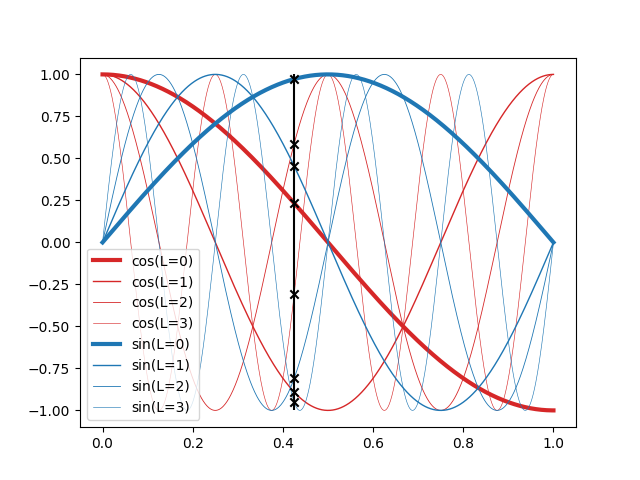
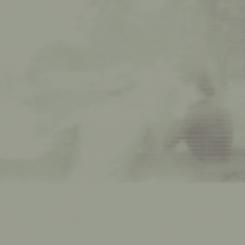
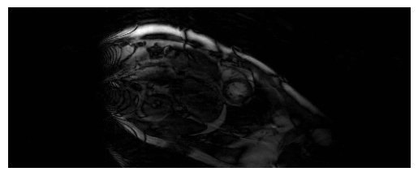

<a href="https://jeremyfix.github.io/deeplearning-lectures/">Deep learning lectures</a> © 2018 by <a href="https://jeremyfix.github.io">Jeremy Fix</a> is licensed under <a href="https://creativecommons.org/licenses/by-nc-sa/4.0/">CC BY-NC-SA 4.0</a>

## Objectives

In this lab, we are going to explore Neural Implicit Representations (NIR) through the encoding of an image (a 2D structure) and of a cardiac MRI recording which is 3D+t representation. This lab is based on several papers : 

- [@Mildenhall2020] which introduced Neural Radiance Fields, 
- [@mueller2022instant] who introduced Instant NGP mainly a NERF with a better encoding of the input coordinates and led to the developpement of tiny-cuda-nn, a highly optimized implementation of NERFs,
- [@Hemidi2023] and [@Feng2024] for the application of NERFs to Cardiac MRI. 

To explore NIR for ECGs, we will use the data provided for the [CMXRecon Cardiac MRI challenge of the MICCAI 2023 conference](https://cmrxrecon.github.io/Home.html). One of the objectives of this challenge was to accelerate the acquisition. 

## Setup and predefined scripts

For this lab, you are provided a base code to complete : [nirlab-kit.tar.gz](../../assets/nirlab-kit.tar.gz). To get and use that code :  

```bash
wget https://jeremyfix.github.io/deeplearning-lectures/assets/nirlab-kit.tar.gz
tar -zxvf nirlab-kit.tar.gz
```

This code is organized as a python library `nirlab` to be installed and used out of source. It contains all the required modules for running your experiments. If you want to add a feature, you need to modify that library.

To install the library, you need to install it in 1) a virtual environment and 2) in developer mode.

**If you use the DCE of CentraleSupélec**, you can use pre-installed virtual environments that already ship several required packages :

```bash
mymachine:~:mylogin$ /opt/dce/dce_venv.sh /mounts/datasets/venvs/torch-2.7.1 $TMPDIR/venv
mymachine:~:mylogin$ source $TMPDIR/venv/bin/activate
```

**otherwise**, you need to create your own venv, for example using the built-in python venv module, although you may also want to consider [uv](https://docs.astral.sh/uv/getting-started/installation/) :

```bash
mymachine:~:mylogin$ python3 -m venv /tmp/venv
mymachine:~:mylogin$ source /tmp/venv/bin/activate
```

Then, to install the library in developer mode :

``` bash
(venv) mymachine:~:mylogin$ python -m pip install -e inr
```

You can verify that the library is installed by running :

``` bash
(venv) mymachine:~:mylogin$ python -c "import nirlab; print(f'Library available at {nirlab.__file__}')"
```

This basic code base offers you several modules :

- data/ : data loading 
  - `image.py` : for loading coordinates and pixel values of 2D images
  - `miccai2023.py` : for loading MRI data
  - `rendering.py`, `scene.py` : for processing 3D scenes, not used in the lab
- models/ : 
  - `encoding.py`: handles positional encoding for arbitrary input coordinates dimensions and hash encoding using [tiny-cuda-nn](github.com/NVlabs/tiny-cuda-nn) for up to 3D coordinates,
  - `hash_encoding.py`: our custom implementation for 2D, 3D, 4D coordinates based on [the work of Yash Sanjay Bhalgat](https://www.github.com/yashbhalgat/HashNeRF-pytorch/)
  - `ngp.py`: offers a complete NIR model combining the coordinates encoding and the feedforward neural network, for arbitrary input/output dimensions
  - `mri.py`: offers the model of [@Hemidi2023] which involves $2$ NIR models
- samplers/:
  - `image.py`: the code for sampling an image given a trained NIR,
  - `mri.py`: the code for sampling a cardiac image given trained MRI NIR model
- `optim.py`: RelativeMSE used for encoding an image, KSpaceLoss and TVLoss used in the MRI section,
- `metrics.py`: the batched computation of the relative MSE and the KSpace metric,
- `utils.py` : ModelCheckpoint, train/test loops, FFT/IFFT functions used in the MRI section, 
- `main.py`: the main script for training and testing a model.

## Encoding an image

The concept of NERFs was introduced in 2020 [@Mildenhall2020] (see also [https://www.matthewtancik.com/nerf](https://www.matthewtancik.com/nerf)). As clearly illustrated on the webpage of the paper (see below), a NERF is a neural network representing a scene and optimised by backpropagating through a loss between ground truth observations and predicted observations. On the image below, the NERFs is used to encode the 3D scene and can be projected on the camera frames by integrating along rays. With the observed camera frames, we can compute a loss to optimize the parameters of the neural network. 


We are going to illustrate the use of NERFs on the giga pixel problem. The gigapixel aims to produce super resolution on an image but the approach considered by NERFs is trully original with respect to what was done before their introduction. In the traditional approach, you would train a neural network to upscale by a fixed factor your image. With the NERF approach, you fit a neural network to predict the pixel values at their integer coordinates and then can evaluate the neural network on arbitrary positions, in particular at subpixel positions.

With NERFs, we train a neural network specifically on one sample, e.g. on an image. We aim at learning a parametric function $f_\theta(x, y) : \mathbb{R}^2 \mapsto \mathbb{R}^3$ which maps pixel coordinates onto RGB values. The pixel coordinates of an image are integer values, right. But with NERFs, in order to obtain super resolution, we learn a function that can be queried with sub-pixels coordinates. The output also belongs to a finite space with values in $[0, 255]$ (unsigned int 8) that will be converted to floating points values in $[0, 1]$.

Let us apply this principle to upscale [Friant](https://en.wikipedia.org/wiki/%C3%89mile_Friant)'s paintings. Emile Friant is a French artist born in Dieuze (North East of France) in the nineteenth century. He belonged to the Realism art movement. His paintings are now in the public domain. Let us consider "Les Amoureux" that he painted in 1888.


This image is already provided to you in the `nirlab/images` directory.

### Data loading

Data loading involves, as usual, providing the datasets objects feeding the dataloaders. These are implemented in `data/image.py` for the datasets and `data/__init__.py` for the dataloaders. For training our neural network on image encoding, we will sample random points in $[0, 1] \times [0, 1]$ for the coordinates and assigned it a ground truth pixel with either **nearest neighbour** interpolation or, **bilinear interpolation** as used in ACORN [@Martel2021] (see "4.1 Image Fitting Task" in the paper) and [tiny-cuda-nn](https://github.com/NVlabs/tiny-cuda-nn/blob/2e757bbe781db59c4980d389d7dccbf5edc09669/samples/mlp_learning_an_image_pytorch.py#L57-L85).

In `data/image.py`, you are provided with a base class `BaseImageDataset` from which `ImageDataset` and `BilinearImageDateset` inherits. These two child classes just have to overload the `sample` method which takes as input floating point coordinates in $[0, 1]\times [0, 1]$ and must return a pixel value in $[0, 1]^3$. The base class already loads an image in the `image` instance attribute.

**Exercice** Implement the `sample` method of both `ImageDataset` and `BilinearImageDataset`. For testing your implementation, you are provided with a test function `test_image_dataset` in `nirlab/data/__main__.py`. If you know what to expect when running this test function, it remains to write the code to make it work :).

``` bash
(venv) mymachine:~:mylogin$ python -m nirlab.data
```

### Positional encoding

If we were to train a neural network $f_\theta(x, y)$, we could use these $(x, y)$ inputs to a feedforward neural network. However, it turns out this is not working very well, as indicated by [@Mildenhall2020]. Can you find in the paper [https://arxiv.org/abs/2003.08934](https://arxiv.org/abs/2003.08934) where this is indicated ? (maybe around section 5). The positional encoding used by [@Mildenhall2020] is similar to the one used in Transformers using sine/cosine of different frequencies. These functions are used to map $\mathbb{R}^2$ to $\mathbb{R}^{2L}$ where $L$ defines the number of frequencies to consider.

In math, given a point $x \in \mathbb{R}^d$, we compute an embedding $E(x)$ of size $d \times 2 \times L$ where we have $2$ harmonic functions (cos/sin) for $L$ frequencies for each of the $d$ components of $x$ :

$$
\begin{array}
\forall i \in [0, d-1], E(x)_{[|i 2 L:(i+1)2L|]} = [&\cos(2^0 \pi x_i),\\
&\cos(2^1 \pi x_i), \\
&\cdots \\
&\cos(2^{L-1} \pi x_i), \\
&\sin(2^0 \pi x_i), \\
&\sin(2^1 \pi x_i), \\
&\cdots,\\
&\sin(2^{L-1} \pi x_i)]
\end{array}
$$

The above formula states the slice of the embedding for one of the components of our point $x$. So far we discussed the case $d=2$ for an image but the positional encoding can be written in a very generic way, for arbitrary input dimension $d$.

**Exercice** Implement the position encoding. This is only $4$ lines of code and you have hints in the code. This must be implement in the `Positional` class in `nirlab/models/encoding.py`. You can test your code with the `test_positional_encoding` function you can invoke with :

``` bash
(venv) mymachine:~:mylogin$ python -m nirlab.models.encoding
```

The expected output is given below. On this image, we set $L=4$ and the encoding of $x=0.425$ is shown with the $2 \times L = 8$ black markers.



### Building the Neural Implicit model

It is now time to stick together the positional encoding with the feedforward neural network. 

**Exercice** Finish the implementation of the neural network structure in the `RealNGP` class in the `nirlab/models/ngp.py`. As you will see, the embedder is instantiated but you still need to code the feedforward neural network. 

You can test your implementation by running :

```bash
(venv) mymachine:~:mylogin$ python -m nirlab.models
```

This will run the functions in `nirlab/models/__main__.py`, in particular `test_real_NGP`. 

### Training your model 

You now have all the building blocks for training your first model. If you look into the `main.py` script, you will recognize the same structure as for the other labs. The loss function we use is the relative mean square error loss, as in the [tiny-cuda-nn](https://github.com/NVlabs/tiny-cuda-nn/blob/2e757bbe781db59c4980d389d7dccbf5edc09669/samples/mlp_learning_an_image_pytorch.py#L171C3-L171C20) implementation. It is implemented in the `optim.py` script and created in the `main.py` script.

```bash
(venv) mymachine:~:mylogin$ python -m nirlab.main train config.yaml
```

An example config file is given below, with a FFNN using $8$ layers of $256$ units and a positional encoding with $L=10$ frequencies. You may want to adjust some hyperparameters, e.g. the learning rate if you wish to stick to the parameters of [@Mildenhall2020].

```yaml
data:
  batch_size: 40960
  num_workers: 4
  class: "ImageDataset"  # Use bilinear interpolation for smoother learning
  params:
    root_dir: './images'
    img_idx: 0
    valid_ratio: 0.2

loss: RelativeMSE
metrics: 
  mse: BatchRelativeMSE

optim:
  algo: Adam
  params:
    lr: 0.01

scheduler:
  step_size: 50
  gamma: 0.5

nepochs: 200

checkpoint_metric: "mse"

sampler: sample_image

logging:
  logdir: "./logs"  # Better to provide the fullpath, especially on the cluster
  imgfreq: 10

model:
  class: "RealNGP"
  params:  
    dim_input: 2
    dim_output: 3
    n_hidden_units: 256
    n_hidden_layers: 8
    pos_encoding:
       class: "Positional"
       params:
         "L": 10
```

During training, the model is sampled over a $1000 \times 1000$ grid and the resulting image is saved in the logdir of your run.

**Exercice** It is your turn to perform experiments. You can try using either the `ImageDataset` or `BilinearImageDataset`.


### Hash encoding

NERFs were introduced in 2020 and triggered a lot of work. For example, in 2022, people at NVIDIA introduced Instant Neural Graphics Primitives (Instant-NGP) [@mueller2022instant] which introduced a Hash based positional encoding. The [tiny-cuda-nn](https://www.github.com/NVlabs/tiny-cuda-nn) offers a highly efficient C++/Cuda implementation of Hash encoding, with a python wrapper.

The Hash encoding of Instant NGP is described in [the paper](https://nvlabs.github.io/instant-ngp/assets/mueller2022instant.pdf) and considers a multi-resolution grid of your coordinates range, say $[0, 1]^d$, as shown on Fig. 3 of the paper. The paper considers $L$ levels of increasing resolution. For each level, each vertex of the grid has some trainable features, say of dimension $F$. Now, to compute the features assigned at a point $x$, you get the corner vertices surrounding $x$ and computes a linear interpolation of the features of these corner vertices.

Let us put some numbers to fix the ideas. The resolution of a level $l$ is denoted $N_l$. For example, the coarsest resolution in the paper is $N_0 = 16$ which means the $[0, 1]^2$ square (for an image) is split into $16 \times 16$ smaller squares. There are $17 \times 17 = 289$ vertices (in general $(N_l+1)\times(N_l+1)$. The number of features per vertex considered in the paper is $F=2$ which leads to $289 \times 2 = 578$ features for the coarsest resolution. What about the finest resolution ? In the paper they consider up to $N = 524.288$ which leads to $524.888 \times 524.888 \times F$ features 😱. So, there is a trick. This trick is a hash function which goes beyond the scope of my understanding for now. The hash function is there to limit the number of possible vertex embedding to a fixed number $T$ where $T \in [2^{14}, 2^{24}]$. The largest value is about $16M$ or so. This is large but far lower than $524.888^2$. To illustrate the idea (the hash function , a simple hash function is $h(v) = v \mod T$ where $v$ is the linear index of a vertex.

Now, let us talk about implementation.

It can be quite tricky to install tiny-cuda-nn, you may need the latest cuda installation. For this lab, I prefer to rely on a pure python implementation to avoid the possible installation issues. The implementation in `nirlab` is provided in `nirlab/models/hash_encoding.py` and is based on [the work of Yash Sanjay Bhalgat](https://www.github.com/yashbhalgat/HashNeRF-pytorch/), extended for 2D, 3D and 4D coordinates.

You can test the hash embedding

```bash
(venv) mymachine:~:mylogin$ python -m nirlab.models.hash_encoding
```

**Exercice** Modify your configuration file to use the multiresolution hash encoding. You can for example consider the parameters below. For the FFFN, as explained in the paper [@mueller2022instant], a much smaller network can be considered. 

```yaml
n_levels: 16
n_features_per_level: 2
log2_hashmap_size: 15
base_resolution: 16
finest_resolution: 7000
```

Using $2$ layers with $64$ units, the networks trains much faster 



### Sampling function

**Exercice** Taking inspiration from the sampling function provided in `nirlab/samplers/image.py`, reproduce the Gigapixel animation as shown on the [webpage of Instant NGP](https://nvlabs.github.io/instant-ngp/). As the coordinates lie in the $[0, 1]^2$ domain, you can progressively zoom in by sampling a grid of a given size on a smaller and smaller domain.

## 3D+t encoding of Cardiac MRI (soon)

We now turn our attention on the use of NERF for encoding structure of a higher dimension than a 2D image, namely a 3D+t, hence 4D, data. 

::: {.callout-warning}

In the following, we will stick to the proposal of [@Hemidi2023] using only 2D+t. The main reason behind that choice is that tiny-cuda-nn, which is the library used in the paper to get the Hash encoding is "only" supporting 2D and 3D coordinates. 

It remains to be tested and adapted but the Hash encoding provided by `nirlab` supports 2D, 3D and 4D coordinates. In principle, it should be possible to learn the representation in 3D+t. If you do so, just let me know ;).
:::

**This part is not yet released**. The code was initially written using the tiny-cuda-nn hash encoding, only supporting up to $3D$ coordinates. This is not completly satisfactory. Indeed, with the pure python Hash embedder, you could reimplement the full $3D+t$ model.

In any case, below is an example of what can be produced with the code base, trained on the MICCAI data.

{width=100%}


<!-- ## Physics Informed Neural Networks (PINNs) -->
<!---->
<!-- Another illustration of implicit neural representations is Physics-Informed-Neural-Networks (PINNs). There, the point is to approximate the solution of a differential equation with a neural network $f_\theta(x)$, where $x$ is to be considered as general coordinates (spatial, temporal, both). An example differential equation we may want to solve could be the Wave equation : -->
<!---->
<!-- $$ -->
<!-- \frac{\partial^2 u}{\partial t^2}(x, y, t) = c^2 (\frac{\partial^2 u}{\partial x^2}(x, y, t) + \frac{\partial^2 u}{\partial x^2}(x, y, t)) -->
<!-- $$ -->
<!---->
<!-- You could basically reorganize the terms as : -->
<!---->
<!-- $$ -->
<!-- \frac{\partial^2 u}{\partial t^2}(x, y, t) - c^2 (\frac{\partial^2 u}{\partial x^2}(x, y, t) + \frac{\partial^2 u}{\partial x^2}(x, y, t)) = 0 -->
<!-- $$ -->
<!---->
<!-- We suppose we observe a physical system at some position. Usually, when we deal with these equations, we are expected to provide boundary conditions. However, when we want to learn a solution of this equation, it is sufficient to consider that the solution is observed at some coordinates, without constraining these observations to lie on a full spatial or temporal slice.  -->
<!---->
<!-- To learn a solution to this equation with PINNs, we will consider two terms in the loss function fitting the following two objectives : -->
<!---->
<!-- - you want your approximate solution $f_\theta(x)$ to output the correct value where we observe them, -->
<!-- - you want your approximate solution to follow the physics everywhere in your volume. -->
<!---->
<!-- For the first objective, it is not a big deal. We have observations and predictions and therefore we can compute a loss (say L2, Huber, or so). For the second one, we will sample the volume at some positions, according to a given strategy. To get the idea, consider you sample uniformely your coordinates. We call these points the **collocation points**. The collocations points are the point where we will compute a loss that will quantify if our solution does follow the physics. To follow the physics mean to verify the differential equation and this guaranteed if the equality above is satisfied. In the case of the wave equation, we can introduce a **residue**:  -->
<!---->
<!-- $$ -->
<!-- r(x, y, t) = \frac{\partial^2 f_\theta}{\partial t^2}(x, y, t) - c^2 (\frac{\partial^2 f_\theta}{\partial x^2}(x, y, t) + \frac{\partial^2 f_\theta}{\partial x^2}(x, y, t)) = 0 -->
<!-- $$ -->
<!---->
<!-- Following the physics means we want $r(x, y, t)$ to exactly on the **collocation points**. -->
