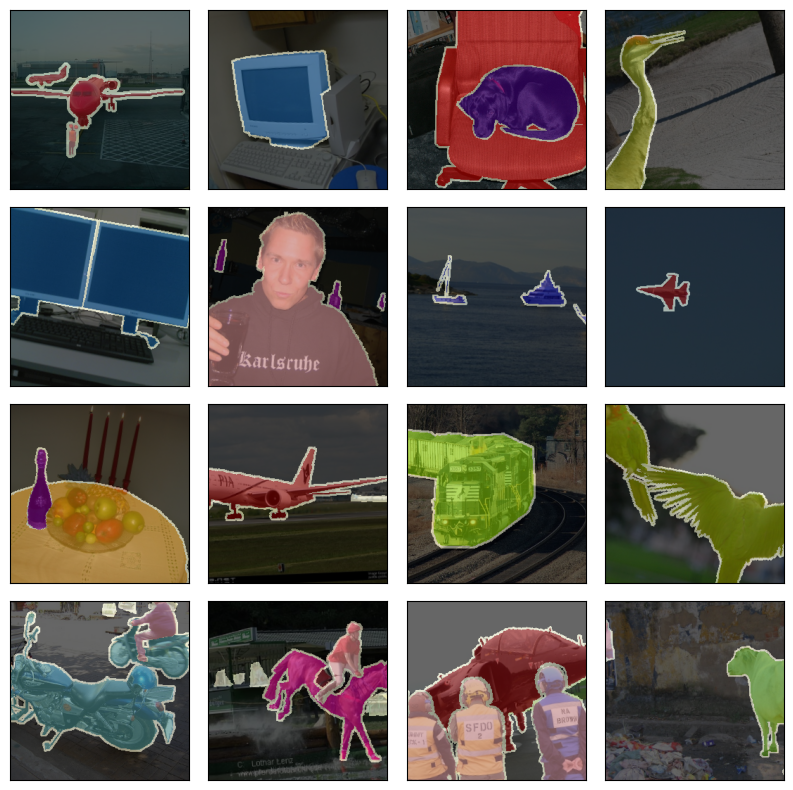
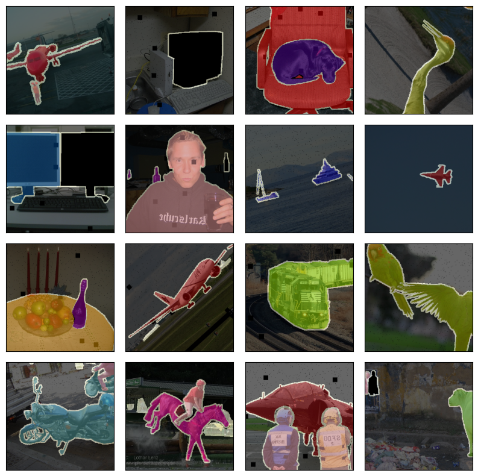
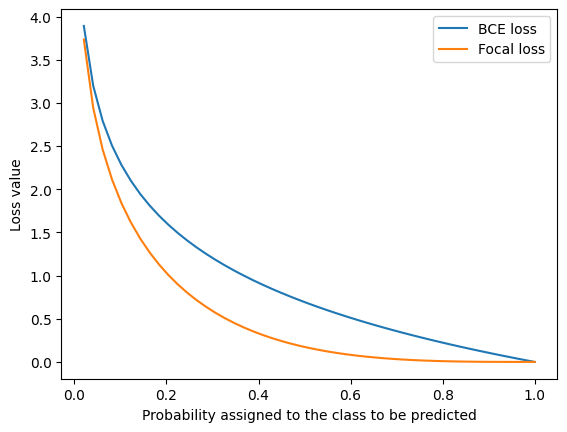
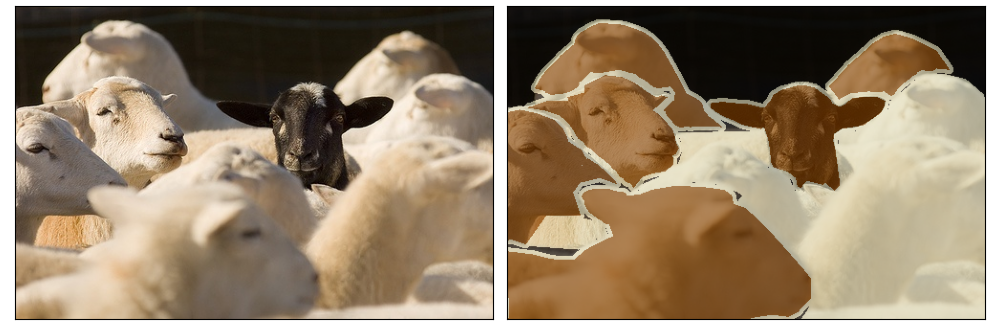
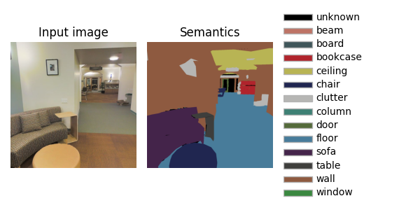

<a href="https://jeremyfix.github.io/deeplearning-lectures/">Deep learning lectures</a> © 2018 by <a href="https://jeremyfix.github.io">Jeremy Fix</a> is licensed under <a href="https://creativecommons.org/licenses/by-nc-sa/4.0/">CC BY-NC-SA 4.0</a>

## Objectives

The objective of this lab work is to implement and explore convolutional neural networks for semantic segmentation. **Semantic segmentation** seeks to learn a function $f_\theta$, parametrized by $\theta$, which takes as input an image $I$ of arbitrary shape $H\times W$ and outputs an image of labels of the same shape $H \times W$ as the input. Indeed, we seek to label every single pixel of the image as belonging to one of $K$ predefined classes. This task is also known as **dense labeling**.

In this lab work, we will be working with the Pascal VOC dataset. The Pascal VOC dataset contains color images of variable sizes, where each pixel is labeled as belonging to one of $21$ classes represented by their color code below. If you count the number of colored boxes below, you will notice there are $22$ colors. The `void/unlabeled` class is labeled $255$ and has to be ignored since these pixels may correspond to one of the $21$ other classes.

](pascal-voc-label-color-map.jpg){width=75%}

Some samples of the dataset are shown below with the labels overlaid on top of the images. The contour of the objects is labeled with $255$ while all the other $21$ categories are labeled $0 \cdots 20$. The classes are strongly imbalanced as most of the labels are from the **background** class $0$. Out of $262$M labeled pixels, the background class represents $69\%$. The second most frequent class is person (class $15$) with $4.6\%$ of labels. Only $5\%$ of the pixels are labeled as `void/unlabeled` (class $255$).

{width=50%}

We will follow the usual path, starting by exploring the data, then implementing a dedicated model, and finally considering a loss able to deal with imbalanced classes.

## Setup and predefined scripts

For this lab, you are provided base code to complete: [semseg-kit.tar.gz](../../assets/semseg-kit.tar.gz). To get and use that code:  

```bash
wget https://jeremyfix.github.io/deeplearning-lectures/assets/semseg-kit.tar.gz
tar -zxvf semseg-kit.tar.gz
```

This code is organized as a Python library `semseg` to be installed and used out of source. It contains all the required modules for running your experiments. If you want to add a feature, you need to modify that library.

To install the library, you should 1) create a virtual environment and 2) install it in developer mode.

**If you use the DCE of CentraleSupélec**, you can use pre-installed virtual environments that already ship several required packages:

```bash
/opt/dce/dce_venv.sh /mounts/datasets/venvs/torch-2.7.1 $TMPDIR/venv
source $TMPDIR/venv/bin/activate
```

**Otherwise**, you need to create your own venv, for example using the built-in Python venv module:

```bash
python3 -m venv /tmp/venv
source /tmp/venv/bin/activate
```

Then, to install the library in developer mode:

``` bash
python -m pip install -e segmentation
```

You can verify that the library is installed by running:

``` bash
python -c "import semseg; print(f'Library available at {semseg.__file__}')"
```

This basic code base offers you several modules that **we will cover step by step**:

- data.py: deals with data loading,
- models/: contains our neural networks,
- utils.py: contains several utility functions such as the training and test loops, saving the best models, etc.
- optim.py: defines the focal loss, which we will use later on,
- metrics.py: provides metrics such as the F1, confusion matrix, etc.
- main.py: the main script which will run training and testing.

## Data exploration

Data loading is handled by the `data.py` submodule. The objective of this module is to provide the dataloaders. To get a grip on the data, let us start by visualizing some samples and applying augmentations to them. In this lab, we will use the [albumentations](https://albumentations.ai/) library, which is dedicated to data augmentation for vision.

**Read and understand** the `plot_samples` function of the `data.py` submodule. You can execute this code:

```bash
python -m semseg.data
```

::: {.callout-note}

The code that gets executed once you evaluate the module `semseg.data` is located at the very end of the script:

``` python 
if __name__ == "__main__":
    plot_samples("/mounts/datasets/datasets/Pascal-VOC2012")
```

:::

In this `plot_samples` function, you will see several transforms are applied. The proposed pipeline is pretty basic:

- `SmallestMaxSize` ensures the shortest dimension of the image is at least $256$ pixels long,
- `RandomCrop` randomly crops a $256\times 256$ patch,
- `Normalize(mean, std, max)` applies the normalization transform $(x - max \times mean)/(max \times std)$
- `ToTensorV2` converts the image from PIL to a PyTorch tensor

**Complete** the transform pipeline by adding transforms in the `augmentation_transforms` list. You can access a list of suitable transforms on [the documentation page of albumentations](https://albumentations.ai/docs/api_reference/full_reference/).

Some augmented samples using `CoarseDropout`, `PixelDropout`, `MaskDropout`, `HorizontalFlip`, and `ShiftScaleRotate` are shown below:

{width=50%}

::: {.callout-warning}

It is always important to take the time to visually calibrate your augmentations. These are expected to be plausible samples. If you use transforms that are too aggressive, you may render the problem unlearnable. 

A more objective calibration score is given by the estimated real risk.

:::

**Complete** the `get_dataloaders` function by updating the content of the augmentation transforms you found interesting in the previous question. The `plot_samples` function was to test the augmentation transforms, but `get_dataloaders` is the function that is called from the main script to provide the dataloaders. Hence we need to propagate our chosen augmentation transforms into this function.

## Model implementation

The parametric model you learn takes as input a 3-channel image and outputs a probability distribution over the $21$
classes. There are several propositions in the literature to address this problem such as FCN [@Long2015], UNet [@Ronneberger2015], VNet [@Milletari2016], SegNet [@Badrinarayanan2017], and DeepLab v3+ [@Chen2018]. In this lab work, I propose we code the UNet of 2015, and you might want to implement DeepLabv3+ as homework :)

UNet is a fully convolutional network (FCN), i.e., involving only convolutional operations (Conv2D, MaxPool, ...; there are no fully connected layers). 

**Question** What does it mean that UNet is a fully convolutional network? What does it mean with respect to the input image sizes it can process? 

**Question** For minibatch training, what is the constraint that we have on the input image sizes?

The name U-Net comes from the specific shape of this encoder–decoder network with a contracting pathway for the
encoding followed by an expanding pathway for the decoding. The contracting pathway is expected to learn higher and
higher-level features as we progress deeper in the network, and the expanding pathway merges these high-level features
with the finer-grained details brought by the encoder through skip connections.

{width=100%}

The provided code implements `UNet` with a `UNetEncoder` class and a `UNetDecoder` class. Both the UNetEncoder and UNetDecoder rely on repetition of blocks which are UNetEncoderBlock on the one hand and UNetDecoderBlock on the other hand.

### Implementing the UNetEncoder

This downsampling pathway is made of :

- several `UNetEncoderBlock` blocks where the $i$-th ($i \in [0, \#blocks-1]$) block is made of:
	- `block1`=Conv($3\times 3$)-ReLU-BatchNorm, with $64 \times 2^i$ output channels 
	- `block2`=Conv($3\times 3$)-ReLU-BatchNorm, with $64 \times 2^i$ output channels and 
	- `block3`= MaxPooling($2\times 2$),
- followed by a Conv($3\times 3$)-ReLU-BatchNorm, with $64 \times 2^{\#blocks}$ output channels

Note that the output of `block2`, just before the downsampling, is transmitted to the decoder stage; therefore, the `UNetEncoderBlock` forward function **outputs two tensors**: one to be propagated along the encoder and one to be transmitted to the decoder.

**Question** In the `models.py` script, implement the code in the `UNetEncoder` and `UNetEncoderBlock` classes. Check your code by running the unit tests in `models/__main__.py:test_unet_encoder()`. Be sure to understand how the propagation is performed through the encoder blocks.

You can run the test code using the usual module call (check the very bottom of the `models/__main__.py` script):

``` bash
python -m semseg.models
```

The output of the final layers of the encoder is a tensor of shape $(batch, 64\times 2^{\#blocks}, H/2^{\#blocks}, W/2^{\#blocks})$

### Implementing the UNet decoder

**UNetDecoder** This upsampling pathway is made of:

- a first Conv($3\times 3$)-ReLU-BatchNorm block which keeps constant the number of channels,
- followed by several `UNetDecoderBlock` blocks with:
	- `upconv`=UpSample($2$)-Conv($3\times 3$)-ReLU-BatchNorm which halves the number of channels, 
	- a concatenation of the upconv output features with the encoder features
	- a `convblock`= Conv($3\times 3$)-ReLU-BatchNorm-Conv($3\times 3$)-ReLU-BatchNorm which halves the number of its input channels

For the `UNetDecoderBlock`, when its input along the decoder pathway has $c_0$ channels, its output has $c_0/2$ channels since:

- upconv outputs $c_0/2$ channels
- the concatenation of $c_0/2$ channels with the $c_0/2$ channels of the encoder leads to $c_0$ channels
- the `convblock` gets $c_0$ input channels and outputs $c_0/2$ output channels

In order to output a score for each of the $21$ classes, the very last layer of the decoder is a Conv($1\times 1$) with the same number of channels as the number of classes.

**Question** In the `models.py` script, implement the code in the `UNetDecoder` and `UNetDecoderBlock` classes. Check your code against the unit tests. Be sure to understand how the propagation is performed through the decoder blocks.

You can run the test code by **uncommenting the appropriate test** and using the usual module call (check the very bottom of the `models/__main__.py` script):

``` bash
python -m semseg.models
```

### Implementing the full model

Once both the encoder and decoder classes are implemented, you can see that the `UNet` class is a simple wrapper around them. 

**Question** Do you identify and understand the code of the **UNet** module?

**Question** In the `models/__main__.py` script, implement the missing code in the `test_unet` function to create a UNet model and test it. Is the output tensor the shape you expect?

We are done with the model implementation, let us move on to the metrics and loss.

## Evaluation metrics

Semantic segmentation is a multi-way classification task; one natural metric could be accuracy, but, if you remember, our classes are unbalanced. 

**Question** What would be the accuracy of a predictor always predicting that a pixel belongs to the background class $0$? Hint: some figures were given in the [data exploration](#data-exploration) section.

<!--

For Pascal VOC :

Given we have 69% of the background class, only these ones will be correctly classified, hence an accuracy of 69% which is pretty high ! 

We may discard the 5% of the unlabeled but this will not change much our computation.


For Stanford 2D 3D S : 

Given we have 33.67% of the pixels that are wall, only these ones will be correctly classified hence an accuracy of 33.67%

-->

To avoid being misled, a metric accounting for class imbalance is the macro F1 score, which reads

$$
macroF1 = \frac{1}{K}\sum_{k=0}^{K-1} \sum_{i=0}^{N-1} \frac{TP(x_i, y_i, k)}{TP(x_i, y_i, k) + \frac{1}{2}(FP(x_i, y_i, k)+FN(x_i, y_i, k))}
$$

which is an $F1$ computed for every class and then averaged over the classes. Another expression for the per-class F1 is given below:

\begin{align}
F1 &= \frac{2}{\frac{1}{precision} + \frac{1}{recall}} \\
precision &= \frac{TP}{TP + FP}\\
recall &= \frac{TP}{TP + FN}
\end{align}

**Question** What would be the macro F1 of a model always predicting the background class?

<!-- 

For Pascal VOC :

We need to compute the F1 for every class

- for the background class, 69% are TP, all the others 31% are FP => F1 = TP / (TP + 0.5 * (FP + FN)) = 69% / (69% + 0.5 * (31% + 0)) = 0.81
- for the other 20 classes, TP=FP=0. The predictions are FN => F1 = TP / (TP + 0.5 * (FP + FN)) = 0

The Macro F1 is therefore : 1/21 * (20 * 0 + 0.81) = 0.04

You could adjust these figures removing the 5% unlabeled.


For Stanford 2D-3D S : 

We need to compute the F1 for every class

For the wall class, 33.67% of the pixels are TP, all the others (66.33%) are FP hence the F1 is  33.67 / (33.67 + 0.5 * (66.33 + 0)) => F1 = 0.5
For the other classes, as the predictor predicts always wall, there are no positives for the prediction so TP = FP = 0; All the samples are either TN or FN , hence F1 = 0 / (0 + 0.5 * (0 + FN)) = 0     Actually, the FN, which are not necessary to know for the F1 estimation, are class dependent 

FN_unknown = $1.26\%$, FN_beam = $1.57\%$, FN_board = $2.71\%$, ....

At the end of the day, the macro F1 is      1/14 * (0.5 + 13 * 0) = 0.5 / 14. = 0.04

-->

In the provided code, the macro F1 is computed both on the training and validation folds. 

**Question** Do you see in the `main.py` script where this metric is computed and what is the use of the macro F1 on the validation fold?

## Loss implementation

We decided the macro F1 measure is the one to be optimized. Unfortunately, it does not provide useful information for gradient-based optimization.

**Question** According to you, why is it useless to use the F1 computed above for the gradient descent optimization of the parameters of our neural network?

<!--

The F1 metric as computed above is really flat, piecewise constant, and therefore its gradient is not informative about the direction to follow

-->

We need a differentiable proxy for that metric. This is still an open area of research (see, for example, [@Yeung2022]). Some of the options we will consider here are to use:

- a class balanced loss [@Cui2019], e.g. a weighted cross entropy loss 
- a focal loss [@Lin2017]

Other options could be to consider a Dice loss, a Tversky loss, a combination of these, or to use a batch sampler which could oversample the samples with the minority classes, etc ...

Similarly to a batch sampler, a weighted cross entropy loss will put higher importance on the minority classes compared to the majority classes. The weighted cross entropy loss for a single pixel of class $y$ with predicted probabilities $\hat{y}_k, k \in [0, K-1]$ is given as:

$$
wBCE(y, \hat{y}) = - w_{y} \log(\hat{y}_y)
$$

where the standard cross entropy loss is obtained with $w_k = 1, \forall k \in [1, K]$. Several weighting strategies are discussed on p.2 of [@Cui2019]. The cross entropy loss of PyTorch allows for this weighting.

<!-- **Question** Which values of the weights would you suggest to fight against class imbalance ? Some classical strategies are discussed in p2 of [@Cui2019] as well as their own scaling strategy. From the pytorch [documentation on the cross entropy loss](https://pytorch.org/docs/stable/generated/torch.nn.CrossEntropyLoss.html), do you see how to specify these weights ?  -->

<!--

We need to put more importance on the minority classes compared to the majority classes. 

One basic option is to use w_k equals to the inverse of the frequency of the class although some suggest to take the square root of that, and then maybe to normalize the w_k in order to really have :

w_k = (\sum_i n_i)/n_k  where n_k is the number of samples per class thereofre we get the inverse of the relative ratio of the class

-->

<!-- **Question** Modify your code to implement the weighted cross entropy with the weighting strategy you choose. -->

Another option for the loss is the **focal loss** which adds a factor in front of the cross entropy loss term :

$$
focal(y, \hat{y}) = -(1-\hat{y}_y)^\gamma \log(\hat{y}_y)
$$

with $\gamma \geq 0$ a tunable parameter. Setting $\gamma=0$, we recover the cross entropy loss. With higher $\gamma$, correctly classified pixels have less and less influence, therefore if the most abundant labels are correctly predicted, they barely influence the loss despite their presence in excess. Compared to the cross entropy loss, each term in the focal is penalized by $$(1-\hat{y}_y)^\gamma$$.

The plot belows compares the cross entropy loss and the focal loss as a function of the probability assigned to the true class to be predicted.

{width=70%}

**Question** As it can be tricky to implement the focal loss, it is given to you. Do you see where this is implemented and which argument of the main script allows to use it ? Hint: check the creation of the loss in the main script.

One of the arguments is `ignore_index=255`. Remember, the class $255$ corresponds to the unlabeled class. As you can see below, this `void/unlabeled` may indeed correspond to legit classes ! If you were to consider them as belonging to the `void/unlabeled` class, you would penalize a model predicting they belong to the class sheep $16$ although it would be correct !

{width=70%}

## Training

Since we now have the data, a UNet model and a loss, it is now time to train a model. To start a training, it is sufficient to call our `semseg` library with an appropriate yaml configuration file. 

For exemple, you can call 

```bash
python -m semseg.main train config.yaml
```

with the file below :

**config.yaml**
```yaml
data:
  root_dir: '/mounts/datasets/datasets/Pascal-VOC2012'
  batch_size: 32
  normalize: True
  crop_size: 256
  valid_ratio: 0.2
  num_workers: 10

optim:
  algo: Adam
  params:
    lr: 0.001

nepochs: 20

logging:
  logdir: "./logs"  # Better to provide the fullpath, especially on the cluster

model:
  class: "UNet"
  num_blocks: 5
  base_c: 32
```

During the training, you can check the metrics outputed in the console and also observe them as well as samples using the tensorboard :

```bash
tensorboard --logdir ./logs
```

**Question** : While the simulation is running, several information (metrics, inference exemples, ...) are dumped into a tensorboard. Take the time to visualize and understand them. 

## Using a pretrained encoder

The previously implemented network, trained from scratch does not perform very well. We can obtain much better results by considering a pretrained encoder. The encoder has the structure of a classification network. We can take a convolutional network, pretrained on ImageNet for example, chop off the head and connect a decoder.

We also see how to create a `GenericUNet` class built from a pretrained encoder and a generic decoder connected to it. The [timm library](https://github.com/huggingface/pytorch-image-models/) offers several state-of-the-art (SOTA) models pretrained on various versions of ImageNet. You can use these models for image classifcation but the API also allows [to get the intermediate features](https://huggingface.co/docs/timm/feature_extraction#multi-scale-feature-maps-feature-pyramid) facilitating the construction of an encoder on top of a pretrained encoder.

**Question** Looking at the documentation, fill in the `models/timm.py` script, the `GenericTimmEncoder` function that returns a pretrained encoder ready [to get the intermediate features](https://huggingface.co/docs/timm/feature_extraction#multi-scale-feature-maps-feature-pyramid).

You can test your implementation by calling the `test_timm_encoder()` function in the `models/__main__.py` script :

```bash
$ python -m semseg.models
For an input of shape torch.Size([1, 3, 256, 256])
Output features of the encoder
 - torch.Size([1, 64, 128, 128])
 - torch.Size([1, 64, 64, 64])
 - torch.Size([1, 128, 32, 32])
 - torch.Size([1, 256, 16, 16])
 - torch.Size([1, 512, 8, 8])
```

We now have to implement the generic decoder. Basically, as you can see from the `GenericUNet` function reproduced below, we can propagate a dummy tensor, at build time, through the encoder, to get the features it outputs and more precisely the number of channels of these features. This is the only information needed by the decoder to create its layers.

```python
def GenericUNet(cfg, input_size, num_classes):
    cin, _, _ = input_size
    encoder = GenericTimmEncoder(cin, **(cfg["encoder"]))

    # Forward propagation of a dummy tensor to get the encoder 
    # features dimensions
    X = torch.zeros((1, cin, 256, 256))
    encoder_features = encoder(X)
    encoder_channels = [fi.shape[1] for fi in encoder_features]
    decoder = GenericDecoder(encoder_channels, num_classes)
    return nn.Sequential(encoder, decoder)
```

**Question** : Define a YAML configuration script to run a training with your newly implemented GenericUNet using a resnet18 pretrained backbone.

## Inference

As training can take a long time, you are provided with a pretrained UNet model with a ResNet-18 backbone which obtained a macro F1 on a validation fold of $0.55$. 

<!--
   F1: [0.9124775361767214, 0.7006744463367578, 0.23233671576908083, 0.5535907000215841, 0.4635044908539235, 0.384556450298308, 0.7398696719244741, 0.7702732678974861, 0.7912242252857311, 0.1832549864905834, 0.33383548152534415, 
0.5378044389728343, 0.561990687837907, 0.4863660217776533, 0.7543760387566746, 0.7868117132857577, 0.43192675546561066, 0.5170726304236187, 0.25632429911504834, 0.7742795344143246, 0.4469266547406082]
   macro_F1: 0.55330841654143[>> BETTER <<]
-->

You can download the pretrained model [genericunet.tar.gz](genericunet.tar.gz). It is provided as a bundle with the normalization statistics and the onnx computational graph. You need to unpack the onnx files and normalizing statistics file in the same directory. Let us call that directory `modeldir`.

**Question** Visualize the computational graph with [netron.app](https://netron.app/)

**Question** The model was exported to ONNX for you, by the `ModelCheckpoint` class defined in the `utils.py` script. Can you identify in the `utils.py` script where the model is exported with onnx ? Reading [the doc on torch.onnx.export](https://pytorch.org/docs/stable/onnx.html#torch.onnx.export) do you understand what is the meaning of the arguments we provided to the export call ?

**Question** Your model can be evaluated on images of arbitrary sizes (width, height). Why do you think this is the case ? 

<!-- 
As our model is fully convolutional, it can be applied to images of any size. Since it does not contain any dense layers and only convolutional operations, there is no need to transform the image to a fixed image size.

-->

Now you can take an image and test your model on it. Some exemple images can be found from the [Coco dataset explorer](https://cocodataset.org/#explore). There, you will find images organized by categories and pick some for which there are objects belonging to the Pascal VOC dataset. 

To run the test function :

```bash
python -m semseg.main test <path_to_modeldir> <path_to_image>
```

**Question** Did you understand the `test` function in the `main.py` scrit ?

## Going further

There are several directions along which you could pursue the study of semantic segmentation. One is about the models. The U-Net architecture we consider has been released in 2015. You might be interested in implementing more recent architectures such as VNet [@Milletari2016] or DeepLab v3+ [@Chen2018]. 

Another direction of study is on the losses. We explored some ways to fight against class imbalance with the weighted cross entropy loss and the focal loss. You might be interested in exploring over losses, such as the Tversky loss, the DICE loss, the Lovasz loss, the Matthews Correlation Coefficient loss [@Abhishek2021]. It is interesting to implement yourself the loss but you might be interested in packages already implementing them such as [smp](https://smp.readthedocs.io/en/latest/losses.html)

In terms of deployment, you could also push a little further the work by serving the onnx model with a webapi that could be requested with an image to label.

## A possible solution

You will find a possible solution at [semseg-sol.tar.gz](../../assets/semseg-sol.tar.gz).

## Extensions : Using models from SMP

In order with other models, we can import models from the [segmentation_models_pytorch (SMP)](https://github.com/qubvel-org/segmentation_models.pytorch) library.

With our code base structure, it is pretty straightforward to add new models. You are provided with the `models/smp.py` script and the `DeepLabV3Plus` function  :

```python
def DeepLabV3Plus(cfg, input_size, num_classes):
  return None
```

Using the [documentation of SMP](https://smp.readthedocs.io/en/latest/models.html#deeplabv3plus), **fill in** the missing code to create a DeepLabV3+ model with the correct number of channels, classes and other parameters you consider useful. 

Do not forget to **provide a test code** in `models/__main__.py` to locally test your model. The following dictionnary should be sufficient for creating a DeepLabV3+ model with a pretrained resnet18 backbone.

```python
{
    "class": "DeepLabV3Plus",
    "parameters": {
      "encoder_name": "resnet18", 
      "encoder_weights": "imagenet"
    }
}
```

## Extensions to Stanford 2D-3D 

### Dataset description

Let us now extend the work to the large [Stanford 2D-3D S dataset](http://buildingparser.stanford.edu/dataset.html). This dataset is built from 3D scans of buildings with multiple annotation types (pixelwise depth, pixel class, pixelwise normals, scene category). We will consider only the pixelwise class labeling. The data have been collected in 6 different areas. 

| Area | Number of images|
| ---  | --- |
| 1    | 10,327 |
| 2    | 15,714 |
| 3    | 3,704 |
| 4    | 13,268 |
| 5    | 17,593 |
| 6    | 9,890 |
| **Total** | 70,496 |

Below is an example of the input RGB image and the associated labels 

{width=80%}

There are $14$ classes, the first being for the unlabeled pixels. The raw images have a size of $1080 \times 1080$. If we keep large images, the minibatches and their successive transformations will occupy a large space in GPU memory. At least, we can resize the images, e.g. to $256\times 256$, and still keep reasonnable segmentations.

If you were to plot the distribution of the classes over the $71000$ masks of size $1080\times 1080$, the relative proportion of the labels are $1.26\%$, $1.57\%$, $2.71\%$, $7.17\%$, $9.94\%$, $3.87\%$, $11.23\%$, $3.05\%$, $10.98\%$, $8.45\%$, $0.33\%$, $2.88\%$, $33.67\%$, $2.88\%$ which is really unbalanced. These figures are ordered the same than the labels on the image at the top, hence $33.67\%$ of the labeled pixels are "wall", and only $0.33\%$ are "sofa". As for Pascal-VOC, the classes are inbalanced.

Some of the labels in the dataset are noisy. For example, check the input image and mask of the image indexed $2702$ (of the area 5a), corresponding to the filename `area_5a/data/semantic/camera_ff5f377af3b34354b054536db27565ae_hallway_7_frame_4_domain_semantic.png`. This noise in the oracle, as well as the one possibly induced by the unknow class, has to be kept in mind as this will certainly prevent a perfect generalization. 

The noise in the oracle may also leads to divergence of the cross entropy loss. Since the cross entropy loss read $-log(p_{y_i})$, if the labels are noisy and your model is super good, the probably of the incorrectly labeled pixels will make the loss diverge.

### Implementation

You are provided, in the `stanford.py` script of your package, with the `StanfordDataset` class which is a pytorch dataset object, i.e. an object implementing the `__len__` and `__getitem__`  methods. The constructor expects follows the [VisionDataset](https://pytorch.org/vision/stable/generated/torchvision.datasets.VisionDataset.html) interface and expects :

- a root directory for the data (e.g. `/mounts/Datasets4/Stanford2D-3D-S/`)
- either a pair of `transform` and `target_transform` function, or a combined `transforms` function for transforming the RGB input and the semantic mask
- an optional list of `areas` to restrict to, e.g. `area = ['1', '5b']` 

**Question** Update your pipeline to train a model using the Stanford-2D-3D-S dataset. On the DCE, the datasets are available on `/mounts/datasets/datasets/Stanford2D-3D-S`

## References

::: {#refs}
:::
